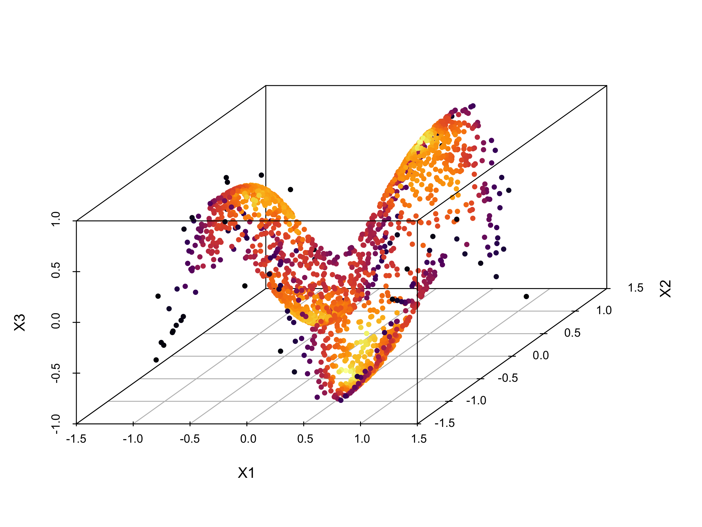

---
output:
  pdf_document: default
  html_document: default
---
```{r setup, include=FALSE}
knitr::opts_chunk$set(
  echo = FALSE,
  cache = T,
  messages = FALSE,
  warning = FALSE,
  eval = TRUE,
  include = TRUE
)
options(tinytex.verbose = TRUE)
library(tidyverse)
library(here)
library(patchwork)
library(kableExtra)
# Jmisc::sourceAll(here::here("R/sources"))
# set.seed(1234)
```

# Introduction {#dckdeintro}

Multivariate kernel density estimation (KDE see @Parzen1962-gt; @Scott2015-vl and references therein) is a fundamental tool for exploratory data analysis and unsupervised learning. Applications of KDE include finding hot spots of traffic networks in the GIS environment [@Xie2008-eb; @Okabe2009-nb], automatic detection in visual surveillance systems [@Elgammal2002-cw], wind power density detection [@Jeon2012-ac] and prime prediction via Twitter messages [@Gerber2014-tq]. For $m$-dimensional data where $m$ is even of moderate size, KDE is challenging due to the well-known curse of dimensionality. However, the manifold hypothesis suggests that many high-dimensional datasets belong to a $d$-dimensional manifold $M$ where $d\ll m$. The problem of KDE on manifolds has been well studied in @Hendriks1990-bt, @Izenman1991-cj, @Pelletier2005-vu, @Henry2013-da, and @Berenfeld2022-fd. However, in these settings, it is assumed that the underlying manifold is known, which is rarely true in practice. The is only a small literature dealing with the case where the manifold is unknown. Recently, @berenfeld2021-den, @berenfeld2022-est and @divol2022measure demonstrated the minimax optimality of certain types of KDE on manifolds. In contrast, our objective in this paper is to propose a new KDE for data that lie on some unknown manifold found using embedding techniques.

When dealing with data that lie on a manifold, it is common to use dimension-reduction techniques. These algorithms, which include ISOMAP, LLE, t-SNE, and UMAP among others, can be thought of as a mapping $\psi:M\rightarrow \mathbb{R}^d$ that take points on the manifold $\bm{p}$ to $d$-dimensional vectors $\bm{y}$, where the dimension $d$ is either assumed to be known a priori or needs to be estimated separately. Details of these algorithms are summarized in @Cayton2005-dp, @Lee2007-wq, @Izenman2012-mx, and @Cheng2021-dh. One could easily apply KDE to the output vectors $\bm{y}$. However, this would be a misleading representation of the density of points as they lie on the manifold. To see how, consider that the density on the manifold must be defined with respect to an appropriate volume form, that is
$$Pr(\bm{p}\in\mathcal{A})=\int_\mathcal{A} f(\bm{p}) dvol_M,$$
where $f$ is the probability density function on the manifold, $\bm{p}$ is a point on the manifold, $\mathcal{A}$ is some region on the manifold and $dvol_M$ is a volume form on the manifold $M$. By a change of variables, this would imply the following density for $\bm{y}$,
\begin{equation}
\label{eq:changevar}
Pr(\bm{y}\in\psi(\mathcal{A}))=\int\limits_{\psi(\mathcal{A})} (f\circ\psi^{-1})(\bm{y})|\det \bm{H}(\bm{y})|^{1/2}d\bm{y},
\end{equation}
where $\psi(\mathcal{A})$ is the image of $\mathcal{A}$ under $\psi$ and $\bm{H}(\bm{y})$ is the Riemannian metric expressed in local coordinates given by the mapping $\psi$ [@doCarmo1992-rm]. It can be seen that the density in terms of $\bm{y}$, differs from the density on the manifold due to the term $|\bm{H}(\bm{y})|^{1/2}$ which can be considered roughly analogous to the Jacobian determinant. Since $\psi$ will typically be a non-linear function, the value of $|\bm{H}(\bm{y})|^{1/2}$ will change across the manifold, in a way that measures the distortion induced by the dimension reduction algorithm. Notably, different choices of dimension reduction algorithm, imply different $\psi$, meaning that if KDE is applied to the output $\bm{y}$ coming from two different dimension reduction algorithms, this could lead to two very different sets of conclusions about the density of the same point.

In this paper, we propose a new KDE. Our estimator is also based on the output of dimension reduction algorithms but accounts for the distortion induced by the algorithm. For this reason, we refer to it as the distortion-corrected KDE (DC-KDE). Critical to our estimator, is obtaining an estimate of $|\bm{H}(\bm{y})|^{1/2}$ for this purpose we use the Learn Metric algorithm of @Perrault-Joncas2013-pq which augments any dimension reduction algorithm with an estimate of the Riemannian metric at each data point. One particular downstream task that we are interested in is anomaly detection, where anomalies are identified as points of low density. In a number of simulation studies, we demonstrate two benefits that arise when using our new estimator. The first is that using distortion correction leads to more accurate density estimates and better detection of anomalies compared to the case where distortion correction is not used. The second is that when the estimates are found using different dimension reduction algorithms (e.g. ISOMAP v UMAP), the results regarding the density estimates and the detection of anomalies are robust only when distortion correction is applied.

In terms of data visualization, our approach allows a two or three-dimensional scatterplot of $\bm{y}$ to be augmented by coloring points according to the magnitude of the density estimate, where the dimension of $\bm{y}$, $d$, is set as 2 or 3 in the dimension reduction algorithms. In this way, the user is able to tell whether a region that has a cluster of points in the output space $\bm{y}$ is truly a high-density region or if instead, this is an artifact of the dimension reduction algorithm 'squeezing' points together. This is particularly pertinent in the case of t-SNE which can form clusters of points even when no such clusters exist in the underlying data.  Furthermore, our estimator can be used for manifolds with elements that are a variety of objects, for instance, rotational frames or images. In our application we consider a probabilistic manifold whose elements are densities, meaning that we estimate a density of densities. Finally, our proposed estimator also takes the form of a KDE with variable bandwidth meaning that it also contributes to extensive literature on this topic [see Section 6.6 of @Scott2015-vl for a summary].

The rest of the paper is organized as follows. In \autoref{kderm}, we present our distortion-corrected kernel density estimator for Riemannian manifolds. Our estimator combines insights from two existing papers, the first is @Pelletier2005-vu who propose a KDE for data on manifolds that are known, the second is @Perrault-Joncas2013-pq who propose the Learn Metric algorithm which we use to estimate the distortion induced by a dimension reduction algorithm. \autoref{simulation} is composed of two simulations; the first deals with 2-dimensional data from a Gaussian mixture model mapped onto a 3-dimensional 'twin peaks' manifold and the second with a 5-dimensional semi-hypersphere data embedded into a 100-dimensional space. \autoref{dckdeapplication} contains an application to an Irish smart meter dataset that visualizes and identifies households with an anomalous distribution of energy usage. Conclusions and discussions are presented in \autoref{dckdeconclusion}. Some additional background on important terms in Riemannian geometry required to understand our proposed method is provided in \autoref{riemgeo}.

# Distortion Corrected Kernel density estimate on Riemannian manifolds {#kderm}

In this section, we introduce our method for kernel density estimation on manifolds that uses an embedding from a dimension reduction algorithm while correcting for the distortion induced by this embedding. Since some readers may be unfamiliar with the nuances of manifolds, we first discuss kernel density estimation for data in Euclidean space, then illustrate in \autoref{Pellet} how this generalizes to the estimator of @Pelletier2005-vu, which can be applied when the data lie on some known manifold. In \autoref{MetLearn}, we describe the Learn Metric algorithm of @Perrault-Joncas2013-pq, which augments an embedding derived from a dimension reduction algorithm with an estimate of the Riemannian metric expressed in local coordinates. By combining elements from the work of @Pelletier2005-vu and @Perrault-Joncas2013-pq, we derive our own novel distortion-corrected kernel density estimate in \autoref{DCKDE}. To keep this section as succinct as possible, we do not define concepts such as manifolds, charts, geodesic distance, etc., but provide this information for readers unfamiliar with differential geometry in \autoref{riemgeo}.

In the following, we denote $M$ as the $d$-dimensional manifold from which our data are sampled. Points on this manifold are denoted $\bm{p}$ in general, with $\bm{p}_1,\dots,\bm{p}_n$ denoting the observed sample. Often $\bm{p}_i$ will be high-dimensional vectors such that $\bm{p}_i\in\mathbb{R}^m$ with $m\gg d$, however, this need not be the case. For instance, $\bm{p}_i$ may be probability distributions on a statistical manifold. The methods we propose for estimating the density at each $\bm{p}_i$ only require some sense of distance between the 'input' points, $d(\bm{p}_i,\bm{p}_j)$, such that we can apply dimension reduction algorithms to obtain an `output' embedding, $\bm{y}_1,\dots,\bm{y}_n$, where $\bm{y}_i\in\mathbb{R}^d$. We will denote this embedding as $\bm{y}_i=\psi(\bm{p}_i)$. Finally, we denote by $\lambda$ the Lebesgue measure of $\mathbb{R}^d$, letting $\|\cdot\|$ be the usual Euclidean norm and following @Pelletier2005-vu, we make the following assumptions about the kernel function $K:\mathbb{R}_+\rightarrow\mathbb{R}$,
\begin{equation}
\begin{aligned}
\label{eq:kernelcondition}
& (i) \int_{\mathbb{R}^{d}} K(\|\bm{y}\|) \mathrm{d} \lambda(\bm{y})=1;
(ii) \int_{\mathbb{R}^{d}} \bm{y} K(\|\bm{y}\|) \mathrm{d} \lambda(\bm{y})=0;
(iii) \int_{\mathbb{R}^{d}}\|\bm{y}\|^{2} K(\|\bm{y}\|) \mathrm{d} \lambda(\bm{y})<\infty; \\
& (iv) \supp K=[0; 1];
(v) \sup K(\|\bm{y}\|)=K(0).
\end{aligned}
\end{equation}

Note that these conditions are different from (and in some cases stricter than) those normally used for kernel density estimation. For instance, condition (iv) requires the support of the kernel to be bounded. The reasons for this will become clearer when we discuss the manifold setting in more detail. Also, for illustration purposes, in this section, we pay particular attention to the uniform kernel for which $K(z)$ equals one if $0\leq z\leq1$ and zero otherwise. In our empirical section, more general kernel functions can be, and are, employed.

For data $\bm{y}_i\in\mathbb{R}^d$ with $i=1,\dots,N$ and assuming a bandwidth matrix $r\bm{I}$ where $r$ is a global bandwidth, then the usual kernel density estimator at a point $\bm{y}$ is given by
\begin{equation}
\label{eq:vkde}
\hat{f}(\bm{y})=\frac{1}{N}\sum\limits_{i=1}^N \frac{1}{r^d} K\left(\frac{\|\bm{y}-\bm{y}_i\|}{r}\right).
\end{equation}

The intuition behind this estimator is very clear for a uniform kernel. The density at a point $\bm{y}$ is equal to the proportion of sample points that lie within a ball of radius $r$ centered at $\bm{y}$, times a term that ensures the density integrates to 1. In general, the bandwidth matrix need not be proportional to the identity matrix. However, the intuition remains the same, only that the ball of radius $r$ centered at $\bm{y}$ is found with respect to Mahalanobis distance rather than the usual Euclidean distance. For more on kernel density estimation in the Euclidean case, see @Scott2015-vl and references therein. Kernel density estimators of this form can and have been applied directly on the output embedding $\bm{y}$, and we will consider this approach as a benchmark in \autoref{simulation}.

<!--As a non-linear transformation, any dimension reduction algorithm `distorts' the density. To make this clear consider the simpler case of computing the density after a change of variables $\psi:\mathbb{R}^d\rightarrow\mathbb{R}^d$, which involves a Jacobian term. A similar notion applies to a manifold embedding so that the density of the output vectors $\bm{y}_i$ differs from the density of the manifold itself.  Furthermore, standard kernel density estimates applied directly on the output embedding will be sensitive to the choice of dimension reduction algorithm since each different algorithm will distort the density on its own. This motivates a kernel density estimate that corrects for the distortion induced by $\psi$.-->

## Kernel Density estimation on manifolds {#Pellet}

For kernel density estimation on a known manifold, @Pelletier2005-vu propose the following estimator,
\begin{equation}
\label{eq:denriem}
\hat{f}(\bm{p}) = \frac{1}{N} \sum_{i=1}^{N} \frac{1}{r^d \theta_{\bm{p}_i}(\bm{p})} K\left(\frac{d_g(\bm{p}, \bm{p}_i)}{r}\right),
\end{equation}

where $d_g(\bm{p}, \bm{p}_i)$ denotes the geodesic distance between two points on the manifold $\bm{p}$ and $\bm{p}_i$ and $\theta_{\bm{p}_i}(\bm{p})$ is known as the volume density function. The intuition behind the term $K\left(\frac{d_g(\bm{p}, \bm{p}_i)}{r}\right)$ is relatively clear. For example, for a uniform kernel, the estimator at point $\bm{p}$ will still depend on the proportion of sample points within a ball of radius $r$ centered at $\bm{p}$. However, in this case, the geodesic distance on the manifold is used, rather than Euclidean or Mahalanobis distance. An additional technical assumption is that $r$ is less than the injectivity radius of the manifold. A definition of the injectivity radius is given by @Chavel2006-mp and also provided in the appendix. For our purposes, it is sufficient to note that this assumption precludes the possibility that the radius of a ball around $\bm{p}$ is so large that some points `fall inside' the ball more than once. For example on a sphere, a ball with a radius greater than half the circumference of a great circle will wrap back around the sphere. This phenomenon also explains why the kernel function must be bounded for density estimation on manifolds.

The inclusion of the volume density function  $\theta_{\bm{p}_i}(\bm{p})$ is perhaps not as immediately clear, therefore, before providing formal details, we will briefly discuss the intuition behind the inclusion of this term. We have already highlighted that when using a uniform kernel, the kernel density estimate at a point $\bm{p}$ directly depends on the proportion of sample points within a ball of radius $r$ around $\bm{p}$. However, the volume of this ball must also be taken into account. In Euclidean space with the usual Lebesgue measure, a radius $r$ ball will always have the same volume regardless of its center. The same does not hold for manifolds and therefore the volume density function must be included in the KDE to ensure that the estimated density integrates to one.

More formally, the volume density function can be explained as follows. Consider the exponential map around $\bm{p}$, given by $exp_{\bm{p}}(\bm{v})$, mapping vectors in the tangent space,  $\bm{v}\in T_{\bm{p}}M$, to points on the manifold, $\bm{q}\in M$. Loosely, $\bm{v}$ `points' in the direction of the geodesic between $\bm{p}$ and $\bm{q}$ and traveling along this geodesic at uniform speed $\|\bm{v}\|$ takes place in one unit of time. Now, consider a chart $\varphi$ mapping points in the neighborhood of $\bm{p}$, via the inverse of the exponential map, to these $\bm{v}$ vectors, expressed in some local coordinate system. The volume density function is then the square root of the determinant of the Riemannian metric expressed in this coordinate system. In proving that the estimator integrates to 1, the volume density function cancels with the term $|\bm{H}(\bm{y})|^{1/2}$ in Equation \@ref(eq:changevar), where $\psi$ is the logarithmic map around $\bm{p}_i$. For more on the volume density function, see @Gallot2004-rc and @Le_Brigant2019-lj.

## Riemannian metric estimation {#MetLearn}

To be able to apply the estimator of @Pelletier2005-vu to the case where the manifold is not known, but where coordinates $\bm{y}_i$ for $i=1,\dots,n$ are obtained from a dimension reduction algorithm, requires an estimate of the Riemannian metric. Formally, the Riemannian metric is a symmetric and positive definite tensor field that defines an inner product on the tangent space $T_{\bm{p}} M$ for every point $\bm{p} \in M$. <!--The inner product between two tangent vectors $u,v \in T_{\bm{p}}M$, given by $\langle u,v \rangle_g$, can be used to define geometric quantities. For example, angles on a manifold are given by $\cos{\theta}=\frac{\langle u,v \rangle_g}{|u| |v|}$, while distances and volumes on manifolds are also defined with reference to the Riemannian metric. While the defined tangent vectors, the Riemannian metric and the geometric quantities are invariant to any specific choice of coordinates, they can still be expressed in terms of local coordinate systems. This is precisely the situation when data on a manifold are mapped to $d$-dimensional Euclidean vectors $\bm{y}_1,\bm{y}_2\dots,\bm{y}_n$ via a dimension reduction algorithm.--> Using the coordinates from a dimension reduction algorithm $\bm{y}$, angles, distances, and volumes in this Euclidean `output space' are not the same as on the manifold since dimension reduction algorithms introduce distortions. To alleviate this issue, @Perrault-Joncas2013-pq propose a method to augment $\bm{y}_1,\bm{y}_2\dots,\bm{y}_n$ with $d\times d$ positive definite matrices, $\bm{H}_1,\bm{H}_2\dots,\bm{H}_n$, at each data point. These matrices estimate the Riemannian metric in local coordinates defined by the dimension reduction algorithm. <!--For example, the angle between $\bm{p}_j$ and $\bm{p}_k$ at $\bm{p}_i$ depends (up to a first order approximation) on the inner product $(\bm{y}_j-\bm{y}_i)'\bm{H}^{-1}_i(\bm{y}_k-\bm{y}_i)$ rather than the usual Euclidean inner product $(\bm{y}_j-\bm{y}_i)'(\bm{y}_k-\bm{y}_i)$. -->

While full details are provided in @Perrault-Joncas2013-pq, we briefly describe the Learn Metric algorithm here. There are four main steps in the algorithm. First, a weighted neighborhood graph is constructed, with edges between $\bm{p}_i$ and $\bm{p}_j$ when $\bm{p}_i$ is a fixed-radius nearest neighbor of $\bm{p}_j$ or vice versa, and edge weights depending on the distance between $\bm{p}_i$ and $\bm{p}_j$ on the manifold. The fixed-radius method considers all points within a specified radius of \(\sqrt{\epsilon}\), allowing the graph to adapt to varying densities in the data and to capture local structure more effectively. As an alternative, K nearest neghbors could also be used. Second, the discrete Laplacian on this graph $\hat{\mathcal{L}}_{\varepsilon,n}$ is estimated [@Zhou2011-za], where $\sqrt{\varepsilon}$ is the radius parameter in the previous step and a constant value $c=0.25$ is used for the use of heat kernel in the weighted neighborhood graph. Third, a dimension reduction method is applied to obtain the output embedding $\bm{y}_1,\dots,\bm{y}_n$. Fourth, the Riemannian metric at each point is estimated by exploiting the connection between the Riemannian metric and the Laplace Beltrami operator (to which the graph Laplacian at Step 2 is a discrete estimator). Full details on these four steps are provided in \autoref{alg:learnmetric}. This algorithm is implemented in a Python library *megaman* [@McQueen2016-xz] although our own results are based on a re-implementation of the algorithm in *R*. For computational efficiency, approximate nearest neighbor searching methods are implemented to construct the neighborhood graph [@Cheng2021-dh; @Perrault-Joncas2013-pq], which are then used in both steps 1 and 3. Two parameters, $c=0.25$ and $\sqrt{\varepsilon} = 0.4$, are set as suggested in the *megaman* library. Note that in \autoref{alg:learnmetric} $c$ and $\sqrt{\varepsilon} = 0.4$ enter multiplicatively therefore only one of these parameters requires tuning. We considered different values of $\sqrt{\varepsilon}$, noting that results were stable for a range of values close to the default value of $\sqrt{\varepsilon} = 0.4$.

As pointed out by @Perrault-Joncas2013-pq, dimension reduction can be carried out such that the dimension of the output vectors is larger than the intrinsic manifold dimension $d$. In this case, the ranks of the matrices $\bm{H}_i$ are equal to $d$. Using a larger embedding dimension is justified since it is in general not possible to embed a manifold of dimension $d$ globally into $d$-dimensional Euclidean space. In our simulated examples, we abstract from this issue by constructing examples that can be globally embedded into $d$-dimesional Euclidean space. In practice, to determine the dimension of the manifold, the *two-nearest neighbor estimator (TWO-NN estimator)* [@Facco2017-rl; @Denti2021-jl] can be used (See Chapter 3 of @Lee2007-wq for more about intrinsic dimension estimation).  The *R* library *intRinsic* [@Denti2021-qc] implements this algorithm and is used in all examples involving real data where the intrinsic dimension is unknown.

\begin{algorithm}[!htb]
  \caption{Learn metric algorithm in \cite{Perrault-Joncas2013-pq} }
  \label{alg:learnmetric}
  \DontPrintSemicolon
  \SetAlgoLined
  \SetKwInOut{Input}{Input}\SetKwInOut{Output}{Output}\SetKwInOut{Parameter}{parameter}\SetKwInOut{OptParameter}{optimization parameter}
  \Input{ high-dimensional data $\bm{x}_i \in \mathbb{R}^s$ for all $i=1,\ldots,N$ }
  \Output{ low-dimensional data $\bm{y}_i \in \mathbb{R}^d$ and its Riemannian metric $\bm{H}_i$ for all $i=1,\ldots,N$ }
  \Parameter{ embedding dimension $d$, bandwidth parameter $\sqrt{\varepsilon}$, manifold learning algorithm EMBED }
  \OptParameter{ manifold learning parameters in EMBED }
  \BlankLine
  \begin{algorithmic}[1]

  \STATE Construct a weighted neighborhood graph $\mathcal{G}_{w,\varepsilon}$ with weight matrix $\bm{W}$ where $w_{i,j}=\exp(-\frac{1}{\varepsilon}\|\bm{x}_i-\bm{x}_j\|^2)$ for data points $\bm{x}_i,\bm{x}_j \in \mathbb{R}^s$;

  \STATE Calculate the $N\times N$ geometric graph Laplacian $\widetilde{\mathcal{L}}_{\varepsilon,N}$ by
  $$
  \widetilde{\mathcal{L}}_{\varepsilon,N} = 1/(c\varepsilon)(\widetilde{D}^{-1} \widetilde{W} - I_N),
  $$
  where $c=0.25$, $\widetilde{D}=diag{\widetilde{W}\bm{1}}$, $\widetilde{W} = D^{-1}WD^{-1}$, and $D = diag{W\bm{1}}$;

  \STATE Embed all data point $\bm{X}\in \mathbb{R}^s$ to embedding coordinates $\bm{Y}=(\bm{y}^1,\dots,\bm{y}^d)^\prime$ by any existing manifold learning algorithm EMBED;

  \STATE Obtain the $d\times d\times N$ tensor $\bm{\tilde{H}}$ by applying the graph Laplacian $\widetilde{\mathcal{L}}_{\sqrt{\varepsilon},N}$ to the embedding coordinates matrix $\bm{Y}$ with elements in $\bm{\tilde{H}}$ found by
  $$
    \bm{\tilde{H}}^{lk \cdot} = \frac{1}{2} \left[\tilde{\mathcal{L}}_{\varepsilon, N}\left(\bm{y}^l \odot \bm{y}^k\right) - \bm{y}^l \odot\left(\tilde{\mathcal{L}}_{\varepsilon, n} \bm{y}^k\right) - \bm{y}^k \odot\left(\tilde{\mathcal{L}}_{\varepsilon, n} \bm{y}^l\right)\right],
  $$
  where $l,k=1,\dots,d$, $\bm{\tilde{H}}^{lki}$ is the element in row $l$ and column $k$ of the inverse Riemannian corresponding to observation $i$, and the $\odot$ calculation is the element-wise product between two vectors;

  \STATE For each embedding data point $\bm{y}_i, i=1,\dots,N$, calculate its $d\times d$ Riemannian metric $\bm{H}_i$ as the rank $d$ pseudo inverse of $\tilde{\bm{H}^{\cdot\cdot i}}$ below
  $$
    \bm{H}_i = \bm{U} \bm{\Lambda}_d^{-1} \bm{U}^\prime,
  $$
  where $[\bm{U}, \bm{\Lambda}]$ is the eigendecomposition of the $d\times d$ matrix $\tilde{\bm{H}^{\cdot\cdot i}}$, $\bm{U}$ is the matrix of column eigenvectors ordered by the eigenvalues in descending order, and $\bm{\Lambda}_d$ is a diagonal matrix containing the top $d$ largest eigenvalues.

  \end{algorithmic}
\end{algorithm}

## Distortion corrected KDE {#DCKDE}

With all fundamentals introduced, we can now give our novel Distortion Corrected KDE (DC-KDE) as
\begin{equation}
\label{eq:denestimator}
\hat{f}(\bm{y}_j) = \frac{1}{N} \sum_{i=1}^{N} \frac{1}{r^d} \bigg(\frac{|\det \bm{H}_j|}{|\det \bm{H}_i|} \bigg)^{1/2} K\bigg( \frac{\| \bm{H}^{-1/2}_i (\bm{y}_j - \bm{y}_i)\|}{r} \bigg).
\end{equation}

The estimator has a similar structure to Equation \@ref(eq:denriem) which can be seen as the counterpart to Equation \@ref(eq:denestimator) if the Riemannian is known exactly. There are however, some key differences between the two equations. To understand these differences, it is first critical to appreciate that the coordinates $\bm{H}^{-1/2}_i (\bm{y}_j - \bm{y}_i)$ give an embedding that is approximately isometric in a small neighborhood around the $i^{th}$ observed point (this insight is discussed at length in Section 6.2 of @Perrault-Joncas2013-pq). This is crucial for two reasons. First, this implies that the term $\| \bm{H}^{-1/2}_i (\bm{y}_j - \bm{y}_i)\|$ approximates the geodesic distance between $\bm{y}_i$ and $\bm{y}_j$. Second, the estimator in Equation \@ref(eq:denriem) is valid only when the coordinate mapping is the logarithmic map around $\bm{y}_i$, and it is this mapping that is approximated by $\bm{H}^{-1/2}_i (\bm{y}_j - \bm{y}_i)$. For this reason, there is a ratio of two determinants to ensure the density integrates to one, the first is a consequence of the mapping from the manifold to the coordinate system (from a dimension reduction algorithm), while the second is the transformation $\bm{H}^{-1/2}_i (\bm{y}_j - \bm{y}_i)$ which ensures that the embedding approximates the logarithmic map. Also worth noting is the resemblance between the estimator and multivariate variable bandwidth estimation [@Breiman1977-qc; @Jones1990-oe; @Terrell1992-ut].

One limitation of the kernel density estimator is that the density can be estimated only at points where data have been observed since the estimator requires the Riemannian $\bm{H}_j$. To estimate the density at points that do not correspond to observed data, any smoothed average of nearest neighbors can be used instead. To account for distortion, this average should be weighted by the determinant of the Riemannian at each of the nearest neighbors. We note that the particular downstream task that we are interested in is anomaly detection for which only the density estimates at observed sample points are required since anomalies are identified as the points with the lowest density. The entire workflow is summarized in \autoref{fig:vkde}. The last two steps in \autoref{fig:vkde} are our main contributions, generating distortion-corrected KDE with adaptive Riemannian metric $\bm{H}_i$ at each point and computing the highest density region plots based on the density estimates for anomaly detection. Compared to the anomaly detection with a general kernel density estimator in @Cheng2021-dh, the changes are also highlighted in blue. With this anomaly detection process, outliers based on the lowest densities could be detected more accurately regardless of the distortion in manifold learning.

(ref:vkdecaption) The proposed schematic for anomaly detection with distortion-corrected kernel density estimates.

```{r vkde, fig.align = 'center', out.width = "95%", fig.cap = "(ref:vkdecaption)", echo = FALSE, eval=TRUE}
knitr::include_graphics("figures/DC-KDE.png")
```


# Simulations {#simulation}

In this section, we examine two scenarios for both low and high dimensions to test our proposed distortion-corrected KDE. For visualization purposes, \autoref{twodgaussian} presents an example of a two-dimensional manifold embedded in 3-dimensional ambient Euclidean space.  As a high-dimensional example, the second simulation in \autoref{fivedgaussian} is based on a 4-dimensional manifold embedded in a 100-dimensional ambient space. To estimate the density, we use the dimension reduction algorithms ISOMAP, LLE, Laplacian Eigenmaps, t-SNE, and UMAP. In general, we aim to highlight two advantages of our proposed distortion-corrected KDE compared to KDE applied directly to the output coordinates. First, the density estimates are closer to the ground truth when distortion correction is used, and as a consequence, distortion correction is more adept at detecting anomalies. Second, we show how density estimation and anomaly detection are more robust to a different choice of dimension reduction method when distortion correction is used.

## Twin peaks example {#twodgaussian}

The simulation setup for the twin peaks example is to first generate vectors $\bm{v}_1,\dots,\bm{v}_N$ for $N=2000$ from a 2-dimensional Gaussian mixture model. The mixture has four components with different means
$\bm{\mu_1}=(0.25, 0.25)^\prime, \bm{\mu_2}=(0.25, 0.75)^\prime, \bm{\mu_3}=(0.75, 0.25)^\prime, \bm{\mu_4}=(0.75, 0.75)^\prime$ and the same variance-covariance matrix $\bm{\Sigma}_i=diag(0.016, 0.016), i=1,2,3,4$. The mixture proportions
are equally set as $\pi_i=0.25, i=1,2,3,4$. The two-dimensional data in \autoref{fig:metadensity} is mapped to a 'twin peaks' surface via the following
\begin{equation}
\label{eq:twinpeak}
\begin{array}{lcl}
x_1 = v_1, \\
x_2 = v_2, \\
x_3 = \sin(\pi v_1) \tan (3 v_2).
\end{array}
\end{equation}

The three-dimensional twin peaks mapping is shown in \autoref{fig:twinpeaks3d}. The colors in both \autoref{fig:metadensity} and \autoref{fig:twinpeaks3d} indicate the true density of the data via the twin peaks mapping, with lower density points in darker colors scattered in the outer as well as center areas.
<!-- We also considered the 'Swiss Roll' mapping and the results for this manifold are summarized in \autoref{swissrollappe}. -->

```{r metadensity, fig.align = 'center', out.width = "80%", fig.cap="Underlying data for the Gaussian mixture model of four kernels with means $(0.25, 0.25), (0.25, 0.75), (0.75, 0.25), (0.75, 0.75)$ and the same variance-covariance matrix $diag(0.016, 0.016)$. The colors indicate the true density of the data when they are mapped via the twin peaks function. Lower density points in darker colors are scattered both in the outer and center areas.", echo = FALSE}

```

(ref:twinpeaks3dcaption) Scatterplot of the 3-d twin peaks data with the same colors indicating the true density as in \autoref{fig:metadensity}.

```{r twinpeaks3d, fig.align = 'center', out.width = "75%", fig.cap="(ref:twinpeaks3dcaption)", echo = FALSE}

```

It is important to note that the *true density* on the manifold is not simply a Gaussian mixture, since the mapping in Equation \@ref(eq:twinpeak) distorts the distribution. To recover the true distribution requires the correct Jacobian term for the pushforward from $\bm{v}$ to the volume form of twin peaks manifold. By treating the $\bm{v}$ as an 'output' embedding from input points $\bm{x}$ that lie on the true manifold and applying the Learn Metric algorithm, we can obtain $\bm{\Gamma}_i$ for $i=1,\dots,n$ where $\bm{\Gamma}_i$ is the Riemannian metric of the coordinate system given by $\bm{v}$. This notation is distinct from $\bm{H}_i$ which is the output of the Learn Metric algorithm for a coordinate system obtained via a dimension reduction algorithm. The true density on the manifold can be obtained as $f(\bm{p}_i)=f(\bm{v}_i)|\bm{\Gamma}_i|^{1/2}$, where $f(\bm{v}_i)$ is the density of a four-component mixture of normals. Knowledge of $\bm{v}$ and $\bm{\Gamma_i}$ will not be used when estimating the density but only to establish a 'ground truth' for densities on the manifold. \autoref{fig:metadensity} shows the simulated $\bm{v}$ with color indicating the true density of data on the manifold. Anomalies are defined as points with the lowest densities shown in darker colors and with 'typical' points having the highest density shown in yellow. The anomalies are found around the edges of the plot, but there is also a low-density region between the means of the four mixture components. The objective is to determine whether we can correctly identify these features without any knowledge of the true density or the $\bm{v}$.

```{r tpoutliers, fig.pos = "!p", fig.align = 'center', out.width = "85%", fig.cap="Highest density region plots of five manifold learning embeddings of the twin peaks data in each row. The top 20 outliers, highlighted in black and indexed in blue text, are found by the true manifold density (left panel), DC-KDE (middle panel), and KDE (right panel). DC-KDE finds more true outliers than KDE in all five rows.", echo = FALSE}

```

\autoref{fig:tpoutliers} summarizes the results. Each row of panels corresponds to a different dimension reduction technique, while the left, center and right columns correspond to density estimates for the ground truth density, distortion-corrected KDE, and KDE respectively. We set the bandwidth parameter in the DC-KDE \@ref(eq:denestimator) as $r=0.5$. Colors show the different estimated densities at each point with anomalies shown in black with blue indexing, and higher density points shown in yellow. For many methods, the salient features of the ground truth distribution are clear regardless of whether distortion correction is applied, for example for ISOMAP, all three plots, identify a similar set of outliers and four high-density regions. On the other hand for LLE, the left panel shows that dimension reduction pulls outliers on the manifold towards the center.  The distortion-corrected KDE can account for this, while KDE without distortion correction on the other hand does not correctly identify the anomalies. For t-SNE, the ground truth and distortion-corrected KDE identify four regions of high density, while a KDE estimate without distortion correction seems to identify a larger number of modes. This concurs with the common observation that t-SNE tends to output clusters even where such clusters may not be present in the underlying data [@cai2022-tsne].

```{r tpcors, echo=FALSE, message=FALSE, eval=T}
load("figures/CorrelationTable_Twin Peak2000_5ml_r0_5.rda")
col.max <- apply(cors, 2, max)
max.match <- rep(col.max, each = 2) == cors
data.frame(cors) %>%
  mutate_if(is.numeric, format, digits = 3, nsmall = 3) %>%
  kableExtra::kbl(caption = "Correlation between true density ranking and estimated density ranking for different manifold learning embeddings of the twin peak data. Distortion-corrected KDE outperforms for all dimension reduction algorithms and gives the higher rank correlation to the output of t-SNE and UMAP.", booktabs = TRUE, digits = 3, escape = FALSE) %>%
  # kable_styling(latex_options = "scale_down") %>%
  kable_paper(full_width = FALSE) %>%
  # column_spec(1, width = "6cm") %>%
  column_spec(2, bold = max.match[,1]) %>%
  column_spec(3, bold = max.match[,2]) %>%
  column_spec(4, bold = max.match[,3]) %>%
  column_spec(5, bold = max.match[,4]) %>%
  column_spec(6, bold = max.match[,5])
```

We can gain further insight by comparing the correlation between ranks of true densities and estimated densities from KDE with and without density correction by \autoref{tab:tpcors}. Distortion correction improves the rank correlation for all dimension reduction algorithms. In particular, while applying KDE to the output of t-SNE and UMAP leads to a moderate correlation below 0.5, applying distortion correction improves these rank correlations to values close to 0.8.

```{r tpisomapden, fig.align = 'center', out.width = "100%", fig.cap="Scatterplot of log scale ranks of true density and estimated density ranks for DC-KDE (in the left panel) and KDE (in the right panel) based on ISOMAP embedding. The colors indicate different levels of highest density regions and the shapes indicate whether the density estimators correctly classify the true anomalies. The shading contains all anomalies that are both truly and correctly identified. KDE without distortion correction gives more misclassified anomalies.", echo = FALSE}
knitr::include_graphics("figures/Twin Peak2000_densityrank_comparison_isomap_radius8_r0_5_logrank_rec_colprob_smallblocks3_crossfalse.png")
```

```{r tptsneden, fig.align = 'center', out.width = "100%", fig.cap="Scatterplot of log scale ranks of true density and estimated density ranks for DC-KDE (in the left panel) and KDE (in the right panel) based on t-SNE embedding. KDE without distortion correction gives many more misclassified anomalies.", echo = FALSE}
knitr::include_graphics("figures/Twin Peak2000_densityrank_comparison_tsne_radius8_r0_5_logrank_rec_colprob_smallblocks3_crossfalse.png")
```

In \autoref{fig:tpisomapden}, we plot ranks of the estimated density against the true density for the ISOMAP embedding with the left panels showing results for distortion correction and the right panel showing results without distortion correction. Data are presented on a log scale to highlight anomalies. The bottom left shaded region contains all points that are truly anomalies and are identified as such (true positives), where an anomaly is defined as a point not falling within a $99\%$ highest density region. The middle shaded region contains anomalies that are true positives in the sense of not lying in a $90\%$ HDR. Points lying outside squares (shown as triangles) are incorrectly classified. For example, the three red triangles in the middle left of the left panel are truly anomalies since they lie outside the $99\%$ HDR, but are not classified as such (although they are true positives if a 90% HDR is used). Overall, the right panel contains many more misclassified anomalies, which shows that failing to apply distortion correction can have a severe impact on anomaly detection. \autoref{fig:tptsneden} shows the same plot but for t-SNE. The quality of t-SNE is worse than ISOMAP in this example therefore many more anomalies are misclassified. However, the difference between KDE with and without distortion correction is stark. These results highlight the importance of applying distortion correction especially when the quality of dimension reduction may not be high.

```{r tpisomapvs4ml, fig.pos = "!p", fig.align = 'center', out.width = "80%", fig.cap="Comparison of ranks of the estimated densities based on ISOMAP  and four other dimension reduction algorithms in each row. Distortion-corrected KDE (on the left panel) and KDE (on the right panel) are compared and DC-KDE shows the robustness to the use of different dimension reduction methods.", echo = FALSE}
knitr::include_graphics("figures/Twin Peak2000_density_compare_isomapvs4ml_radius8_r0_5_rank.png")
# knitr::include_graphics("figures/Twin Peak2000_density_compare_llevs4ml_radius8_r0_5_rank.png")
# knitr::include_graphics("figures/Twin Peak2000_density_compare_levs4ml_radius8_r0_5_rank.png")
# 
# knitr::include_graphics("figures/Twin Peak2000_density_compare_umapvs4ml_radius8_r0_5_rank.png")
```

\FloatBarrier

Finally, \autoref{fig:tpisomapvs4ml} demonstrates the robustness of distortion correction methods to the use of a dimension reduction algorithm. Each row of panels compares ranks of the estimated densities based on a dimension reduction algorithm to the estimated density based on ISOMAP. The left column shows results when distortion correction is applied, and the right column when it is not applied. It can be seen that the rank correlation between estimates based on different dimension reduction algorithms is much higher when distortion correction is applied. This is critical since conclusions will be more robust to the choice of dimension reduction algorithm.

## Semi-hypersphere example embedded in 100-D space {#fivedgaussian}

As a high-dimensional experiment, we generate the underlying data from a 5-dimensional semi-hypersphere, embedded within 100-dimensional ambient space. To start with, we simulate vectors $(\bm{v}_1, \dots, \bm{v}_N)^\prime$ for $N=10,000$ points from a 4-dimensional Gaussian mixture model with two mixture components, $\mathcal{N}(\bm{\mu}_1, \bm{\Sigma}_1)$ and $\mathcal{N}(\bm{\mu}_2, \bm{\Sigma}_2)$, with the same means $\bm{\mu}_1 = \bm{\mu}_2 =(0, 0, 0, 0)^\prime$ and different variance-covariance matrices $\bm{\Sigma}_1 = diag(1,1,1,1)$ and $\bm{\Sigma}_2 = diag(2,2,2,2)$. The mixture proportions are set as $\pi_1=0.99$ and $\pi_2=0.01$. With this design, the observations from the second component tend to be outlying anomalies. The data are mapped to a hemisphere via the equation
$v_1^2 + v_2^2 + v_3^2 + v_4^2 + v_5^2 = r^2$ where $v_5>0$ and $r$ is set as $8$.
\autoref{fig:fivedmeta} shows a scatterplot which is a single frame from a 5-D tour path^[See the animation of the 5-D grand tour at https://github.com/ffancheng/kderm/blob/master/monash/figures/tourr_5d_animation.gif.] animation using the R package *tourr* [@Wickham2011-ir]. The round and triangular point shapes indicate the two mixture components $\mathcal{N}(\bm{\mu}_1, \bm{\Sigma}_1)$ and
$\mathcal{N}(\bm{\mu}_2, \bm{\sigma}_2)$, and the colors indicate the distance between each point and the center of the distribution. It can be seen that the most distant points are in darker colors and triangular shapes, meaning that the most anomalous observations are generated from the second mixture component.

```{r fivedmeta, fig.align = 'center', out.width = "70%", fig.cap="Scatterplot display of the animation of a 5-D tour path with shapes indexing two Gaussian mixture components and the colors showing the distance to the kernel cores. Distant points in darker colors could be seen as anomalies.", echo = FALSE}
knitr::include_graphics("figures/tourr_5d_semisphere.png")
```

To embed the 5-D hyper-semisphere into 100-D space, we append 95 zero columns to $\bm{v}_i$ so that $\bm{v}_i=(v_1, \dots, v_5, 0, \dots, 0), i=1,\dots,N$. Next, we rotate the $100$-dimensional vectors $(\bm{v}_1, \dots, \bm{v}_N)^\prime$ by multiplying by a randomly generated rotation matrix. To generate the rotation matrix we first simulate elements from a uniform $(0,1)$ distribution, stack them into a $100\times 100$ matrix $\bm{A}$ and then take the R matrix from the QR decomposition of $\bm{A}$. Rotating the vectors results in input vectors that are no longer sparse. Nonetheless, the intrinsic dimension of this is still $d=4$.

```{r fivedisomapden, fig.align = 'center', out.width = "90%", fig.cap="Rank comparison between the true density and estimated density from both DC-KDE and KDE. Four manifold learning methods are used row-wise. The point shapes indicate whether they are the true outliers, and the grey shading highlights the top 1\\% rank region. The colors show the distance to the center of the semisphere, with darker points being distant from the center.", echo = FALSE}
knitr::include_graphics("figures/sim4d10000_density_comparison_4ml_radius10_k200_rankdensity_circleoutlier_with1rec.png")
```

Following similar steps to \autoref{twodgaussian}, we estimate the densities of the 4-D manifold and compare them with the ground truth density. The bandwidth parameter for the DC-KDE estimator is set as $r=1$ for this example. In \autoref{tab:fivedcors}, the rank correlations between true densities and estimated densities from DC-KDE and KDE are presented. For ISOMAP and LLE, KDE without distortion correction has a slightly higher rank correlation with the true density than for KDE with distortion correction, but these differences are negligible and both density estimators have a very high correlation of more than 0.96. However, for Laplacian Eigenmaps and UMAP, more distortion is induced through dimension reduction, the rank correlation between estimated and true densities is close to 0 when distortion correction is not applied. In the same settings, the corresponding rank correlations are relatively high at 0.87 and 0.78 for Laplacian Eigenmaps and UMAP respectively, when distortion correction is applied.

\autoref{fig:fivedisomapden} is constructed in a similar fashion to \autoref{fig:tpisomapden} to show the effect of distortion correction on the detection of anomalies. As in \autoref{fig:fivedmeta}, the point shapes indicate which of the two mixture Gaussian mixture components an observation was generated from and the colors indicate the distance from the center of the distribution with outliers shown in darker colors. The ranks of the estimated densities are shown against ranks of true densities (on the log scale) with panels on the left showing distortion-corrected KDE and panels on the right showing KDE without distortion correction. The panels from top to bottom show four dimension reduction algorithms: ISOMAP, LLE, Laplacian Eigenmaps, and UMAP. Note that we exclude t-SNE algorithm in this section because it is designed mainly for low-dimensional visualization purposes and is only applicable to an embedding dimension less than or equal to three.

Comparing the left and right panels for each row, we notice that KDE with distortion correction has fewer misclassified observations, and therefore outperforms KDE. For UMAP, almost all ground truth anomalies (points outside a $99\%$ HDR) are not correctly detected using KDE, while almost all anomalies are correctly detected after correcting for distortion. For DC-KDE in the left panel there are several triangles in a horizontal line, this arises, due to many points having an estimated density of close to zero (values less than $10^{-7}$) which leads to tied ranks. These low-density points are all detected as anomalies for all dimension reduction algorithms, which again shows the robustness of DC-KDE.

```{r fivedcors, echo=FALSE, message=FALSE, eval=T}
load("figures/CorrelationTable_4d_N10000_4ml_radius10_r1.rda")
col.max <- apply(cors, 2, max)
max.match <- rep(col.max, each = 2) == cors
data.frame(cors) %>%
  mutate_if(is.numeric, format, digits = 3, nsmall = 3) %>%
  kableExtra::kbl(caption = "Correlation between true density and estimated density for four manifold learning embeddings of the 100-D data. DC-KDE has a slightly lower rank correlation for ISOMAP and LLE above 0.96, but significantly outperfoms KDE for Laplacian Eigenmaps and UMAP when more distortion is induced in dimension reduction.", booktabs = TRUE, digits = 3, escape = FALSE) %>%
  # kable_styling(latex_options = "scale_down") %>% # automatically adjust the table to page width
  kable_paper(full_width = FALSE) %>%
  # column_spec(1, width = "6cm") %>%
  column_spec(2, bold = max.match[,1]) %>%
  column_spec(3, bold = max.match[,2]) %>%
  column_spec(4, bold = max.match[,3]) %>%
  column_spec(5, bold = max.match[,4])
```

```{r fourdhdrtable, echo=FALSE, message=FALSE, eval=T}
load("figures/hdrtable_4d_N10000_4ml_radius10_r1.rda")
hdrtable %>%
  head(n = 2) %>%
  `rownames<-` (c(">99\\% HDR", "99\\% HDR")) %>%
  kableExtra::kbl(caption = "Proportion comparison of outliers in correct highest density regions in density estimation of four manifold learning embeddings for the 100-D data.", booktabs = TRUE, digits = 3, escape = FALSE, align = "c",
                  col.names = c(rep(c("DC-KDE", "KDE"), 4))
                  ) %>%
  # kable_classic("striped") %>%
  kable_styling(latex_options = "scale_down") %>%
  kable_paper(full_width = FALSE) %>%
  # add_header_above(c("HDRs" = 1, rep(c("DC-KDE" = 1, "KDE" = 1), 4))) %>%
  add_header_above(c(" " = 1, "ISOMAP" = 2, "LLE" = 2, "Laplacian Eigenmaps" = 2, "UMAP" = 2)) %>%
  # column_spec(1, bold = TRUE) %>%
  column_spec(2, bold = hdrmax[,1]) %>%
  column_spec(3, bold = hdrmax[,2]) %>%
  column_spec(4, bold = hdrmax[,3]) %>%
  column_spec(5, bold = hdrmax[,4]) %>%
  column_spec(6, bold = hdrmax[,5]) %>%
  column_spec(7, bold = hdrmax[,6]) %>%
  column_spec(8, bold = hdrmax[,7]) %>%
  column_spec(2*(1:4), border_left = T, background = grey(0.9))
```

\autoref{tab:fourdhdrtable} further illustrates the proportions of correctly classified anomalies in the $>99\%$ and $99\%$ highest density regions. Compared with KDE, the proportions are always higher when distortion correction methods are used. The proportions with distortion correction are very close for ISOMAP, LLE, and Laplacian Eigenmaps with a value of around $83\%$ while slightly lower for UMAP at around $77\%$. This could be due to the severe distortion usually induced by the UMAP algorithm.

# Application {#dckdeapplication}

<!-- # Irish smart meter dataset -->

In this application, we use the smart meter data from the *CER Smart Metering Project - Electricity Customer Behaviour Trial, 2009-2010* in Ireland [@cer2012-data] between 14 July 2009 and 31 December 2010. The CER dataset^[accessed via the Irish Social Science Data Archive - www.ucd.ie/issda.] records the half-hourly electricity consumption of individual residential and commercial properties, but not including energy for cooling or heating systems. We selected the $3,639$ residential data with no missing values during the data collection period for a total of $535$ days.

For the electricity consumption data of residential individuals, it is worthwhile to explore the distribution of electricity demand rather than the raw consumption data, so as to study the usage patterns of different households or different periods of the week [@Hyndman2018-ia]. This can be considered as a case of dimension reduction on a statistical manifold, that is a manifold with elements that are probability distributions. @Cheng2021-dh propose estimators of the Total Variation Metric and Hellinger distance between distributions that can be used in a computationally practical manner for dimension reduction on statistical manifolds. Again, we use ISOMAP, LLE, Laplacian Eigenmaps, t-SNE, and UMAP for dimension reduction to obtain a $2$-dimensional embedding for kernel density estimation and anomaly detection. To this end, we compare the density estimates from KDE with and without distortion correction and show how robust the anomalies are to different dimension reduction algorithms, only when distortion correction is used. We use the highest density regions plot to visualize the density estimates. However, for this real data set with an unknown structure, the ground truth densities are unknown and it is not possible to tell which anomalies are the true ones.

Although full details for data processing and dimension reduction are provided in @Cheng2021-dh, we briefly describe the process here. For each household, a discrete approximation of the distribution of electricity demand at each one of the $336$ half-hourly periods of the week is found. For any pair of households the total variation metric can be found between the distributions corresponding to any half hour of the week, and summing over these gives a distance measure between the pair of households, subsequently used for dimension reduction algorithms and the Learn Metric algorithm. The number of nearest neighbors in manifold learning $K$ is set as $100$ and the bandwidth parameter $r=180$ to match the distances between the distributions of households.

```{r electricityembedding, fig.align = 'center', out.width = "85%", fig.cap="Highest density region plots of the 2-D embedding for $3,639$ households, with each point representing the distribution of one household and colors indicating the density estimated from DC-KDE (left panel) and KDE (right panel). The black points with blue text indexing are the top 20 anomalous households found by each dimension reduction method in each row.", echo=FALSE, eval=T}

```
```{r electricityoutliers, eval=T}
load("figures/Electricity_2d_table_outlier_idcompare_5ml_radius20_r180.rda")
# tabletop20 <-
  f20 %>%
  kableExtra::kbl(caption = "Top 20 anomalous household IDs using density estimates of different 2-dimensional embedding. The left five columns are anomalies by DC-KDE, while the right five columns are anomalies using KDE. The blue-colored IDs are IDs that are detected over three times, with the darker one indicating five times and the lighter one indicating four times.", booktabs = TRUE, digits = 3, escape = FALSE, align=rep('c', 10),
                  col.names = c(" ", rep(c("ISOMAP", "LLE", "Laplacian Eigenmaps", "t-SNE", "UMAP"), 2))
                  ) %>%
  kable_styling(latex_options = "scale_down") %>%
  kable_paper(full_width = TRUE) %>%
  # add_header_above(c(" " = 1, rep(c("ISOMAP" = 1, "LLE" = 1, "Laplacian Eigenmaps" = 1, "t-SNE" = 1, "UMAP" = 1), 2))) %>%
  add_header_above(c(" " = 1, "DC-KDE" = 5, "KDE" = 5)) %>%
  # row_spec(1, bold = TRUE) %>%
  column_spec(1, bold = FALSE) %>%
  column_spec(2, bold = freqmax[,2], color = f20cols[,2]) %>%
  column_spec(3, bold = freqmax[,3], color = f20cols[,3]) %>%
  column_spec(4, bold = freqmax[,4], color = f20cols[,4]) %>%
  column_spec(5, bold = freqmax[,5], color = f20cols[,5]) %>%
  column_spec(6, bold = freqmax[,6], color = f20cols[,6]) %>%
  column_spec(7, bold = freqmax[,7], color = f20cols[,7], border_left = TRUE) %>%
  column_spec(8, bold = freqmax[,8], color = f20cols[,8]) %>%
  column_spec(9, bold = freqmax[,9], color = f20cols[,9]) %>%
  column_spec(10, bold = freqmax[,10], color = f20cols[,10]) %>%
  column_spec(11, bold = freqmax[,11], color = f20cols[,11])
# tabletop20
```

\autoref{fig:electricityembedding} presents the highest density regions of the 2-dimensional embedding for each dimension reduction method, ISOMAP, LLE, Laplacian Eigenmaps, t-SNE, and UMAP, with the left panels showing the densities estimated with the distortion corrected KDE and the right panels showing those estimate with KDE. There are six density regions colored in the plot, $1\%$, $5\%$, $50\%$, $90\%$, $99\%$ and $>99\%$, and darker colors indicate lower density regions. The black points indexed with blue household IDs are the top 20 anomalies with the lowest densities. First of all, for the same electricity data, each dimension reduction method generates quite different embeddings, meaning that distortions exist in these embeddings. When comparing row-wise for the same embedding, it can be seen that ISOMAP and LLE give similar anomalies while the outliers are more clustered for Laplacian Eigenmaps, t-SNE, and UMAP with DC-KDE compared with the KDE. As the anomalous IDs are not easy to distinguish in the plots, we list them in \autoref{tab:electricityoutliers} and highlight the IDs that are most identified as anomalies. The darker blue points are those households that are identified five times out of the ten cases shown in \autoref{fig:electricityembedding}, and lighter blue points are those identified four times. Again, KDE with distortion correction methods finds more anomalies in common regardless of the dimension reduction methods, compared with KDE where only LLE could find similar anomalies to other cases. Without distortion correction, the density estimates are different not only in scale, but also show inconsistency in the rank of density estimates.

```{r electricityhdrpercent}
load("figures/Electricity_2d_hdrtable_umapvs4ml_radius20_r180.rda")
# hdrmax <- hdrmax[1:2,]
# table_outlierpercent <-
hdrtable %>%
  head(n = 2) %>%
  `rownames<-` (c(">99\\% HDR", "99\\% HDR")) %>%
  kableExtra::kbl(caption = "Proportion of the same outliers as UMAP in two highest density regions when estimating densities for four manifold learning embeddings.", booktabs = TRUE, digits = 3, escape = FALSE, align = "c",
                  col.names = c(rep(c("DC-KDE", "KDE"), 4))
  ) %>%
  # kable_classic("striped") %>%
  kable_styling(latex_options = "scale_down") %>%
  kable_paper(full_width = FALSE) %>%
  # add_header_above(c("HDRs" = 1, rep(c("DC-KDE" = 1, "KDE" = 1), 4))) %>%
  add_header_above(c(" " = 1, "ISOMAP" = 2, "LLE" = 2, "Laplacian Eigenmaps" = 2, "t-SNE" = 2)) %>%
  # column_spec(1, bold = TRUE) %>%
  # add_indent(1:6) %>%
  column_spec(2, bold = hdrmax[,1]) %>%
  column_spec(3, bold = hdrmax[,2]) %>%
  column_spec(4, bold = hdrmax[,3]) %>%
  column_spec(5, bold = hdrmax[,4]) %>%
  column_spec(6, bold = hdrmax[,5]) %>%
  column_spec(7, bold = hdrmax[,6]) %>%
  column_spec(8, bold = hdrmax[,7]) %>%
  column_spec(2*(1:4), border_left = T, background = grey(0.9))
# table_outlierpercent
```
```{r electricityrank, fig.align = 'center', out.width = "90%", fig.cap="Comparison of ranks of the estimated densities based on UMAP and four dimension reduction algorithms in each row. Distortion-corrected KDE (on the left panel) and KDE (on the right panel) are compared and DC-KDE shows a higher level of robustness to the use of different dimension reduction methods.", echo=FALSE, eval=T}

```

Unlike for the simulations where the ground truth densities are known, in the applications, we have no knowledge of the truly anomalous households. To explore the robustness of anomaly detection both with and without distortion correction, we assume, in this case, that the anomalies given by UMAP are the `true' ones and evaluate the performance of the other four dimension reduction methods, ISOMAP, LLE, Laplacian Eigenmaps and t-SNE. The results are summarized in \autoref{tab:electricityhdrpercent} which can be interpreted similarly to \autoref{tab:fourdhdrtable}. \autoref{tab:electricityhdrpercent} presents the proportions of 'true' outliers (given by UMAP) where anomalies fall outside the $>99\%$ and $99\%$ HDRs respectively that are also identified as anomalies by different dimension reduction methods. Both DC-KDE and KDE are shown in the table. Apart from the lower percentage of ISOMAP in $>99\%$ HDRs, distortion-corrected KDE gives higher proportions of true outliers in all other methods. The improvement brought by distortion correction is much more pronounced in Laplacian Eigenmaps and t-SNE which would otherwise detect almost completely different anomalies to UMAP. \autoref{fig:electricityrank} presents the visualization of density ranking in log scale. The grey shading area covers the density rank from 1 to 20, which are the anomalies listed in \autoref{tab:electricityoutliers}. Again, the plots show the robustness of density estimated with distortion correction regardless of the dimension reduction methods. The robustness of anomaly detection to different methods when using distortion correction is also shown in \autoref{tab:electricityoutliers}. The household indices shown in darker shades of blue are identified as anomalies the most with dimension reduction algorithms. It is notable that without applying distortion correction, Laplacian Eigenmaps, t-SNE and UMAP do not identify any of the same anomalies as ISOMAP and LLE.

```{r electricityraw, fig.align = 'center', out.width = "95%", fig.cap="Electricity usage plots of all 535 days for the most typical household (top row) and three anomalies.", echo = FALSE, eval=T}

```

We now further examine households 3161, 4546, and 7049, which appear as anomalies for at least three dimension reduction algorithms as well as  Households 2396, which is the most typical household with the highest density estimate. Their half-hourly electricity demands across the entire trial period are plotted in \autoref{fig:electricityraw}. Compared with ID 2396, the other three households show different usage patterns. ID 3161 has much less electricity usage in summers, mostly below 1kWh, than in winters, above 3kWh. As this data set does not include the energy used for cooling or heating systems, it is possible that there are other large electronic appliances used in winter for this household. The other two anomalous IDs, 4546 and 7049, however, have nearly zero kWh electricity consumption for many days and some spikes for other days. It is likely that these two households are not occupied all the time during the trial and could be used as temporary accommodation (e.g. through a holiday rental service such as Airbnb).

```{r electricityhdrsvkde, fig.align = 'center', out.width = "95%", fig.cap="Quantile region plots of electricity demand against the time of the week for one typical household 1472 and three anomalies, 3161, 4546, and 7049. The day-of-the-week patterns are much more different for Household 4546 and 7049 compared with 3161.", echo = FALSE, eval=T}

```

Further insights could be gained by comparing the quantile region plots of electricity demand against the time of the week for the same typical or anomalous households in \autoref{fig:electricityraw}. The distribution of the typical households in the top panel has shown a repeated period-of-the-week usage pattern, with higher usage during mealtime on all seven days of the week and slightly higher usage for weekends.
This repeated pattern in a week window is also shown on some days of the week for household ID 3161 with small spikes at noon and midnight but not on Fridays and Saturdays. As for the bottom two households, the middle row in \autoref{fig:electricityhdrsvkde} shows a distribution with zero median and a $75\%$ quantile of 1kWh from around 9 pm to 6 am, while the distributions for ID 7049 do not have an obvious pattern across different periods of the week. These findings show that distortion correction methods work well in estimating the densities of the electricity usage and detecting anomalous households in the smart meter data despite the various embeddings from different dimension reduction methods.

# Conclusions {#dckdeconclusion}

In this paper, we propose a novel distortion correction method to estimate the density of an embedding from manifold learning algorithms and further identify outliers based on the densities. Compared with KDE, our distortion-corrected KDE makes use of geometric information for each data point to correct the distortion induced by the embedding. The Riemannian metric is estimated with the Learn Metric algorithm to approximate the geodesic distance and volume density function locally at each point. We compare our proposed method with KDE by two simulation settings, a 2-D manifold embedded as a 3-D twin peaks shape and a 4-D manifold mapped in a 100-D ambient space, and show that DC-KDE could generate more accurate kernel density estimation is more robust to the choice of dimension reduction algorithm.

As an empirical example, we explore the distributions of $3,639$ households and $336$ time periods of the week in the Irish smart meter data. Five manifold learning algorithms, including ISOMAP, LLE, Laplacian Eigenmaps, t-SNE, and UMAP, are applied to get the 2-D embedding, followed by density estimation with KDE and DC-KDE. Without the ground truth density, we assume that UMAP gives the true densities and compare both density estimation methods by looking at the distributions of the most typical households with the highest densities and three anomalous households that are identified most times. The distortion correction methods could identify the typical households with repeated time-of-the-week usage patterns, while the distributions of the outliers are anomalous in different ways.

There are several open questions to be explored. The first involves the selection of bandwidth parameters and kernel types for kernel density estimation, which has been widely explored in many KDE-related literature. Our method requires the choice of a single scale $r$ that tunes the varying bandwidth matrix. In practice this could be selected using a grid search according to some criteria that depends on the downstream task. For instance for anomaly detection, this criterion may be a measure of the similarity of anomalies detected both in sample and out-of-sample found using cross validation. For densities on unknown manifolds, @Berenfeld2021-as also provide some insights on the assumptions of the kernel function in \@ref(eq:kernelcondition). The second one is that the proposed density estimation method is only limited to the embedding points. Although for the downstream task of anomaly detection, only density estimated on these points is needed, it would be worth exploring the out-of-sample density estimation and estimation on the boundary of manifolds [@Berry2017-rz] in the future.
The last question is related to the quality of the embedding from dimension reduction methods. Although our distortion correction method is fairly robust to different choices of manifold learning methods, in certain cases, when the data structure is too complex and the distortion is too severe to correct, the quantitative relationship between embedding quality and density estimation accuracy is not immediately clear. The embedding quality could be measured using one of the metrics discussed in the online supplementary material of @Cheng2021-dh, but when the ground truth densities are unknown, which is usually the case with real-world data set, it is hard to tell whether the distortion is corrected in the right way. The density estimates on the edges of the whole data structure could also be explored because most outer area points tend to be detected as outliers. However, the outperformance of DC-KDE over KDE has been shown in the higher dimensional simulation data and the electricity usage data, which are more related to real-life data sets.


# Acknowledgment {-}

This research was supported in part by the Monash eResearch Centre and eSolutions-Research Support Services through the use of the MonARCH HPC Cluster. The first author acknowledges the financial support of the Monash Graduate Scholarship (MGS) and the Monash International Tuition Scholarship (MITS) at Monash University.
