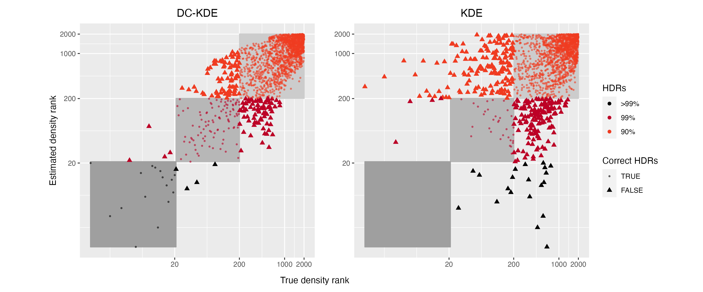
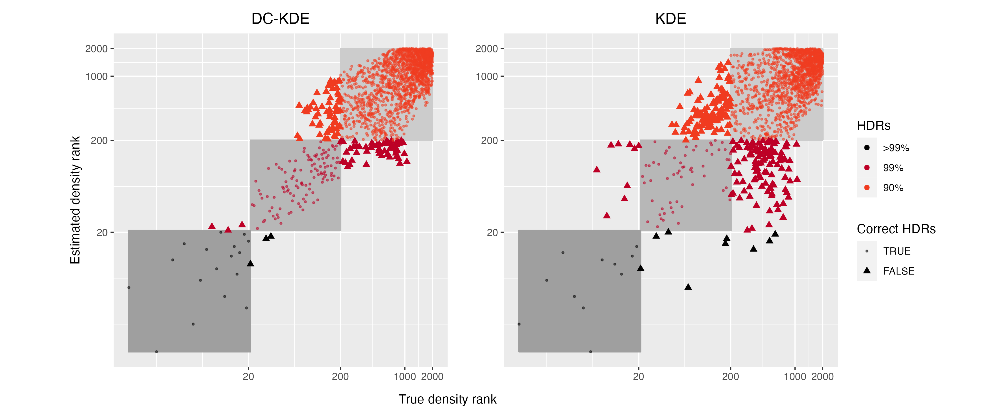
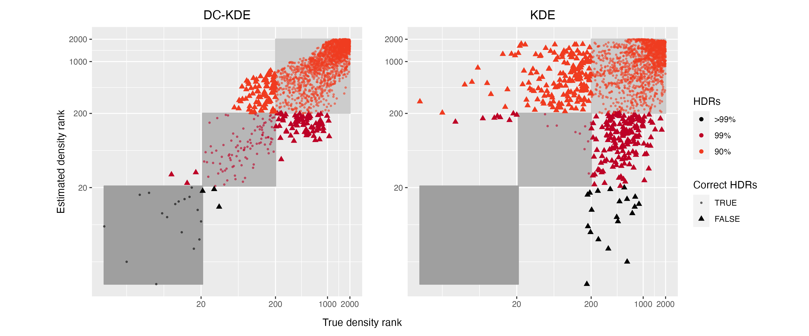

\appendix

# Notions about Riemannian geometry {#riemgeo}

In this appendix, we present some notions about the Riemannian geometry used in this paper.

## Differentiable manifolds

In topology, a *homeomorphism* is a bijective map between two topological spaces that is continuous in both directions. A *Hausdorff space* is a topological space where any two distinct points can be separated by disjoint neighborhoods. And a $d$-dimensional (topological) *manifold* $M$ is a connected Hausdorff space $(M, \mathcal{T}_M)$ where the neighborhood $U$ for each point $p$ is homeomorphic to an open subset $V$ of the Euclidean space $\mathbb{R}^d$. Such a homeomorphism $\varphi: U \rightarrow V$ together with $U$ gives a (coordinate) *chart*, denoted as $(U, \varphi)$, with the corresponding local coordinates $(x^1(p),\dots, x^d(p)) := \varphi(p)$. Further, a collection of charts $\{U_\alpha, \varphi_\alpha\}$ ranging over the manifold $M$ is called an *atlas*, denoted as $\mathcal{A}$.

The manifold $M$ is a *differentiable manifold* if there exists an atlas of $M$, $\{U_\alpha, \varphi_\alpha\}$, such that the *transition maps* between any two charts,
$$
\varphi_\beta \circ \varphi_\alpha^{-1}: \varphi_\alpha(U_\alpha \cap U_\beta) \rightarrow \varphi_\beta(U_\alpha \cap U_\beta),
$$ are differentiable of class $C^\infty$ (smooth).
Let $\varphi$ be an injective map: $E \rightarrow \varphi(E)$. Then $\varphi$ is an *embedding* of $E$ into $M$ if and only if
$\varphi: E \rightarrow \varphi(E)$ is a homeomorphism, and $\varphi(E)$ is called an embedded submanifold of $M$ with the subspace topology.

## Tangent vector and tangent space

The tangent vector at point $p$ can be intuitively viewed as the velocity of a curve passing through point $p$ or as the directional derivatives at $p$. Here we define the tangent vector via the velocity of curves.

For any point $p \in M$, let $\gamma_1: (-\epsilon_1, \epsilon_1)\rightarrow M$ and $\gamma_2: (-\epsilon_2, \epsilon_2)\rightarrow M$ be two smooth curves passing through $p$, i.e. $\gamma_1(0) = \gamma_2(0) = p$. We say $\gamma_1$ and $\gamma_2$ are *equivalent* if and only if there exists a chart $(U,\varphi)$ at $p$ such that
$$
(\varphi \circ \gamma_1)^\prime(0) = (\varphi \circ \gamma_2)^\prime(0).
$$
A *tangent vector* to a manifold $M$ at point $p$, denoted as $v_p$, is any equivalent class of the differentiable curves initialized at $p$. The set of all tangent vectors at $p$ defines the *tangent space* of $M$ at $p$, denoted as $T_pM$. The tangent space is a vector space of dimension $d$, equal to the dimension of $M$, and it does not depend on the chart $\varphi$ locally at $p$. The collection of all tangent spaces defines the *tangent bundle*, $TM = \cup_{p \in M}T_pM$.

Tangent vectors can also be seen as the directional derivatives at $p$. For a given coordinate chart $\varphi=(x^1,\dots,x^d)$, the tangent vectors defining partial
derivatives are denoted as $\frac{\partial}{\partial x^1}(p),\dots,\frac{\partial}{\partial x^d}(p)$, which defines a *basis* of the tangent space.
The tangent space $T_pM$ also admits a dual space $T^\star_pM$ called the *cotangent space* with the corresponding *cotangent vectors* $z_p: T^\star_pM \rightarrow \mathbb{R}^d$ and a basis denoted as $dx^1(p),\dots,dx^d(p)$.

## Riemannian metric and geodesic distance

A Riemannian metric $g_p$ defined on the tangent space $T_pM$ at each point $p$ is a local inner product $T_pM \times T_pM \rightarrow \mathbb{R}$, where $g_p$ is a $d\times d$ symmetric positive definite matrix and varies smoothly at $p$. Generally, we
omit the subscript $p$ and refer to $g$ as the Riemannian metric. The inner product between two vectors $u, v \in T_pM$ is written as $\langle u, v \rangle_g = g_{ij}u^iv^j$ using the Einstein summation convention where implicit summation over all indices, $\sum_{i,j} g_{ij}u^iv^j$, is assumed. A differentiable manifold $M$ endowed with the Riemannian metric $g$ on each tangent space $T_pM$ is called a *Riemannian manifold* $(M,g)$.

The Riemannian metric $g$ can be used to define the norm of a vector $u$, $\|u\| = \sqrt{\langle u,v \rangle_g}$, and the angle between two vectors $u$ and $v$, $\cos\theta = \frac{\langle u,v \rangle_g}{\|u\| \|v\|}$, which are the geometric quantities induced by $g$. It could also be used to define the line element $dl^2 = g_{ij}dx^i dx^j$ and the volume element $dV_g = \sqrt{\det(g)}dx^1 \dots dx^d$, where $(x^1,\dots,x^d)$ are the local coordinates of the chart $(U, \varphi)$.
For a curve $\gamma: I \rightarrow M$, the length of the curve is
$$
l(\gamma) = \sqrt{\int_0^1 \|\gamma^\prime(t)\|^2_g dt} = \sqrt{\int_0^1 g_{ij} \frac{dx^i}{dt} \frac{dx^j}{dt} dt},
$$
where $\gamma(I) \subset U$. The volume of $W \subset U$ is defined as
$$
Vol(W) = \int_W \sqrt{\det(g)}dx^1 \cdots dx^d,
$$
which is also called the *Riemannian measure* on $M$.

The *geodesics* of $M$ are the smooth curves that locally join the points along the shortest path on the manifold. Intuitively, geodesics are the *straightest possible curves* in a Riemannian manifold [Section 7.2.3 of @Nakahara2018-zs].
A curve $\gamma: I \rightarrow M$ is a geodesic if for all indices $i,j,k$, the second-order ordinary differential equation is satisfied,
$$
\frac{d^2 x^i}{dt^2} + \Gamma^i_{jk} \frac{d x^j}{dt} \frac{dx^k}{dt} = 0,
$$
where $\{x^i\}$ are the coordinates of the curve $\gamma$ and $\Gamma^i_{jk}$ is the *Christoffel symbol* defined by
$$
\Gamma^i_{jk} = \frac{1}{2} \sum_l g^{il} (\frac{\partial g_{il}}{\partial x^k}
+ \frac{\partial g_{kl}}{\partial x^j} - \frac{\partial g_{jk}}{\partial x^l}).
$$
The geodesics have a constant speed with norm $\| \gamma^\prime(t) \|$, and they are the local minimizers of the arc
length functional $l:\gamma \rightarrow \sqrt{\int_0^1 \| \gamma^\prime(t) \|_g^2 dt}$ when the curves are defined over the interval $[0,1]$.
The *geodesic distance* $d_g$ is the length of the shortest geodesic between two points on the manifold. For a point $p \in M$, when the geodesic distance starting at $p$ is not minimized, we call such set of points the *cut locus* of $p$, and the distance to the cut locus is the *injectivity radius* at $p \in M$. Therefore, the injectivity radius of the Riemannian manifold $(M,g)$, $\textit{inj}_gM$, is the infimum of the injectivity radii over all points on the manifold.


## Exponential map and logarithmic map

Denote $B(p, r) \subset M$ as an open ball centered at point $p$ with radius $r$. Then $B(0_p, r) = exp_p^{-1}(B(p,r))$ is an open neighborhood of $0_p$ in the tangent space at $p$, $T_pM$, where $exp_p$ is the *exponential map* at point $p$. The exponential map maps a tangent vector $u \in B(0_p, r)$ to the endpoint of the geodesic $\gamma: I \rightarrow M$ satisfying $\gamma(0)=p, \gamma^{\prime}(0)=u$, and $\gamma(1)=exp_p(u)$. It is a differentiable bijective map of differentiable inverse (i.e. *diffeomorphism*). Intuitively, the exponential map moves point $p$ to an endpoint at speed $u$ after covering the length of $\|u\|$ along the geodesic in one time unit.

The inverse of the exponential map is called the *logarithm map*, denoted as $\log_p(q):= \exp^{-1}_p(q)$, which gives the tangent vector to get from point $p$ to $q$ in one unit time. Also define the *geodesic ball* centered at $p$ of radius $r > 0$ as the image by the exponential map of $B(0_p, r) \subset T_pM$ with $r < \textit{inj}_gM$. Then we could interpolate a geodesic $\gamma$ between two points $p$ and $q$ with the exponential map and the logarithmic map, $\gamma(t) = \exp_p(t\log_p(q))$, and the geodesic distance is given by $d_g(p,q) = \|\log_p(q)\|_g$.
<!-- [TODO: reference in appendix]. -->

## Pushforward and pullback metric

Pushforward and pullback are two notions corresponding to the notions of tangent and cotangent vectors.
Let $\phi: M \rightarrow E$ be a smooth map between the Riemannian manifold $(M,g)$ to another smooth manifold $E$. Then the differential of $\phi$ at point $p$ is a linear map $d\phi_p: T_pM \rightarrow T_{\phi (p)}E$, which pushes the tangent vector $u \in T_pM$ at point $p$ forward to the tangent vector $\phi_*u \in T_{\phi (p)}E$ at the mapping point $\phi(p)$.
The image of the tangent vector $u \in T_pM$ under the differential $d\phi_p$, denoted as $d\phi_p u$ is called the pushforward of $u$ by the map $\phi$.
Then pushforward metric $h=\varphi_*g$ of the Riemannian metric $g$ along $\varphi$ is given by the inner product
$$
\langle \phi_*u,\phi_*v \rangle_{\varphi*g} = \langle d\phi_p \phi_*u, d\phi_p \phi_*v \rangle_{g}.
$$

<!--  is a linear map $f_*:TM \rightarrow TE$, which maps the tangent vectors $u$ at point $p \in M$ to the tangent vectors $f_*u$ at the mapping point $f(p) \in E$.
For two tangent vectors $u, v \in T_{f(p)}E$, we have
$$
\langle u,v \rangle_{\varphi*g} = \langle df_p^{-1}u, df_p^{-1}v \rangle_{g},
$$
where $df_p^{-1}$ is the Jacobian of $f^{-1}$.  -->

The tangent vectors $\phi_*u$ are equivalent to the velocity vector of a curve $\gamma: I\rightarrow M$ passing through point $p$ at time zero with a constant speed $\gamma^{\prime}(0)=u$,
$$
d\phi_p(\gamma^{\prime}(0)) = (\phi \circ \gamma)^\prime (0).
$$
Similarly, the pullback maps the cotangent vectors $z_{f(p)}$ at $f(p) \in E$ to cotangent vectors at $p \in M$ acting on tangent vectors $u \in T_pM$. The linear map is called the pullback by $\phi$ and is often denoted as $\phi^*$.


# Rank comparison plots for twin peaks mapping {#twinpeaksappe}

This appendix contains the comparison plots for the density rank between DC-KDE and KDE using different manifold learning algorithms, similar to \autoref{fig:tpisomapden}, \autoref{fig:tptsneden}, and \autoref{fig:tpisomapvs4ml}. 
The density rank used in the paper is defined as the relative position or order of an item within a set from the lowest to the highest, based on its density value.
By comparing these plots, it could be concluded that DC-KDE could categorize the density ranks into the highest density regions more accurately than KDE. By correcting the distortion in different manifold learning embeddings, DC-KDE is more robust in identifying the lowest density regions, which are usually used to detect anomalies.

```{r tplleden, fig.align = 'center', out.width = "100%", fig.cap="Scatterplot of true density and estimated density ranks of LLE embedding for DC-KDE and KDE, with colors indicating the absolute rank errors weighted by the sum of true and estimated ranks. DC-KDE shows a strong linear positive relationship with a higher rank correlation compared to KDE.", echo = FALSE}

```

```{r tpleden, fig.align = 'center', out.width = "100%", fig.cap="Scatterplot of true density and estimated density ranks of Laplaxian Eigenmaps embedding for DC-KDE and KDE, with colors indicating the absolute rank errors weighted by the sum of true and estimated ranks. DC-KDE shows a strong linear positive relationship with a higher rank correlation compared to KDE.", echo = FALSE}

```

```{r tpumapden, fig.align = 'center', out.width = "100%", fig.cap="Scatterplot of true density and estimated density ranks of UMAP embedding for DC-KDE and KDE, with colors indicating the absolute rank errors weighted by the sum of true and estimated ranks. DC-KDE shows a strong linear positive relationship with a higher rank correlation compared to KDE.", echo = FALSE}

```


```{r tpllevs4ml, fig.align = 'center', out.width = "90%", fig.cap="Comparison of outliers found by LLE compared to the other four for DC-KDE (on the left panel) and KDE (on the right panel). The four colors and shapes represent the four gaussian kernels in the 2-D metadata. Outliers found by DC-KDE are more consistent regardless of the manifold learning embedding.", echo = FALSE}
knitr::include_graphics("figures/Twin Peak2000_density_compare_llevs4ml_radius8_r0_5_rank.png")
```
```{r tplevs4ml, fig.align = 'center', out.width = "95%", fig.cap="Comparison of outliers found by Laplacian Eigemaps compared to the other four for DC-KDE (on the left panel) and KDE (on the right panel).", echo = FALSE}
knitr::include_graphics("figures/Twin Peak2000_density_compare_levs4ml_radius8_r0_5_rank.png")
```
```{r tptsnevs4ml, fig.align = 'center', out.width = "95%", fig.cap="Comparison of outliers found by t-SNE compared to the other four for DC-KDE (on the left panel) and KDE (on the right panel).", echo = FALSE}
knitr::include_graphics("figures/Twin Peak2000_density_compare_tsnevs4ml_radius8_r0_5_rank.png")
```
```{r tpumapvs4ml, fig.align = 'center', out.width = "95%", fig.cap="Comparison of outliers found by UMAP compared to the other four for DC-KDE (on the left panel) and KDE (on the right panel).", echo = FALSE}
knitr::include_graphics("figures/Twin Peak2000_density_compare_umapvs4ml_radius8_r0_5_rank.png")
```
