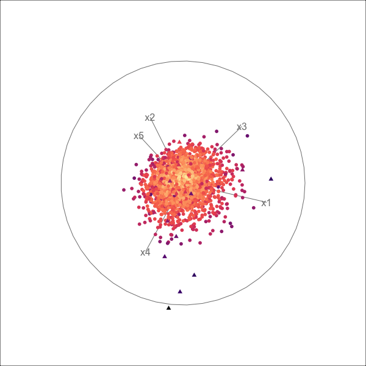

```{r setup, include=FALSE}
knitr::opts_chunk$set(
  echo = TRUE,
  cache = FALSE,
  messages = FALSE,
  warning = FALSE,
  eval = TRUE
  # include = FALSE
)
options(tinytex.verbose = TRUE)
library(tidyverse)
library(dimRed)
library(reticulate)
library(here)
library(viridis)
library(hdrcde)
library(igraph)
library(matrixcalc)
library(akima)
library(car)
library(ggforce)
library(ks)
library(patchwork)
# library(copula)
library(plotly)
Jmisc::sourceAll(here::here("R/sources"))
# set.seed(123)
```


# Introduction
	
	Background (anomaly detection with density) with summarized contribution

		Anomaly detection on very high-dimensional data. Applications. Main contribution.

	Anomaly detection using densities, other methods for anomaly detection. Based manifold learning embeddings, density estimates

	Density estimation methods, KDE with distortion, 2-D variable kernel denstiy estimate with Riemannian matrix

	- Main contributions: better anomaly detection

		fix distortion with Riemmannian matrix

		anomaly detection using density estimates

		kernel density estimate is not accurate

		improve density estimation with distortion in the embedding plot


In manifold learning, the underlying idea is that the data lies on a low-dimensional smooth manifold which is embedded in a high-dimensional space. One of the fundamental objectives of manifold learning is to explore the geometry of the dataset, including the distances between points and volumes of regions of data. These intrinsic geometric attributes of the data, such as distances, angles, and areas, however, can be distorted in the low-dimensional embedding, leading to failure to recover the geometry of the manifold [@Goldberg2008-co]. To tackle this problem and measure the distortion incurred in manifold learning, @Perrault-Joncas2013-pq propose the Metric Learning algorithm to augment any existing embedding output with geometric information in the Riemannian metric of the manifold itself. By applying the Metric Learning algorithm, the outputs of different manifold learning methods can be unified and compared under the same framework, which would highly benefit in improving the effectiveness of the embedding.

The Riemannian metric defined at each point of the manifold is used to compute the geometric quantities, including angle, length, and volume, of the low-dimensional manifold embedding in any coordinate system, and be further applied to correct the distortion caused by the manifold learning algorithms. 
In variable kernel density estimate, the bandwidth matrix $H$ is also defined to control the amount of smoothing for each data point. 
Therefore, if we could replace the bandwidth matrix with the Riemannian metric, we could further get the kernel density estimation of the manifold $\mathcal{M}$. This kernel density estimate can then be used to produce the highest density region plots [@Hyndman1996-lk] for anomaly detection. 
The proposed schematic is shown in Figure \@ref(fig:vkde). 

(ref:vkdecaption) The proposed schematic for variable kernel density estimation with recovered geometry.
```{r vkde, fig.align = 'center', out.width = "95%", fig.cap = "(ref:vkdecaption)", echo = FALSE, eval=FALSE}
knitr::include_graphics(here::here("report/vkde.png"))
```

Now I briefly describe different steps involved in this main chapter. By applying an existing manifold learning algorithm to the data $X\in \mathbb{R}^r$ with $n$ observations, a low-dimensional embedding $f_n \in \mathbb{R}^d$ can be computed. Most manifold learning methods involve the construction of the nearest neighbor graph based on which the Laplace-Beltrami operator $\Delta_\mathcal{M}$ is built. The Laplacian is quite useful because it can be coordinate-free while containing all the important geometry. @Perrault-Joncas2013-pq have stated one way to compute the approximated $\Delta_\mathcal{M}$ with a discrete consistent estimator, the geometric graph Laplacian $\mathcal{L}_{\varepsilon,n}$ [@Zhou2011-za], where $\varepsilon$ is the radius parameter for the nearest neighbor graph. The graph Laplacian together with the embedding can be used in the Metric Learning algorithm to achieve the augmented embedding with the Riemannian metric $(f_n, g_n)$. The highlighted two steps in Figure \@ref(fig:vkde) are the main contributions of this main chapter, replacing the bandwidth matrix $H_i$ with the Riemannian metric $g_i$ for each point in variable kernel density estimate, and computing the highest density region plots based on the density estimates, $\hat{f}(\mathbb{x})$, for anomaly detection.


The rest of the paper is organized as follows.
In \autoref{vkde}, we present the proposed algorithm to detect anomalies based on variable kernel density estimates of manifold embeddings. In this section, we provide justification for the use of Riemannien matrix as the bandwidth of variable kernel density estimation, including the comparison with fixed bandwidth.
\autoref{simulation} is composed with two simulations with the proposed algorithm; the first deals with a 2-dimensional meta data and the second with a 100-dimensional meta data.
\autoref{application} contains the application to visualize and identify anomalies in the [TODO] data.
Conclusions and discussions are presented in \autoref{conclusion}.


# Variable kernel density estimation with manifold embeddings {#vkde}

	Idea: whole process for the main contribution

	Kernel density estimate with variable bandwidth

In this section, we introduce the proposed method to detect anomalies based on the kernel density estimates of manifold learning embeddings where the Riemannian matrix is used as the pointwise variable bandwidth to measure the direction and angle of the distortion of the low-dimensional embeddings. For a high-dimensional data set, various manifold learning algorithms including ISOMAP, LLE, Laplacian Eigenmaps, t-SNE, and UMAP, are applied to get a low-dimensional embedding. The manifold learning algorithms map the points through nonlinear functions that stretches some regions of the space while shrinks others. @Perrault2009 gives us an idea of how to measure the direction and angle of the distortion using the Riemannian metric and the Riemannian metric is a positive simi-definite square matrix for each data point. To learn the distribution of the low-dimensional embedding, we use the kernel density estimation with the bandwidth matrix being the Riemannian metric. The outliers could then be defined as the points with lowest density estimates. 

To start with, we introduce the notations in this manuscript. Then we introduce the multivariate kernel density estimation method with variable bandwidth matrix and the metric learning algorithm to derive the pointwise Riemannian metrix. Finally, we propose our novel method to detect anomalies for high-dimensional data set.

	
## Notations


## Two dimensional kernel density estimation

<!-- In general a multivariate kernel density estimate looks something like this -->

<!-- $$ -->
<!-- \hat{f}(\mathbf{x})=\sum\limits_{i=1}^N K_{\mathbf{H}}(\mathbf{x}-\mathbf{x}_i) -->
<!-- $$ -->

<!-- where if a Gaussian kernel is used -->

<!-- $$ -->
<!-- K_{\mathbf{H}}(\mathbf{x}-\mathbf{x}_i)=(2\pi)^{-d/2}|\mathbf{H}|^{-1/2}\exp\left[-\frac{1}{2}(\mathbf{x}-\mathbf{x}_i)'\mathbf{H}^{-1}(\mathbf{x}-\mathbf{x}_i)\right] -->
<!-- $$ -->

<!-- The matrix $\mathbf{H}$ is called the bandwidth matrix and is very important.  -->

For a bivariate random sample $\pmb X_1, \pmb X_2, \ldots, \pmb X_n$ 
drawn from a density $f$, 
the kernel density estimate is defined by
$$
\hat{f} (\pmb x; \pmb H) = n^{-1}\sum_{i=1}^n K_{\pmb H} ( \pmb x - \pmb{X}_i)
$$
where $\pmb x = (x_1, x_2)^T$ and $\pmb{X}_i = (X_{i1}, X_{i2})^T, i = 1, 2,  
\ldots, n$.  Here 
$K(\pmb x)$ is the kernel which is a symmetric probability density function, 
$\pmb H$ is the bandwidth matrix which is symmetric and positive-definite,  
and $K_{\pmb H}(\pmb x) = |\pmb H|^{-1/2} K( \pmb H^{-1/2} \pmb x)$. 
The choice of $K$ is not crucial: we take 
$K(\pmb x) = (2\pi)^{-1} \exp(-\tfrac{1}{2} \pmb x^T \pmb x)$ the standard normal
throughout.  
In contrast, the choice of $\pmb H$ is crucial in determining the performance of $\hat f$. 
The most common parameterizations of the bandwidth matrix
are the diagonal and the 
general or unconstrained which has no restrictions on $\pmb H$
provided that $\pmb H$ remains positive definite and symmetric, that is 
$$
\pmb H = \begin{bmatrix}h_1^2 & 0 \\0 & h_2^2 \end{bmatrix}
\ \mathrm{or} \ 
\pmb H = \begin{bmatrix}h_1^2 & h_{12} \\ h_{12}  & h_2^2 \end{bmatrix}.
$$
This latter parameterization allows kernels to have an arbitrary orientation
whereas the former only allows kernels which are oriented to the
co-ordinate axes.


<!-- The bandwidth matrix is about smoothing and it is.  -->
An alternative way to think of kernel estimation is that kernel densities 'borrow strength' from nearby points and the bandwidth determines what is "nearby".  If the bandwidth is large then all points are "nearby" and we get an overly smooth kernel density estimate.  The interesting thing about a bandwidth matrix is that it allows for different notions of what is "nearby" along different coordinates and even along diagonal directions.


    Riemannian matrix could be used to measure distortion

    Use riemannian matrix as variable bandwidth
        Bandwidth is a symmetric positive-definite square matrix, similar to riemannian matrix

## Use riemannian matrix as variable bandwidth

The Riemannian estimated using the method of Perrault Joncas and Meila (2009) gives some idea of the distortion of an embedding (or so they claim). Mapping the points through a non-linear function "stretches" some regions of space and "shrinks" others. The Riemannian gives us an idea of the direction and angle of this stretching.  The Riemannian is quite a technical concept but an important thing to understand is that the estimate that comes out of Perrault Joncas algorithm is a square matrix.

We saw how points that are far apart in the embedding may not have been so far apart on the original manifold.  The Riemannian gives us some way of correcting this.  Similarly a bandwidth matrix in a kernel density estimate is all about determining the "directions" in which there should be more or less "closeness".  So the basic idea is to replace the kernel density estimate with

$$
\hat{f}(\mathbf{x})=\sum\limits_{i=1}^N K_{\mathbf{H}_i}(\mathbf{x}-\mathbf{x}_i)\\
K_{\mathbf{H}_i}(\mathbf{x}-\mathbf{x}_i)=(2\pi)^{-d/2}|\mathbf{H}_i|^{-1/2}\exp\left[-\frac{1}{2}(\mathbf{x}-\mathbf{x}_i)'\mathbf{H}_i^{-1}(\mathbf{x}-\mathbf{x}_i)\right]
$$

where $H_i$ is either the Riemannian or the inverse of the Riemannian (I am not totally sure which one).  Notice that the bandwidth matrix is different for each point.  This makes it a kernel density estimate with local smoothing, which is quite interesting, but we should take care to understand the properties of such things.  
<!-- There is a paper by Terrel and Scott from Annals of Statistics in 1992 where they talk about this (it is called "variable kernel density estimation"). Some other search terms to find relevant papers might be "adaptive" or "varying bandwidth". I don't know if anyone has had the idea of bringing all these ideas together with manifold learning and the estimate of the Riemannian - we should do a thorough literature search.  However, if no one has already done this I think it is a very interesting way to do anomaly detection for very high dimensional data. -->


The Riemannian metric $g$ is a symmetric and positive definite tensor field which defines an inner product $<,>_g$ on the tangent space $T_p\mathcal{M}$ for every point $p \in \mathcal{M}$. 
If the inner product of the tangent space is known for a given geometry, the Riemannian metric is a good measure to recover the geometry of manifold.
The Metric Learning algorithm [@Perrault-Joncas2013-pq] then augment the embedded manifold with the Riemannian metric and produce a Riemannian manifold $(\mathcal{M}, g)$.

To recover the original geometry of the manifold, we need to know what the inner product corresponds to in the embedding. 
The inner product between two vectors $u,v \in T_p\mathcal{M}$, $<u,v>_g=g_{ij}u^iv^j$[^1], can be used to define some geometric quantities, such as the vector norm $\|u\|=\sqrt{<u,v>_g}$ and the angle between two vectors $\cos{\theta}=\frac{<u,v>_g}{\|u\|\|v\|}$ in the tangent space. Therefore, for each point $p\in \mathcal{M}$ in any coordinate system, the Riemannian metric $g$ is a $d\times d$ symmetric positive definite matrix, where $d$ is the dimension of the manifold.

[^1]: Here the Einstein notation is used where superscripts denote summation over $i$ and $j$

The line element and volume element of the full manifold or a subset of the manifold can also be computed from $g$. The arc length of a curve $c\in \mathcal{M}$ is defined as 
$$
l(c)=\int_a^b \sqrt{g_{ij} \frac{dx^i}{dt} \frac{dx^j}{dt}} dt,
$$
where $(x^1,\dots,x^d)$ are the coordinates of chart $(U,x)$ and $c(t)$ is a function mapping $[a,b]$ to $\mathcal{M}$. While the volume of $V\subset \mathcal{M}$ is computed by
$$
Vol(V)=\int_V \sqrt{\|g\|} dx^1\dots dx^d.
$$
Both the concepts of distance and volume are relevant to kernel density estimation.


    	- Manifold learning distortion

    		dimension reduction using manifold learning
    		Riemannian matrix to measure topological distortion
    		distortion is informative for true embedding

The aim of the project is not to evaluate different manifold learning algorithms.  Although ISOMAP worked OK here it is still distorted and in real examples you will never 'know' that the data are uniform on the sphere.  Instead the idea of this project is to do kernel density estimation in a way that takes distortion into account.


### Metric Learning algorithm

@Perrault-Joncas2013-pq propose the Metric Learning algorithm which mainly involves four main steps.

As pointed out by @Perrault-Joncas2013-pq, if the embedding dimension $s$ is larger than the manifold intrinsic dimension $d$, the rank of the embedding metric $h_n(p)$ is $d$; otherwise, the Riemannian metric $g_n$ will be returned. 
This algorithm is also implemented in a Python library *megaman* [@McQueen2016-xz]. It is designed to apply the manifold learning methods to large-scale data sets, as well as computing the Riemannian metric of the manifold. 


Learn metric algorithm

\begin{algorithm}[!htb]
  \caption{Learn metric algorithm}
  \label{alg:learnmetric}
  \DontPrintSemicolon
  \SetAlgoLined
  \SetKwInOut{Input}{Input}\SetKwInOut{Output}{Output}\SetKwInOut{Parameter}{parameter}\SetKwInOut{OptParameter}{optimization parameter}
  \Input{ high-dimensional data $x_i \in \pmb{R}^p$ for all $i=1,\ldots,N$ }
  \Output{ low-dimensional data $y_i \in \pmb{R}^d$ and its Riemannian metric $h_i$ for all $i=1,\ldots,N$ }
  \Parameter{ embedding dimension $d$, bandwidth parameter $\sqrt{\varepsilon}$, manifold learning algorithm }
  \OptParameter{ manifold learning parameters }
  \BlankLine
  \begin{algorithmic}[1]

  \STATE Construct a weighted neighborhood graph $\mathcal{G}_{w,\varepsilon}$ with weight matrix $W$ where $w_{i,j}=\exp(-\frac{1}{\varepsilon}\|x_i-x_j\|^2)$ for data points $x_i,x_j \in \mathbb{R}^p$;

  \STATE Calculate the $N\times N$ geometric graph Laplacian $\widetilde{\mathcal{L}}_{\varepsilon,N}$ by
  $$
  \widetilde{\mathcal{L}}_{\varepsilon,N} = 1/(c\varepsilon)(\widetilde{D}^{-1} \widetilde{W} - I_N),
  $$
  where $\widetilde{D}=diag{\widetilde{W}\pmb{1}}$, $\widetilde{W} = D^{-1}WD^{-1}$, and $D = diag{W\pmb{1}}$;

  \STATE Embed each data point $x\in \mathbb{R}^p$ to embedding coordinates $y(x)=(y^1(x),\dots,y^d(x))$ by any existing manifold learning algorithm;

  \STATE Obtain the matrix $\tilde{h}(x)$ at each point by applying the graph Laplacian $\widetilde{\mathcal{L}}_{\sqrt{\varepsilon},N}$ to the embedding coordinates $y$ with each element being
  $$
    \tilde{h}^{i j}=\frac{1}{2}\left[\tilde{\mathcal{L}}_{\varepsilon, N}\left(y_i \cdot y_j\right)-y_i \cdot\left(\tilde{\mathcal{L}}_{\varepsilon, n} y_j\right)-y_j \cdot\left(\tilde{\mathcal{L}}_{\varepsilon, n} y_i\right)\right];
  $$

  \STATE Calculate the Riemannian metric $h(x)$ as the rank $d$ pseudo inverse of $\tilde{h}(x)$ with 
  $$
    h(x) = U diag{1/(\Gamma[1:d])} U^\prime,
  $$
  where $[U, \Gamma]$ is the eigendecomposition of matrix $\tilde{h}(x)$, and $U$ is the matrix of column eigenvectors ordered by the eigenvalues $\Gamma$ in descending order.

  \end{algorithmic}
\end{algorithm}


## Proposed algorithm

Now we present our proposed method for anomaly detection based on variable kernel density estimates.

\begin{algorithm}[!htb]
  \caption{Variable kernel density estimates with Riemannian metric}
  \label{alg:vkderm}
  \DontPrintSemicolon
  \SetAlgoLined
  \SetKwInOut{Input}{Input}\SetKwInOut{Output}{Output}\SetKwInOut{Parameter}{parameter}\SetKwInOut{OptParameter}{optimization parameter}
  \Input{ high-dimensional data $x_i$ for all $i=1,\ldots,N$ }
  \Output{ outliers embedding coordinates $y_1, \dots, y_{\textit{n_outliers}}$ with their estimated densities $f_1, \dots, f_{\textit{n_outliers}}$ }
  \Parameter{ number of outliers \textit{n_outliers}, embedding dimension $d$ }
  \OptParameter{ }
  \BlankLine
  \begin{algorithmic}[1]

  \STATE for all $i=1,\ldots,N$, compute the $d$-dimensional embeddings $y_i$ with any exsiting manifold leanring algorithms and the corresponding Riemannian metric $h_i$ using Algorithm&nbsp;\@ref(alg:learnmetric) with inputs $d$ and $\sqrt{\varepsilon} = 0.4$ and $c=0.25$ for heat kernels;

  \STATE Set the variable bandwidth for each point as $h_i$;

  \STATE Compute the kernel density estimates for each point as
  $$
  \hat{f}(\mathbf{y})=\sum\limits_{i=1}^N K_{\mathbf{H}_i}(\mathbf{x}-\mathbf{x}_i)\\
  K_{\mathbf{H}_i}(\mathbf{x}-\mathbf{x}_i)=(2\pi)^{-d/2}|\mathbf{H}_i|^{-1/2}\exp\left[-\frac{1}{2}(\mathbf{x}-\mathbf{x}_i)'\mathbf{H}_i^{-1}(\mathbf{x}-\mathbf{x}_i)\right];
  $$

  \STATE Reorder the embedding coordinates $y$ according to the density estimates $f(y)$ and subset the top $\textit{n_outliers}}$ as the outliers.

  \end{algorithmic}
\end{algorithm}

Now that we have proposed a way to take into account the distortion of manifold in kernel density estimate, it would be straightforward to produce the highest density region plots [HDR plots; @Hyndman1996-lk] which are also computed using kernel density estimate of the embedding. Similar to Figure \@ref(fig:hdr) in Chapter \ref{mlann}, we can use the HDR plots to do anomaly detection and apply it to very high dimensional data sets.


# Simulation {#simulation}

In this section, we exam two scenarios for both low and high dimensions to test our proposed algorithm. For visualization purpose, \autoref{twodgaussian} presents a 2-D meta data example. We first simulate the data of size $N=2000$ from a mixture of four Gaussian kernels with the same covariance but different means, each consisting of $500$ points. Different mapping functions are then applied to the 2-D meta data so that they now lie on a 3-D feature space, which gives the input data for different manifold learning algorithms, including ISOMAP, LLE, Laplacian Eigenmaps, t-SNE, and UMAP. The embedded dimension is set as $D=2$, same as the meta data dimension. This enables us to compare the manifold learning embedding with the true meta data. We could now apply the algorithm described in [TODO]. Similarly, the second simulation in \autoref{fivedgaussian} is based on a 5-D meta data embedded in a 100-D space and the corresponding embedding dimension is $D=5$.

## 2-D Meta data from a Gaussian Mixture Model {#twodgaussian}

We first generate a 2-dimensional data of size $N=2000$ from a Gaussian mixture model with four components with means $\pmb{\mu_1}=(0.25, 0.25)^\prime, \pmb{\mu_2}=(0.25, 0.75), \pmb{\mu_3}=(0.75, 0.25), \pmb{\mu_4}(0.75, 0.75)$ and the same variance-covariance matrix $\pmb{\Sigma}_i=diag(0.02, 0.02), i=1,2,3,4$. The mixture proportions are equally set as $\pi_i=0.25, i=1,2,3,4$.
<!-- $\big(\begin{smallmatrix} 0.02&0\\ 0&0.02 \end{smallmatrix}\big)$. -->
Then the mixture Gaussian mixture density function is a weighted linear combination of the four component Gaussian densities as
\begin{equation}
\label{eq:gmm}
P(\pmb{X}=\pmb{x}) = \sum_{i=1}^{4}\pi_i \frac{1}{(2\pi)^{d/2}|\pmb{\Sigma}_i|^{-1/2}} \exp{\{-\frac{1}{2} (\pmb{x}-\pmb{\mu_i})^\prime \pmb{\Sigma}_i^{-1} (\pmb{x}-\pmb{\mu_i}) \}}.
\end{equation}
\autoref{fig:metadensity} shows the 2-dimensional meta data and the colors indicate the true density of all data points, with brighter colors showing high densities and dark colors showing low densities. We then define outliers as points with lowest densities shown in black and typical points with highest densities shown in yellow. Based on the true density plot, the outliers are scattered in the middle and the outer area of the whole structure, while typical points are near the means of four kernels. This is the baseline to be compared with outliers from variable kernel density estimates.

```{r metadensity, fig.align = 'center', out.width = "80%", fig.cap="True density of the Gaussian mixture model of four kenels with means $(0.25, 0.25), (0.25, 0.75), (0.75, 0.25), (0.75, 0.75)$ and the same variance-covariance matrix $diag(0.02, 0.02)$", echo = FALSE}
knitr::include_graphics("figures/truedensity_4kernels.png")
```

Given the 2-D meta data, multiple mapping functions could be applied to embed the data in a 3-D space. One of the most famous example in manifold learning is the swiss roll data, with the mapping function as below. 
$$
\left\{ 
\begin{array}{lcl}
X = X_1 \times \cos{X_1}, \\
Y = X_2, \\
Z = X_1 \times \sin{X_1}.
\end{array}
\right.
$$
Now we are able to apply different manifold learning algorithms to reduce the dimension back to 2, and further estimate the density of the embedding to detect anomalies. According to the density estimates, we could rank the data points and then identify which observations lie in an highest density region of specified coverage, eg. 1%, 50%, 99%, >99%. The top outliers with lowest densities are also indexed in blue, which we call *true outliers*. For each of the four manifold learning methods, namely ISOMAP, LLE, t-SNE, and UMAP, \autoref{fig:sroutliers} presents in one column the 2-D embedding plot, with the colors indicating the densities, the top row for true densities from the Gaussian mixture model, the middle row for highest density region plots with densities from our proposed variable KDE, and the bottom for similar HDR plots with densities from KDE with fixed bandwidth. Since there are four kernels in the meta data and darker points are the defined outliers, we could derive that for ISOMAP and LLE, variable kernel density estimates could detect the number of kernels more accurately than the KDE with fixed bandwidth. As for t-SNE and UMAP, both embeddings are quite close to each other with points clustered together, but the mixture of kernel structure is not as clear as ISOMAP and UMAP. Instead, we could roughly compare the location of outliers. For t-SNE, the middle plot have indexed more true outliers than the bottom plot; while for UMAP, both the middle and bottom plot fail to find the true outliers, but the outliers from fixed bandwidth are more scattered along the curved embedding.

```{r sroutliers, fig.align = 'center', out.width = "95%", fig.cap="Highest density region plots of four manifold learning embeddings of the swiss roll data. Colors are indicating densities from top: true densities from the Gaussian mixture model; middle: KDE with Riemannian matrix as variable bandwidth; and bottom: KDE with fixed bandwidth. Variable KDE preforms better in finding kernel structures with ISOMAP and LLE, and in locating outliers with t-SNE. Both methods are not detecting outliers accurately when using UMAP.", echo = FALSE}
knitr::include_graphics("figures/outliers_comparison_4ml_3cases.png")
```

```{r mappings, fig.align = 'center', out.width = "80%", fig.cap="3-D Mappings of the meta data with colors indicating four kernels. Left: swiss roll mapping. Right: twin peak mapping.", echo = FALSE}
knitr::include_graphics("figures/mappings_sr_tp.png")
```

For comparison, we use the same meta data with different mapping function, twin peak mapping, with the corresponding 3-D data is shown in \autoref{fig:mappings}. The four colors in both mappings represents the four gaussian kernels in the meta data. Similar to \autoref{fig:sroutliers}, four manifold learnings are obtained and used to detect outliers with two bandwidth selection methods in \autoref{fig:tpoutliers}.

```{r tpoutliers, fig.align = 'center', out.width = "95%", fig.cap="Highest density region plots of four manifold learning embeddings of the twin peak data. Variable KDE preforms better in finding kernel structures with ISOMAP and LLE, and in locating outliers with t-SNE and UMAP.", echo = FALSE}
knitr::include_graphics("figures/twin_peak_outliers_comparison_4ml_3cases.png")
```

<!-- Multiple mapping functions: swiss roll, twin peak -->

<!-- Manifold learning results for the mapped 3-D data -->

<!--     ISOMAP, LLE, Laplacian Eigenmaps, t-SNE, UMAP (useful ones, and the one with too severe distortion) -->

<!-- Outlier plot based on density estimates -->

<!--     Fixed bandwidth -->

<!--     Pointwise adaptive bandwidth using Riemmanien -->

<!--     Comparison -->

<!--         Rank of densities with the true density (f=f_1/4 + f_2/4 + f_3/4 + f_4/4) -->
<!--         Sum of squared errors in the density estimates -->


## 5-D data embedding in 100-D space {#fivedgaussian}

For the high-dimensional case, we generate the meta data from a 5-dimensional semi-hypersphere. First, we simulate $N=2000$ points from a 4-dimensional Gaussian mixture model with two mixture components, $\mathcal{N}(\pmb{\mu}_1, \pmb{\Sigma}_1)$ and $\mathcal{N}(\pmb{\mu}_2, \pmb{\sigma}_2)$, where $\pmb{\mu}_1 = \pmb{\mu}_2 =(0, 0, 0, 0)^\prime$, $\pmb{\Sigma}_1 = diag(1,1,1,1)$, and $\pmb{\Sigma}_1 = diag(25,25,25,25)$. In order to manually generate anomalies, the mixture proportions are set as $\pi_1=0.99$ and $\pi_2=0.01$.
The fifth dimension is calculated to satisfy $x_1^2 + x_2^2 + x_3^2 + x_4^2 + x_5^2 = r^2$ where $r$ is set as 15. Similarly, the Gaussian mixture densities could be calculated using Equation \@ref(eq:gmm) as the true density of the 5-d meta data. \autoref{fig:fivedmeta} shows a scatterplot when animating a 5-D tour path with the R package *tourr* [REFERENCE].
Then we initial the other 95 dimensions in the high-dimensional space as zero columns and further rotate the 100-dimensional data of size $N$ (denote the transpose of the data matrix as $X$) to get rid of the zeros so that it could be passed to the manifold learning algorithms.
The rotation matrix is derived from the QR decomposition of a $100\times 100$ matrix $A$ with all components randomly generated from a uniform distribution $\mathcal{U}(0,1)$. 
For any real matrix $A$ of dimension $p\times q$, the QR decomposition could decompose the matrix into the multiplication of two matrix $Q$ and $R$ so that $A = QR$, where the dimension of $Q$ is a matrix with unit norm orthogonal vectors, $Q^\prime Q = I$, and $R$ is an upper triangular matrix. Matrix $Q$ is used as the rotation matrix and it satisfies 
$X^\prime X=(QX)^\prime(QX)$, where the rotated data matrix $(QX)^\prime$ is now the input for the manifold learning algorithms.

```{r fivedmeta, fig.align = 'center', out.width = "60%", fig.cap="Scatterplot display of the animation of a 5-D tour path.", echo = FALSE}

```

# Application {#application}

	Dataset

	Goal and process

	Results (Plots and tables)

	Analysis and summary

# Conclusion {#conclusion}

	Summary of the contribution and conclusion

	Details about the process

	Shortcoming and other references for future direction (improvement on density estimation, other kernels, densities on edges, bad embeddings with inaccurate distortions, multi-dimensional kernel density estimate)


<!-- ## Using dimension reduction algorithms -->

<!-- Now we can try to see what happens when we use an actual dimension reduction algorithm, for instance ISOMAP -->

<!-- ```{r isomap, echo=TRUE,message=FALSE, eval=FALSE} -->
<!-- dat<-dimRedData(cbind(x,y,z)) #Prepare data to use in dimRed -->
<!-- emb<-embed(dat,"Isomap") #Isomap embedding -->
<!-- plot(hdrscatterplot(emb@data@data[,1],emb@data@data[,2])) #HDR plot -->
<!-- ``` -->

<!-- Which seems to not distort things too much.  The HDR plot still identifies outliers (because it has to) but they are just scattered around the corners in a very non-systematic way.  -->

<!-- For something that leads to a lot of distortion have a look t t-SNE. -->


<!-- ```{r tsneplot, echo=TRUE,message=FALSE, eval=FALSE} -->
<!-- emb_tsne<-embed(dat,"tSNE") #tSNE embedding -->
<!-- plot(hdrscatterplot(emb_tsne@data@data[,1],emb_tsne@data@data[,2])) #HDE plot -->
<!-- ``` -->
