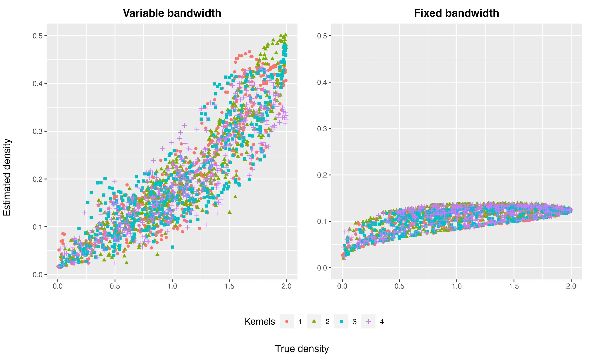

```{r setup, include=FALSE}
knitr::opts_chunk$set(
  echo = TRUE,
  cache = FALSE,
  messages = FALSE,
  warning = FALSE,
  eval = TRUE
  # include = FALSE
)
options(tinytex.verbose = TRUE)
library(tidyverse)
# library(dimRed)
# library(reticulate)
library(here)
# library(viridis)
library(hdrcde)
# library(igraph)
# library(matrixcalc)
# library(akima)
library(car)
# library(ggforce)
# library(ks)
library(patchwork)
# library(copula)
library(plotly)
library(kableExtra)
# Jmisc::sourceAll(here::here("R/sources"))
# set.seed(1234)
```

\newpage

# Introduction

Anomaly detection has been an important and diverse area where anomalies or outliers are detected in a given data. It often involves a data analysis process to uncover the unusual patterns and has been widely applied to machine learning [@Omar2013-lz], network intrusions identification [@Ahmed2016-co; @Bhuyan2013-ra], medical imaging [@Fernando2022-ef], fraudulent attacks [@Ahmed2016-dz], cyber-security [@Ten2011-co], energy consumption [@Cheng2021-ex], the last of which explored detecting households with anomalous electricity usage distributions instead of raw data. 
In the case of non-Euclidean sample space, the observations lie on a Riemannian manifold embedded in a very high-dimensional ambient space, which makes it computationally expensive or impossible to detect anomalies. To address this problem, we propose a kernel density estimator of the low-dimensional statistical manifold embedding and find outliers as the data with the lowest density estimates.

Kernel density estimation [KDE; @Parzen1962-gt; @Chen2017-dw] is one of the most popular methods to calculate the probability density function from a sample dataset. KDE is flexible to learn the shape of the underlying density from the data controlled by the bandwidth and the selection of bandwidth is crucial in KDE [@Jones1990-oe; @Terrell1992-ut]. There is extensive research on bandwidth selection, two main categories of which are cross-validation [@Jones1992-ta; @Sain1994-gr] and plug-in methods [@Wand1994-gc; @Duong2003-sp]. For multivariate data, variable kernel density estimator [VKDE;  @Jones1990-oe; @Terrell1992-ut] has been studied with an adaptive bandwidth matrix to control the amount of smoothing on the location of the estimated point [balloon estimator; @Terrell1992-ef] or the data point [sample smoothing estimator; @Terrell1992-ef].
However, these density estimators are based on random samples in the Euclidean space. 

For samples points lying on a manifold with the differentiable structure called the Riemannian manifold, @Pelletier2005-vu proposed a kernel density estimator based on the kernel weight depending on the distance between the estimated points and the sample data points. The idea of the estimator is to use a strictly positive function of the geodesic distance on the manifold and then normalize it with the volume density function of the Riemannian manifold for curvature. [@Henry2009-ll] In many application scenarios, we tend to find that the sample points on a manifold are embedded in a much higher-dimensional space, and the kernel density estimator from @Pelletier2005-vu is not directly applicable. This is when we introduce manifold learning to reduce the input data dimension.
For these high-dimensional data set, various manifold learning algorithms including ISOMAP, LLE, Laplacian Eigenmaps, t-SNE, and UMAP (see details of these algorithms in @Cheng2021-ex), are applied to get a low-dimensional embedding. We propose a kernel density estimator to be applied to the low-dimensional embedding and define outliers as those with the lowest densities. 

In manifold learning, the underlying idea is that the data lies on a low-dimensional smooth manifold that is embedded in a high-dimensional space. One of the fundamental objectives of manifold learning is to explore the geometry of the dataset, including the distances between points and volumes of regions of data. These intrinsic geometric attributes of the data, such as distances, angles, and areas, however, can be distorted in the low-dimensional embedding, leading to failure to recover the geometry of the manifold [@Goldberg2008-co]. To tackle this problem and measure the distortion incurred in manifold learning, @Perrault-Joncas2013-pq propose the Learn metric algorithm to augment any existing embedding output with geometric information in the Riemannian metric of the manifold itself. By applying this algorithm, the outputs of different manifold learning methods can be unified and compared under the same framework, which would highly benefit in improving the effectiveness of the embedding.

The Riemannian metric using the method of @Perrault-Joncas2013-pq gives some idea of the distortion of an embedding. Mapping the points through a non-linear function "stretches" some regions of space and "shrinks" others. The Riemannian gives us an idea of the direction and angle of this stretching, which is informative for learning the manifold.
In variable kernel density estimate, the bandwidth matrix $H$ is also defined to control the amount of smoothing for each data point. 
Therefore, we propose to the use Riemannian metric as the bandwidth matrix in, we could further get the kernel density estimation of the manifold $\mathcal{M}$. This kernel density estimate can then be used to produce the highest density region plots [@Hyndman1996-lk] for outlier visualization. 

The rest of the paper is organized as follows.
In \autoref{vkde}, we present the proposed algorithm to detect anomalies based on variable kernel density estimates of manifold embeddings. In this section, we provide justification for the use of the Riemannian metric as the bandwidth of variable kernel density estimation, including the comparison with fixed bandwidth.
\autoref{simulation} is composed of two simulations with the proposed algorithm; the first deals with 2-dimensional meta data mapped into a 3-D swiss roll or twin peaks data and the second with a 5-D semi-hypersphere mapped in a 100-D space.
\autoref{application} contains the application to visualize and identify anomalies in the Irish smart meter dataset.
Conclusions and discussions are presented in \autoref{conclusion}.


# Notions about Riemannian geometry {#riemgeo}

In this section, we present some notions about the Riemannian geometry used in this paper.

## Differentiable manifolds

In topology, a *homeomorphism* is a bijective map between two topological spaces that is continuous in both directions. 
A *Hausdorff space* is a topological space where any two distinct points can be separated by disjoint neighborhoods.
A $d$-dimensional (topological) *manifold* $M$ is a connected Hausdorff space $(M, \mathcal{T}_M)$ where the neighborhood $U$ for each point $p$ is homeomorphic to an open subset $V$ of the Euclidean space $\mathbb{R}^d$. Such a homeomorphism $\varphi: U \rightarrow V$ and $U$ gives a (coordinate) *chart*, denoted as $(U, \varphi)$, with the corresponding local coordinates $(x_1(p),\dots, x_d(p)) := \varphi(p)$. A collection of charts $\{U_\alpha, \varphi_\alpha\}$ ranging over the manifold $M$ is called an *atlas*, denoted as $\mathcal{A}$.
The manifold $M$ is a *differentiable manifold* if there exists an atlas of $M$, $\{U_\alpha, \varphi_\alpha\}$, such that the *transition maps* between any two charts,
$$
\varphi_\beta \circ \varphi_\alpha^{-1}: \varphi_\alpha(U_\alpha \cap U_\beta) \rightarrow \varphi_\beta(U_\alpha \cap U_\beta),
$$
are differentiable of class $C^\infty$ (smooth).

Let $\varphi$ be an injective map $E \rightarrow \varphi(E)$. Then $\varphi$ is an embedding of $E$ into $M$ if and only if $\varphi: E \rightarrow \varphi(E)$ is a homeomorphism. $\varphi(N)$ is called an embedded submanifold of $M$ with the subspace topology.

## Tangent vector and tangent space

The tangent vector at point $p$ can be intuitively viewed as the velocity of a curve passing through the point $p$ or as the directional derivatives at $p$. Here we define the tangent vector via the velocity of curves.

For any $p \in M$, let $\gamma_1: (-\epsilon_1, \epsilon_1)\rightarrow M$ and $\gamma_2: (-\epsilon_2, \epsilon_2)\rightarrow M$ be two smooth curve through $p$, i.e. $\gamma_1(0) = \gamma_2(0) = p$. $\gamma_1$ and $\gamma_2$ are *equivalent* if and only if there exists a chart, $(U,\varphi)$, at $p$ such that
$$
(\varphi \circ \gamma_1)^\prime(0) = (\varphi \circ \gamma_2)^\prime(0).
$$
A *tangent vector* to $M$ at $p$ is any equivalent class of the differentiable curves initialized at $p$. 
The set of all tangent vectors at $p$ defines the *tangent space* of $M$ at $p$, denoted as $T_pM$. The tangent space is vector space of dimension $d$, equal to the dimension of $M$, and it does not depend on the charts $\varphi$ locally at $p$. The collection of all tangent spaces defines the *tangent bundle* $TM = \cup_{p \in M}T_pM$.
Tangent vectors can also be seen as the directional derivatives at $p$. For a given coordinate chart $\varphi=(x_1,\dots,x_d)$, the tangent vectors defining partial derivatives are denoted as $\frac{\partial}{\partial x_1}(p),\dots,\frac{\partial}{\partial x_d}(p)$, which define a *basis* of the tangent space $T_pM$.

The tangent space $T_pM$ also admits a dual space $T^*_pM$ called the *cotangent space* with corresponding *cotangent vector* $z_p: T^*_pM \rightarrow \mathbb{R}^d$, and basis denoted as $dx_1(p),\dots,dx_d(p)$.

## Pushforward and pullback metric

Pushforward and pullback are two notions corresponding to the notions of tangent and cotangent vectors. 
Let $f$ be an embedding from the Riemannian manifold $(M,g)$ to another smooth manifold $E$. The pushforward $h=\varphi*g$ of the Riemannian metric $g$ along $\varphi \equiv f^{-1}$ is a linear map $f_*:TM \rightarrow TE$, which maps the tangent vectors $u_p$ at point $p \in M$ to the tangent vectors $f_*u_p$ at the mapping point $f(p) \in E$, and satisfies that for $u, v \in T_f(p)E$,
$$
<u,v>_{\varphi*g_p} = <df_p^{-1}u, df_p^{-1}v>_{g_p},
$$
where $df_p^{-1}$ is the Jacobian of $f^{-1}$. 
The tangent vectors  $f_*u_p$ are equivalent to the velocity vector of a curve $\gamma: I\rightarrow M$ passing through point $p$ at time zero with a constant speed $\gamma^{-1}(0)=u_p$.
Similarly, the pullback maps the cotangent vectors $z_{f(p)}$ at $f(p) \in E$ to cotangent vectors at $p \in M$ acting on tangent vectors $u \in T_pM$.


<!-- embedding pushforward metric [@Perrault-Joncas2013-pq] -->

## Riemannian metric and geodesic distance

A Riemannian metric $g_p$ defined on the tangent space $T_pM$ at each point $p$ is a local inner product $T_pM \times T_pM \rightarrow \mathbb{R}$, where $g_p$ is $d\times d$ symmetric positive definite and varies smoothly at $p$. Generally, we omit the subscript $p$ and refer to $g$ as the Riemannian metric. 
The inner product for two vectors $u, v \in T_pM$ is written as $<u, v>_g = g_{ij}u^iv^j$ using the Einstein summation convention where implicit summation over all indices, $\sum_{i,j}$, is assumed. 
A differentiable manifold $M$ endowed with the Riemannian metric $g$ on each tangent space $T_pM$ is called a *Riemannian manifold* $(M,g)$.

The Riemannian metric $g$ can be used to define the norm of a vector $u$, $\|u\| = \sqrt{<u,v>_g}$ and the angle between two vectors $u$ and $v$, $\cos\theta = \frac{<u,v>_g}{\|u\| \|v\|}$, which are the geometric quantities induced by $g$.
$g$ could also be used to define the line element $dl^2 = g_{ij}dx_idx_j$ and the volume element $dV_g = \sqrt{\det(g)}dx_1\dots dx_d$, where $(x_1,\dots,x_d)$ are the local coordinates of the chart $(U, \varphi)$. 
For a curve $\gamma: I \rightarrow M$, the length of the curve is 
$$l(\gamma) = \sqrt{\int_0^1 \|\gamma\prime(t)\|^2_g dt} = \sqrt{\int_0^1 g_{ij} \frac{dx_i}{dt} \frac{dx_j}{dt} dt}$$,
where $\gamma(I) \subset U$. The volume $W \subset U$ is defined as
$$
Vol(W) = \int_W \sqrt{\det(g)}dx_1 \dots dx_d,
$$
which is also called the *Riemannian measure* on $M$.

The *geodesics* of $M$ are the smooth curves that locally joins the points along the shortest path on the manifold. A curve $\gamma: I \rightarrow M$ is a geodesic if for all indices $i,j,k$,
the second-order ordinary differential equation is satisfied,
$$
\frac{d^2 x^i}{dt^2} + \Gamma^i_{jk} \frac{d x_j}{dt} \frac{dx_k}{dt} = 0,
$$
where $\Gamma^i_{jk}$ is the *Christoffel symbol* defined by
$$
\Gamma^i_{jk} = \frac{1}{2} \sum_l g_{il} (\frac{\partial g_{il}}{\partial x_k} 
+ \frac{\partial g_{kl}}{\partial x_j} - \frac{\partial g_{jk}}{\partial x_l}).
$$
The geodesics have a constant speed with norm $\| \gamma^\prime(t) \|$, and they are the local minimizers of the arc length functional $l:\gamma \rightarrow \int_0^1 \| \gamma^\prime(t) \| dt$ when the curves are defined over the interval $[0,1]$. The *geodesic distance* $d_g$ is the length of the shortest geodesic between two points on the manifold. 
For a point $p \in M$, when the geodesic distance starting at $p$ is not minimized, we call such set of points the *cut locus* of $p$, and the *injectivity radius* at $p \in M$ is the distance to the cut locus. The injectivity radius of $(M,g)$, $\textit{inj}_gM$ is the infimum of the injectivity radii over all points on the manifold.

<!-- ### Isometry -->


## Exponential map and logarithmic map

Denote $B(p, r) \subset T_pM$ as an open ball centered at point $p$ with raidus $r$. Then $B(0_p, r) = exp_p^{-1}(B(p,r))$ is an open neighborhood of $0_p$ in the tangent space at $p$, $T_pM$.
Define $exp_p$ as the *exponential map* at point $p$, where $exp_p$ is a differentiable, bijective map of differentiable inverse (i.e. *diffeomorphism*) that maps a tangent vector $u \in B(0_p, r)$ to the endpoint of the geodesic $\gamma: I \rightarrow M$ satisfying $\gamma(0)=p, \gamma^{-1}(0)=u$, and $\gamma(1)=exp_p(u)$.
The exponential map moves point $p$ from $p$ at speed $u$ to an endpoint after covering the length of $\|u\|$ along the geodesic in one time unit. 
The inverse of the exponential map is called the *logarithm map*, $\log_p(q):= \exp^{-1}_p(q)$, which gives the vector from point $p$ to $q$.
Also define the *geodesic ball* centered at $p$ of radius $r > 0$ as the image by the exponential map of $B(0_p, r) \subset T_pM$ with $r < \textit{inj}_gM$.
Then we could interpolate a geodesic $\gamma$ between two points $p$ and $q$ with the exponential map and the logarithmic map, $\gamma(t) = \exp_p(t\log_p(q))$, and the geodesic distance is given by $d_g(p,q) = \|\log_p(q)\|_g$.


## Canonical metric

<!-- For a compact Kahler manifold M, canonical metric can mean: (i) Kahler-Enstein metric or (ii) metric with constant scalar curvature which is the extremal metric of the Calabi functional. -->


## Volumn density function

For any $u \in T_pM$, let $\gamma(u): t \rightarrow \exp(\frac{tu}{\|u\|})$ and let $w_i, i=1,\dots,d$ be Jacobi fields along $\gamma$ such that $w_i(0)=0$, for all $i=1,\dots,d$, $Dw_1/dt(0)=u/\|u\|$ and $Dw_i/dt(0)$ forms an orthonomal basis of the tangent space $T_pM$. 
Define $\theta_p(q): T_pM \rightarrow \mathbb{R}$ the volume density function on $M$ as
$$
\theta_p(u) = \|u\|^{d-1} \det(w_1(\|u\|),\dots,w_d(\|u\|)).
$$
<!-- $$ -->
<!-- \theta_p: q \rightarrow \theta_p(q)=\frac{\mu_{\exp_p{g}}}{\mu_{g_p}}(\exp^{-1}_p(q)), -->
<!-- $$ -->
Rewrite $\theta_p(u) = \theta_p(\log_p(u))$.
The exponential map $\exp_p: T_pM \rightarrow M$ induced by pullback of a volume form $\exp_p^*\textit{vol}$ on $T_pM$, and
$\theta_p$ is its density with respect to the Lebesgue measure of the Euclidean structure on $T_pM$, which gives in normal coordinates
$$
d\exp_p^*vol(u) = \theta_p(u)du.
$$

<!-- the volume density function is the quotient of the canonical measure of the Riemannian metric $\exp_p{g}$ on $T_pM$ by the Lebesgue measure of the Euclidean structure $g_p$ on $T_pM$. -->


## Laplace-Beltrami operator


# Kernel density estimation on manifolds {#vkde}

In this section, we introduce the proposed method to detect anomalies based on the kernel density estimates of manifold learning embeddings where the Riemannian matrix is used as the pointwise variable bandwidth to measure the direction and angle of the distortion of the low-dimensional embeddings. @Perrault-Joncas2013-pq gives us an idea of how to measure the direction and angle of the distortion using the Riemannian metric and the Riemannian metric is a positive definite square matrix for each data point. To learn the distribution of the low-dimensional embedding, we use the kernel density estimation with the bandwidth matrix being the Riemannian metric. The outliers could then be defined as the points with the lowest density estimates. The proposed schematic is shown in Figure \@ref(fig:vkde). The highlighted two steps in Figure \@ref(fig:vkde) are the main contributions of this main chapter, replacing the bandwidth matrix $\pmb{h}_i$ with the Riemannian metric $\pmb{g}_i$ for each point in variable kernel density estimate, and computing the highest density region plots based on the density estimates, $\hat{f}(\pmb{x})$, for anomaly detection.

(ref:vkdecaption) The proposed schematic for variable kernel density estimation with recovered geometry.
```{r vkde, fig.align = 'center', out.width = "95%", fig.cap = "(ref:vkdecaption)", echo = FALSE, eval=TRUE}

```

To start with, we introduce the notations used in this manuscript. Then we introduce the multivariate kernel density estimation method with variable bandwidth matrix and the metric learning algorithm to derive the pointwise Riemannian metric. Readers familiar with these topics could skip the corresponding subsections. Finally, we propose our novel algorithm to estimate densities and detect anomalies for high-dimensional data set.
	
## Notations

Denote the $s$-dimensional input data with observations $x_i, i = 1, 2, \dots, N$, where $x_i \in \mathcal{R}^s$. The underlying manifold $\mathcal{M}$ has the true density $f$. Manifold learning takes the input data and finds its $d$-dimensional representation of data that lie on the manifold $\mathcal{M}$, with output data points $y_i, i = 1, 2, \dots, N$, where $y_i \in \mathcal{R}^d$ and $d \ll s$. The Riemannian metric of the embedding is denoted as $\pmb{g_i}, i = 1, 2, \dots, N$. In kernel density estimate, the pointwise variable bandwidth matrix $H_i$ is used to estimate the density of the embedding, $\hat{f}$. 

## Kernel density estimator on Riemannian manifolds

Consider a compact Riemannian manifold $(\mathcal{M}, g)$ of dimension $d$ without boundary and a probability distribution with density $f$ on the manifold. Assume $(\mathcal{M}, d_g)$ is a complete metric space, where $d_g$ is the Riemannian distance induced by $g$ and the strictly positive injectivity radius [@Chavel2006-mp] of the manifold. Denote $A_i, i = 1, 2, \dots, N$, where $A_i \in \mathcal{R}^d$, as i.i.d. random objects on $\mathcal{M}$ with density $f$. For each $p\in \mathcal{M}$, @Pelletier2005-vu proposed the kernel density estimator of $f$ to be
\begin{equation}
\label{eq:denriem}
f_N(p) = \frac{1}{N} \sum_{i=1}^{N} \frac{1}{h^d \theta_p(A_i)} K(\frac{d_g(p, A_i)}{h}),
\end{equation}
where $\theta_p(x)$ is the volume density function on the manifold, $K: \mathcal{R}_{+} \rightarrow \mathcal{R}$ is a non-negative function, and $h$ is the bandwidth.
@Pelletier2005-vu discussed the volume density function $\theta_p(x)$ defined for $p$ in a neighborhood of $x$ on the manifold, with the geodesic normal coordinates at $x$, $\theta_p(x)$ is equal to the determinant of the Riemannian metric $g$ at $\exp_p^{-1}(x)$. The expression in \@ref(eq:denriem) is also proved to be consistent with the kernel density estimators in the Euclidean case as
\begin{equation}
\label{eq:denconsist}
f_N(p) = \frac{1}{N} \sum_{i=1}^{N} \frac{1}{h^d} K(\frac{\|p-A_i\|}{h}),
\end{equation}
and converges at the same rate as the Euclidean kernel density estimator [@Henry2009-ll].

However, in application, we usually found the observations lie on a $d$-dimensional manifold embedded in a $s$-dimensional space, where $d \ll s$. Then manifold learning can be applies to find the $d$-dimensional representation of the manifold $M$. Therefore, based on the estimator in \@ref(eq:denriem), we propose to a kernel density estimator of f with the manifold embedding $y_i, i = 1, 2, \dots, N$ to be
\begin{equation}
\label{eq:denestimator}
f_N(p) = \frac{1}{N} \sum_{i=1}^{N} \frac{1}{h_i^d |g(\exp_p^{-1}(y_i))|} K(\frac{d_g(p, y_i)}{h_i}),
\end{equation}
where $h_i, i = 1, 2, \dots, N$ is the pointwise variable bandwidth matrix and $h_i$ is positive definite with dimension $d\times d$.

An important goal of manifold learning is to recover the local or global features of the data. In order to recover the geometry of the manifold, @Perrault-Joncas2013-pq propose a method to augment any existing reasonable embedding and allow for the computation of geometric values to be calculated with an estimation of the Riemannian metric $g$. This could also be used to fix the geometric distortion in the embedding. It is worth noticing that the Riemannian metric from @Perrault-Joncas2013-pq is a $d\times d$ positive definite matrix for each data point. Therefore, we propose to take the geometric distortion into consideration when estimating the kernel densities of the embedding with Equation \@ref(eq:denestimator). In this way, we present a consistent kernel density estimator with pointwise variable bandwidth as the Riemannian metric. 


## Multivariate kernel density estimation

In general, a multivariate variable kernel density estimate of $f$ at point $\pmb{x} \in \mathcal{R}^d$ is defined as
$$
\hat{f}(\pmb{x})=\sum\limits_{i=1}^N K_{\pmb{h}_i}(\pmb{x}-\pmb{a}_i),
$$
where $a_i, i = 1, 2, \dots, N$ is the random sample drawn from a density $f$, $\pmb{h}_i$ is a $d\times d$ symmetric positive definite matrix that is variable at $i$, and $K_{\pmb{h}_i}$ is the kernel function
$$
K_{\pmb{h}_i}(\pmb{x}-\pmb{a}_i)=(2\pi)^{-d/2}|\pmb{h}|^{-1/2}\exp\left[-\frac{1}{2}(\pmb{x}-\pmb{a}_i)'\pmb{h}_i^{-1}(\pmb{x}-\pmb{a}_i)\right],
$$
with $|\pmb{h}_i|$ being the determinant of matrix $\pmb{h}_i$. The bandwidth matrix is important in controlling the smoothing across all data points and the shape is determined by the kernel function $K(\pmb{x})$. We use the sample smooth estimator for each data point, which makes a kernel density estimate with local smoothing.
@Duong2007-up present an R package *ks* that implement kernel density estimates with fixed bandwidth and variable bandwidth, but it is limited to bandwidth vector or diagonal matrix and does not apply to full bandwidth matrix.


## Riemannian metric as variable bandwidth

The Riemannian metric $g$ is a symmetric and positive definite tensor field which defines an inner product $<,>_g$ on the tangent space $T_p\mathcal{M}$ for every point $p \in \mathcal{M}$. 
If the inner product of the tangent space is known for a given geometry, the Riemannian metric is a good measure to recover the geometry of the manifold.
The Metric Learning algorithm [@Perrault-Joncas2013-pq] then augment the embedded manifold with the Riemannian metric and produce a Riemannian manifold $(\mathcal{M}, g)$.

To recover the original geometry of the manifold, we need to know what the inner product corresponds to in the embedding. 
The inner product between two vectors $u,v \in T_p\mathcal{M}$, $<u,v>_g=g_{ij}u^iv^j$[^1], can be used to define some geometric quantities, such as the vector norm $\|u\|=\sqrt{<u,v>_g}$ and the angle between two vectors $\cos{\theta}=\frac{<u,v>_g}{\|u\|\|v\|}$ in the tangent space. Therefore, for each point $p\in \mathcal{M}$ in any coordinate system, the Riemannian metric $g$ is a $d\times d$ symmetric positive definite matrix, where $d$ is the dimension of the manifold.

[^1]: Here the Einstein notation is used where superscripts denote summation over $i$ and $j$

The line element and volume element of the full manifold or a subset of the manifold can also be computed from $g$. The arc length of a curve $c\in \mathcal{M}$ is defined as 
$$
l(c)=\int_a^b \sqrt{g_{ij} \frac{dx^i}{dt} \frac{dx^j}{dt}} dt,
$$
where $(x^1,\dots,x^d)$ are the coordinates of chart $(U,x)$ and $c(t)$ is a function mapping $[a,b]$ to $\mathcal{M}$. While the volume of $V\subset \mathcal{M}$ is computed by
$$
Vol(V)=\int_V \sqrt{\|g\|} dx^1\dots dx^d.
$$
Both the concepts of distance and volume are relevant to kernel density estimation.


@Perrault-Joncas2013-pq propose the Learn metric algorithm which mainly involves four steps: weighted neighborhood graph construction; geometric graph Laplacian calculation; manifold learning; and Riemannian metric calculation. We restate these four steps in Algorithm \@ref(alg:learnmetric).
By applying an existing manifold learning algorithm to the data $X\in \mathbb{R}^r$ with $n$ observations, a low-dimensional embedding $f_n \in \mathbb{R}^d$ can be computed. Most manifold learning methods involve the construction of the nearest neighbor graph based on which the Laplace-Beltrami operator $\Delta_\mathcal{M}$ is built. The Laplacian is quite useful because it can be coordinate-free while containing all the important geometry. @Perrault-Joncas2013-pq have stated one way to compute the approximated $\Delta_\mathcal{M}$ with a discrete consistent estimator, the geometric graph Laplacian $\mathcal{L}_{\varepsilon,n}$ [@Zhou2011-za], where $\varepsilon$ is the radius parameter for the nearest neighbor graph. The graph Laplacian together with the embedding can be used in the Metric Learning algorithm to achieve the augmented embedding with the Riemannian metric $(f_n, g_n)$.

As pointed out by @Perrault-Joncas2013-pq, if the embedding dimension $s$ is larger than the manifold intrinsic dimension $d$, the rank of the embedding metric $h_n(p)$ is $d$; otherwise, the Riemannian metric $g_n$ will be returned. 
This algorithm is also implemented in a Python library *megaman* [@McQueen2016-xz]. It is designed to apply the manifold learning methods to large-scale data sets, as well as compute the Riemannian metric of the manifold. 

\begin{algorithm}[!htb]
  \caption{Learn metric algorithm in \cite{Perrault-Joncas2013-pq} }
  \label{alg:learnmetric}
  \DontPrintSemicolon
  \SetAlgoLined
  \SetKwInOut{Input}{Input}\SetKwInOut{Output}{Output}\SetKwInOut{Parameter}{parameter}\SetKwInOut{OptParameter}{optimization parameter}
  \Input{ high-dimensional data $x_i \in \mathcal{R}^s$ for all $i=1,\ldots,N$ }
  \Output{ low-dimensional data $y_i \in \mathcal{R}^d$ and its Riemannian metric $h_i$ for all $i=1,\ldots,N$ }
  \Parameter{ embedding dimension $d$, bandwidth parameter $\sqrt{\varepsilon}$, manifold learning algorithm }
  \OptParameter{ manifold learning parameters }
  \BlankLine
  \begin{algorithmic}[1]

  \STATE Construct a weighted neighborhood graph $\mathcal{G}_{w,\varepsilon}$ with weight matrix $W$ where $w_{i,j}=\exp(-\frac{1}{\varepsilon}\|x_i-x_j\|^2)$ for data points $x_i,x_j \in \mathbb{R}^s$;

  \STATE Calculate the $N\times N$ geometric graph Laplacian $\widetilde{\mathcal{L}}_{\varepsilon,N}$ by
  $$
  \widetilde{\mathcal{L}}_{\varepsilon,N} = 1/(c\varepsilon)(\widetilde{D}^{-1} \widetilde{W} - I_N),
  $$
  where $\widetilde{D}=diag{\widetilde{W}\pmb{1}}$, $\widetilde{W} = D^{-1}WD^{-1}$, and $D = diag{W\pmb{1}}$;

  \STATE Embed each data point $x_i\in \mathcal{R}^s$ to embedding coordinates $\pmb{y}=(\pmb{y}^1,\dots,\pmb{y}^d)^\prime$ by any existing manifold learning algorithm;

  \STATE Obtain the matrix $\pmb{\tilde{h}}$ of all data point by applying the graph Laplacian $\widetilde{\mathcal{L}}_{\sqrt{\varepsilon},N}$ to the embedding coordinates matrix $\pmb{y}$ with each element vector in $\pmb{\tilde{h}}$ being
  $$
    \pmb{\tilde{h}}^{i j} = \frac{1}{2} \left[\tilde{\mathcal{L}}_{\varepsilon, N}\left(y^i \cdot \pmb{y}^j\right) - \pmb{y}_i \cdot\left(\tilde{\mathcal{L}}_{\varepsilon, n} \pmb{y}^j\right) - \pmb{y}^j \cdot\left(\tilde{\mathcal{L}}_{\varepsilon, n} \pmb{y}^i\right)\right],
  $$
  where $i,j=1,\dots,d$ and the $\cdot$ calculation is the elementwise product between two vectors; 

  \STATE Calculate the Riemannian metric $\pmb{h}$ as the rank $d$ pseudo inverse of $\tilde{\pmb{    h}}$ with 
  $$
    \pmb{h} = U diag{1/(\Lambda[1:d])} U^\prime,
  $$
  where $[U, \Lambda]$ is the eigendecomposition of matrix $\pmb{\tilde{h}}(x)$, and $U$ is the matrix of column eigenvectors ordered by the eigenvalues $\Lambda$ in descending order.

  \end{algorithmic}
\end{algorithm}


# Outlier detection on manifold learning embedding

Now we present our proposed algorithm for anomaly detection based on variable kernel density estimates in \@ref(alg:vkderm). There are mainly four steps involved in the algorithm. The first step is to apply the Learn metric algorithm described in \@ref(alg:learnmetric) to the input high-dimensional data $x_i,i=1,\ldots,N$ where $x_i\in \mathcal{R^s}$ to get the low-dimensional embedding $y_i$, where $y_i\in \mathcal{R^d}$ and the Riemannian metric $\pmb{H}_i$ with dimension $d\times d$ for each observation. Two parameters $\sqrt{\varepsilon} = 0.4$ and $c=0.25$ are given for Gaussian kernels. Then we could use the pointwise Riemannian metric to calculate the kernel density estimate with our proposed estimator in Equation \@ref(eq:denestimator). The top outliers of size $n\_outliers$ are obtained by ordering the embedding points $y_i$ according to their density estimates $f_N(\pmb{y}_i)$.

\begin{algorithm}[!htb]
  \caption{Variable kernel density estimates with Riemannian metric}
  \label{alg:vkderm}
  \DontPrintSemicolon
  \SetAlgoLined
  \SetKwInOut{Input}{Input}\SetKwInOut{Output}{Output}\SetKwInOut{Parameter}{parameter}
  \Input{ high-dimensional data $x_i$ for all $i=1,\ldots,N$ }
  \Output{ outliers embedding coordinates $y_1, \dots, y_{n\_outliers}$ with their estimated densities $f_1, \dots, f_{n\_outliers}$ }
  \Parameter{ number of outliers $n\_outliers$, embedding dimension $d$ }
  \BlankLine
  \begin{algorithmic}[1]

  \STATE For all $i=1,\ldots,N$, compute the $d$-dimensional embeddings $y_i$ with any exsiting manifold leanring algorithms and the corresponding Riemannian metric $\pmb{g}_i$ using the Learn metric algorithm with inputs $d$ and $\sqrt{\varepsilon} = 0.4$ and $c=0.25$ for heat kernels;

  \STATE Set the variable bandwidth for each observation as $\pmb{h}_i = \pmb{g}_i$;

  \STATE Compute the kernel density estimates $f_N(\pmb{y}_i)$ for all $i=1,\ldots,N$ using Equation \@ref(equ:denestimator);

  \STATE Reorder the embedding coordinates $\pmb{y}$ according to the density estimates $f_N(y)$ and subset the top \textit{n\_outliers} as the outliers.

  \end{algorithmic}
\end{algorithm}

If the embedding dimension $d=2$, the HDR plots [@Hyndman1996-lk] could be used to identify the relative location of outliers in the embedding and find which observations lie in the highest density region of specified coverage, eg. 1%, 50%, 99%, >99%.


# Simulations {#simulation}

In this section, we examine two scenarios for both low and high dimensions to test our proposed algorithm. For visualization purposes, \autoref{twodgaussian} presents a 2-D meta data example. We first simulate the data of size $N=2,000$ from a mixture of four Gaussian kernels with the same covariance but different means, each consisting of $500$ points. Different mapping functions are then applied to the 2-D meta data to be mapped in a 3-D feature space, which gives the higher-dimensional input for different manifold learning algorithms, including ISOMAP, LLE, Laplacian Eigenmaps, t-SNE, and UMAP. The embedded dimension is set as $d=2$, the same as the meta data dimension. This enables us to compare the manifold learning embedding with the true meta data. We could now apply Algorithm \@ref(alg:vkderm) to get the density estimates of all data points and further detect anomalies. As a high-dimensional example, the second simulation in \autoref{fivedgaussian} is based on a 5-D meta data of size $N=2,000$ embedded in a 100-D space and the corresponding embedding dimension is $d=5$.

## 3-D mapping from a 2-D Gaussian Mixture Model {#twodgaussian}

We first generate a 2-dimensional data of size $N=2000$ from a Gaussian mixture model with four components with different means $\pmb{\mu_1}=(0.25, 0.25)^\prime, \pmb{\mu_2}=(0.25, 0.75)^\prime, \pmb{\mu_3}=(0.75, 0.25)^\prime, \pmb{\mu_4}=(0.75, 0.75)^\prime$ and the same variance-covariance matrix $\pmb{\Sigma}_i=diag(0.02, 0.02), i=1,2,3,4$. The mixture proportions are equally set as $\pi_i=0.25, i=1,2,3,4$.
<!-- $\big(\begin{smallmatrix} 0.02&0\\ 0&0.02 \end{smallmatrix}\big)$. -->
Then the mixture Gaussian mixture density function is a weighted linear combination of the four component Gaussian densities as
\begin{equation}
\label{eq:gmm}
P(\pmb{X}=\pmb{x}) = \sum_{i=1}^{4}\pi_i \frac{1}{(2\pi)^{d/2}|\pmb{\Sigma}_i|^{-1/2}} \exp{\{-\frac{1}{2} (\pmb{x}-\pmb{\mu_i})^\prime \pmb{\Sigma}_i^{-1} (\pmb{x}-\pmb{\mu_i}) \}}.
\end{equation}
\autoref{fig:metadensity} shows the 2-dimensional meta data and the colors indicate the true density of all data points calculated from \@ref(eq:gmm), with brighter colors showing higher densities and darker colors showing lower densities. We then define outliers as points with lowest densities shown in black and typical points with highest densities shown in yellow. Based on the true density plot, the outliers are scattered in the middle and the outer area of the whole structure, while typical points are near the means of four kernels. These are *true outliers* to be compared with outliers from the kernel density estimates.

```{r metadensity, fig.align = 'center', out.width = "80%", fig.cap="True density of the Gaussian mixture model of four kenels with means $(0.25, 0.25), (0.25, 0.75), (0.75, 0.25), (0.75, 0.75)$ and the same variance-covariance matrix $diag(0.02, 0.02)$. The colors indicate the density of the data and lower density points in darker colors are scattered both in the outer and center areas. The shapes indicate the four kernels.", echo = FALSE}
knitr::include_graphics("figures/truedensity_4kernels.png")
```

### Swiss roll mapping

```{r mappings, fig.align = 'center', out.width = "80%", fig.cap="3-D Mappings of the meta data with colors and shapes indicating the four kernels. Left: swiss roll mapping. Right: twin peak mapping.", echo = FALSE}
knitr::include_graphics("figures/mappings_sr_tp.png")
```

Given the 2-D meta data, multiple mapping functions could be applied to embed the data in a 3-D space. One of the most famous examples in manifold learning is the swiss roll data, with the mapping function in \@ref(eq:swissroll). The two-dimensional meta data $(\pmb{X}_1, \pmb{X}_2)^\prime$ is transformed into the three-dimensional data $(\pmb{X}, \pmb{Y}, \pmb{Z})^\prime$, shown in the left plot of \autoref{fig:mappings}. The four colors in the mappings represent the four Gaussian kernels used to generate the meta data $(\pmb{X}_1, \pmb{X}_2)^\prime$. 
\begin{equation}
\label{eq:swissroll}
\left\{
\begin{array}{lcl}
X = X_1 \cos{X_1}, \\
Y = X_2, \\
Z = X_1 \sin{X_1}.
\end{array}
\right.
\end{equation}

```{r sroutliers, fig.align = 'center', out.width = "95%", fig.cap="Highest density region plots of five manifold learning embeddings of the swiss roll data. Colors are indicating densities from left: true densities from the Gaussian mixture model; middle: KDE with Riemannian matrix as variable bandwidth; and right: KDE with fixed bandwidth. Variable KDE performs better in finding kernel structures with ISOMAP, LLE, and Laplacian Eigenmaps, and in locating outliers with ISOMAP and LLE. The t-SNE and UMAP embeddings are highly distorted and the outliers found are clustered.", echo = FALSE}

```

Now we are able to apply different manifold learning algorithms to $(\pmb{X}, \pmb{Y}, \pmb{Z})^\prime$ and reduce the dimension back to $d=2$, and further estimate the density of the 2-D embedding. According to the density estimates, we could rank the data points and then identify which observations lie in the highest density region of specified coverage, eg. 1%, 5%, 50%, 99%, >99%. For each of the five manifold learning methods, namely ISOMAP, LLE, Laplacian Eigenmaps, t-SNE, and UMAP, \autoref{fig:sroutliers} presents the 2-D embedding plot in the same row, with the colors indicating the densities levels, the left column for true densities from the Gaussian mixture model, the middle column for highest density region plots with densities from our proposed variable KDE method, and the right for similar HDR plots with densities from KDE with fixed bandwidth. The top twenty outliers with the lowest densities are highlighted in black with point indexes in blue. 
From \autoref{fig:metadensity} and the data generating process, we know that there are four highest density regions. However, in all manifold learning embeddings colored with true densities (left column in \autoref{fig:sroutliers} ), except for LLE, the number of highest density regions are not the same as the meta data. When comparing the number of HDRs for variable and fixed bandwidth (middle and right column in \autoref{fig:sroutliers} ), our proposed method with variable bandwidth outperforms fixed bandwidth for ISOMAP, LLE, and Laplacian Eigenmaps (top three rows in \autoref{fig:sroutliers} ). 
In terms of the top 20 outliers found rowwise, variable bandwidth could find most outliers lying on the left area of the embedding in ISOMAP and UMAP, and both methods in LLE embedding could find the outliers in the outer area, but for the other methods, both variable and fixed bandwidth are not detected true outliers accurately. For t-SNE and UMAP embedding, the embedding structure is highly distorted and the points are clustered together in a discontinuous way, which is also shown in the clustered outliers.

```{r srcors, echo=FALSE, message=FALSE, eval=T}
load("figures/CorrelationTable_Swiss Roll_4ml_riem0_08.rda")
col.max <- apply(cors, 2, max)
max.match <- rep(col.max, each = 2) == cors
data.frame(cors) %>% 
  mutate_if(is.numeric, format, nsmall = 3, digits = 3) %>% 
  kableExtra::kbl(caption = "Correlation between true density ranking and estimated density ranking for different manifold learning embeddings of the swiss roll data. Variable bandwidth KDE outperfoms for LLE and UMAP, and LLE gives the highest rank correlation.", booktabs = TRUE, digits = 3, escape = FALSE) %>%
  # kable_styling(latex_options = "scale_down") %>%
  kable_paper(full_width = FALSE) %>%
  # column_spec(1, width = "6cm") %>% 
  column_spec(2, bold = max.match[,1]) %>%
  column_spec(3, bold = max.match[,2]) %>%
  column_spec(4, bold = max.match[,3]) %>%
  column_spec(5, bold = max.match[,4]) %>%
  column_spec(6, bold = max.match[,5])
```

To further compare the accuracy of the estimated densities for all data points, we calculate the correlation between the rank of true densities and the estimated densities and present in \autoref{tab:srcors}. It can be seen that the rank correlation of our proposed method with variable bandwidth is higher for LLE and UMAP, although the correlation for UMAP is very close to zero. The highest correlation comes from our method in LLE embedding, which is mainly due to it being closest to the rectangular structure of the meta data shown in \autoref{fig:metadensity}. For Laplacian Eigenmaps, our method has wrongly estimated the left area with lower densities even though their true densities are very high in yellow, leading to a negative correlation. The negative correlation would occur typically when the highest or lowest true density areas are not well estimated. As for the estimates in highly distorted embedding, including ISOMAP, t-SNE, and UMAP, the rank correlations are quite low. This shows that our proposed method could improve the kernel density estimate of manifold learning embedding by considering the distortion using the Riemannian metric. However, if the distortion is too severe, eg. ISOMAP, or when the embedding is discontinuous, eg. t-SNE and UMAP, the density estimates are not as reliable for outlier detection.

<!-- Since there are four kernels in the meta data and darker points are the defined outliers, we could derive that for ISOMAP and LLE, variable kernel density estimates could detect the number of kernels more accurately than the KDE with fixed bandwidth. As for t-SNE and UMAP, both embeddings are quite close to each other with points clustered together, but the mixture of kernel structure is not as clear as LLE. Instead, we could roughly compare the location of outliers. For t-SNE, the middle plot has indexed more true outliers than the bottom plot; while for UMAP, both the middle and bottom plot fail to find the true outliers, but the outliers from fixed bandwidth are more scattered along with the curved embedding. -->

### Twin peaks mapping

For comparison, we use the same 2-D meta data in \autoref{fig:metadensity} with a different mapping function, twin peaks mapping in Equation \@ref(eq:twinpeak), with the corresponding 3-D structure shown in the right plot of \autoref{fig:mappings}.
\begin{equation}
\label{eq:twinpeak}
\left\{ 
\begin{array}{lcl}
X = X_1, \\
Y = X_2, \\
Z = \sin(\pi X_1) \tanh (3 X_2).
\end{array}
\right.
\end{equation}

```{r tpoutliers, fig.align = 'center', out.width = "95%", fig.cap="Highest density region plots of four manifold learning embeddings of the twin peak data. Variable KDE preforms better in finding kernel structures with ISOMAP and LLE, and in locating outliers with t-SNE and UMAP.", echo = FALSE}

```

Similar to \autoref{fig:sroutliers}, different manifold learning embeddings are obtained and used to detect outliers with true densities and two bandwidth selection methods shown in \autoref{fig:tpoutliers}. 
In general, the four highest density regions in yellow are identified in almost all manifold learning embeddings except for ISOMAP with fixed bandwidth and t-SNE. For ISOMAP, our proposed variable KDE, compared with the true density, gives the most accurate mixture kernel structure with the lowest estimated densities (darker colored points) in the outside and the center of the embedding, and the kernel means (yellow points) with highest densities are also clearly identified. In contrast, the fixed bandwidth KDE failed to identify the lowest density area in the center. Both variable and fixed bandwidth KDE are quite close with LLE and Laplacian Eigenmaps, but in Laplacian Eigenmaps embedding, the top outliers are indexed in the middle instead of the true outer areas due to the large distortion in the middle. For t-SNE and UMAP, there are four clusters in the embedding and UMAP does a better job in finding the HDRs than t-SNE. Also due to the clusters in the embedding, the outliers found in UMAP are clustered.

```{r tpcors, echo=FALSE, message=FALSE, eval=T}
load("figures/CorrelationTable_Twin Peak_4ml_riem0_1.rda")
col.max <- apply(cors, 2, max)
max.match <- rep(col.max, each = 2) == cors
data.frame(cors) %>% 
  mutate_if(is.numeric, format, digits = 3, nsmall = 3) %>% 
  kableExtra::kbl(caption = "Correlation between true density ranking and estimated density ranking for different manifold learning embeddings of the twin peak data. Variable bandwidth KDE outperfoms for LLE and UMAP, and LLE gives the highest rank correlation.", booktabs = TRUE, digits = 3, escape = FALSE) %>%
  # kable_styling(latex_options = "scale_down") %>%
  kable_paper(full_width = FALSE) %>%
  # column_spec(1, width = "6cm") %>% 
  column_spec(2, bold = max.match[,1]) %>%
  column_spec(3, bold = max.match[,2]) %>%
  column_spec(4, bold = max.match[,3]) %>%
  column_spec(5, bold = max.match[,4]) %>%
  column_spec(6, bold = max.match[,5])
```

We can gain further insight by comparing the correlation between ranks of true densities and estimated densities from variable and fixed bandwidth KDE by \autoref{tab:tpcors}. 
Again the highest correlations appear from embedding with higher quality, including ISOMAP, Laplacian Eigenmaps, and UMAP. The rank correlations between variable and fixed bandwidth are equivalent to the third decimal place in Laplacian Eigemaps and UMAP. As for t-SNE, the four clusters in the embedding are less separated than in UMAP and our proposed method has misidentified the kernel cores, leading to a lower rank correlation in variable bandwidth. Since the embeddings from twin peak data generally capture the rectangular structure in the meta data than those from the swiss roll data, the rank correlations are much higher in \autoref{tab:tpcors} than in \autoref{tab:srcors}, with the lowest correlation being `r round(min(cors), 3)`. This again suggests that the accuracy of outlier detection is highly related to the quality of manifold learning embedding. 

```{r tpisomapden, fig.align = 'center', out.width = "95%", fig.cap="Scatterplot of true density and estimated density of ISOMAP embedding for KDE with both variable and fixed bandwidth. The four colors and shapes represents the four gaussian kernels in the 2-D meta data. Variable bandwidth shows a strong linear positive relationship.", echo = FALSE}

```

In \autoref{fig:tpisomapden}, we plot the estimated density against the true density of the ISOMAP embedding for KDE with variable and fixed bandwidth, with colors and shapes showing the four kernels in the meta data. The linear positive relationship between the true densities and variable KDEs on the left handside is stronger than that of the fixed bandwidth KDEs. Combined with the top-right subplot in \autoref{fig:tpoutliers}, we could tell that most points are underestimated near the true kernel cores, which also suggests that the fixed bandwidth tries to smooth across all the data points and fails to fix the local distortions in the manifold learning process like the proposed pointwise variable bandwidth.

## 100-D mapping from a 5-D semi-hypersphere {#fivedgaussian}

```{r fivedmeta, fig.align = 'center', out.width = "70%", fig.cap="Scatterplot display of the animation of a 5-D tour path with shapes indexing the Gaussian mixture component and the colors showing the distance to the kernel cores.", echo = FALSE}
knitr::include_graphics("figures/tourr_5d_semisphere.png")
```

As a high-dimensional experiment, we generate the meta data from a 5-dimensional semi-hypersphere, transform it into a 100-dimensional space, and then embed it in $d=5$ with manifold learning. First, we simulate $N=2,000$ points, $(\pmb{X}_1, \pmb{X}_2, \pmb{X}_3, \pmb{X}_4)^\prime$, from a 4-dimensional Gaussian mixture model with two mixture components, $\mathcal{N}(\pmb{\mu}_1, \pmb{\Sigma}_1)$ and $\mathcal{N}(\pmb{\mu}_2, \pmb{\Sigma}_2)$, where $\pmb{\mu}_1 = \pmb{\mu}_2 =(0, 0, 0, 0)^\prime$, $\pmb{\Sigma}_1 = diag(1,1,1,1)$, and $\pmb{\Sigma}_1 = diag(2,2,2,2)$. In order to manually add anomalies to be distant points from the means, the mixture proportions are set as $\pi_1=0.99$ and $\pi_2=0.01$. 
The fifth dimension is calculated to satisfy the five-dimensional semi-hypersphere surface equation $X_1^2 + X_2^2 + X_3^2 + X_4^2 + X_5^2 = r^2$ where $X_5>0$ and $r$ is set as $7$. 
The Gaussian mixture densities could be calculated using Equation \@ref(eq:gmm) as the true density of the 5-d meta data. \autoref{fig:fivedmeta} shows a scatterplot display when animating a 5-D tour path with the R package *tourr* [REFERENCE]. The round and triangular point shapes index the two mixture components $\mathcal{N}(\pmb{\mu}_1, \pmb{\Sigma}_1)$ and $\mathcal{N}(\pmb{\mu}_2, \pmb{\sigma}_2)$, and the colors shows the distance between the simulated $4-D$ data point from Gaussian mixture model and the kernel means $(0, 0, 0, 0)^\prime$. The more distant from the point to the kernel cores, the lower the true densities, which shows in a darker color in \autoref{fig:fivedmeta}. It can be seen that the most distant points are in a triangular shape, meaning that they are simulated from $\mathcal{N}(\pmb{\mu}_2, \pmb{\Sigma}_2)$. The dark colors also indicate that they are the true outliers because of their low densities.

Then we initial the other 95 dimensions in the high-dimensional space as zero columns and further rotate the $100$-dimensional data of size $N$ (denote the transpose of the data matrix as $\pmb{X}_0$ with dimension $100 \times N$) to get rid of the zeros so that it could be passed to the manifold learning algorithms. 
The rotation matrix is derived from the QR decomposition of a $100\times 100$ matrix $\pmb{A}$ with all components randomly generated from a uniform distribution $\mathcal{U}(0,1)$. 
For any real matrix $\pmb{A}$ of dimension $p\times q$, the QR decomposition could decompose the matrix into the multiplication of two matrix $\pmb{Q}$ and $\pmb{R}$ so that $\pmb{A} = \pmb{QR}$, where the dimension of $Q$ is a matrix with unit norm orthogonal vectors, $\pmb{Q}^\prime \pmb{Q} = \pmb{I}$, and $\pmb{R}$ is an upper triangular matrix. Matrix $\pmb{Q}$ satisfies 
$\pmb{X}_0^\prime \pmb{X}=(\pmb{QX}_0)^\prime(\pmb{QX}_0)$, meaning that the pairwise Euclidean distances between data points in $\pmb{X}_0^\prime$ is equivalent to that of $(\pmb{QX}_0)^\prime$. Therefore, we use matrix $Q$ as the rotation matrix for where the rotated data matrix $\pmb{X} = (\pmb{QX}_0)^\prime$ of dimension $N \times 100$ is now the input data for the manifold learning algorithms. Again, we set the embedding dimension to be equal to the meta data dimension $d=5$. 

```{r fivedisomapden, fig.align = 'center', out.width = "95%", fig.cap="Scatterplot of true density and estimated density of different embeddings for KDE with both variable and fixed bandwidth. The point shapes indicates the two Gaussian mixture components and the colors shows the distance to the kernel cores.", echo = FALSE}

```

In \autoref{fig:fivedisomapden}, the estimated densities are compared with the true density on the x-axis for four manifold learning embeddings, ISOMAP, LLE, Laplacian Eigenmaps, and UMAP. Note that we exclude t-SNE algorithm in this section because it is designed mainly for low-dimensional visualization purposes, and it is only applicable to embedding dimensions within three. 
Similar to \autoref{fig:fivedmeta}, the point shapes show the two mixture component in the meta data, and the colors represent the distance to the kernel means, with distant outliers shown in darker colors. For well-estimated densities, the true outliers with low true densities will also have low estimated densities, which suggests that darker-colored points should appear in the bottom-left corner in \autoref{fig:fivedisomapden}. This is true for both ISOMAP and LLE, partly true for Laplacian Eigenmaps, but not in UMAP where these outliers have relatively high density estimates.
For variable bandwidth KDE, there is a strong positive linear relationship with the true densities for ISOMAP, LLE, and Laplacian Eigenmaps, and the relationship is stronger than the fixed bandwidth. This suggests that our proposed KDE with variable bandwidth is more accurate than the fixed bandwidth in estimating the manifold learning embedding densities. In KDE with fixed bandwidth, the bandwidth is often too large to smooth across all data points, especially when there is severe distortion in the embedding data. By introducing the pointwise variable Riemannian metric in kernel density estimation, it is reasonable to believe that it could fix the distortion introduced by these three manifold learning algorithms. 

```{r fivedcors, echo=FALSE, message=FALSE, eval=T}
load("figures/CorrelationTable_fived_4ml_riem20.rda")
col.max <- apply(cors, 2, max)
max.match <- rep(col.max, each = 2) == cors
data.frame(cors) %>% 
  mutate_if(is.numeric, format, digits = 3, nsmall = 3) %>% 
  kableExtra::kbl(caption = "Correlation between true density and estimated density for four manifold learning embeddings.", booktabs = TRUE, digits = 3, escape = FALSE) %>%
  # kable_styling(latex_options = "scale_down") %>% # automatically adjust the table to page width
  kable_paper(full_width = FALSE) %>%
  # column_spec(1, width = "6cm") %>% 
  column_spec(2, bold = max.match[,1]) %>%
  column_spec(3, bold = max.match[,2]) %>%
  column_spec(4, bold = max.match[,3]) %>%
  column_spec(5, bold = max.match[,4])
```


# Application {#application}
	
## Irish smart meter dataset

In this application, we use the smart meter data from the *CER Smart Metering Project - Electricity Customer Behaviour Trial, 2009-2010* in Ireland [@cer2012-data] between 14 July 2009 and 31 December 2010. The CER dataset^[accessed via the Irish Social Science Data Archive - www.ucd.ie/issda.] records the half-hourly electricity consumption of individual residential and commercial properties, not including energy for cooling or heating systems. We selected the $3,639$ residential data with no missing values during the data collection period for a total of $535$ days. 

For the electricity consumption data of residential individuals, it would be worthwhile to explore the distribution of electricity demand rather than the raw consumption data to study the usage patterns of different households or different periods or the week [@Hyndman2018-ia]. @Cheng2021-ex propose two non-Euclidean distance estimators to enable manifold learning algorithms in statistical manifolds with each observation as a distribution. @Cheng2021-ex use the same smart meter data for identifying outliers with kernel bandwidth estimation but fail to consider the distortion and information loss in the 2-dimensional embeddings given that the input data dimension is much higher. By introducing the Riemannian metric as the bandwidth matrix, we could take into account the distortion in the 2-D embedding and further improve the accuracy of the density estimation.

 In this section, we first calculated the same empirical distributions of the $336$ half-hourly periods of the week for each household, and apply the total variation distance estimator proposed in @Cheng2021-ex in the statistical manifold learning to get the 2-D embedding of all households. Algorithm \@ref(alg:vkderm) is then used to obtain density estimates with the pointwise variable Riemannian metric as the bandwidth matrix and detect outliers. The data processing steps have been clearly stated in the application section of @Cheng2021-ex and they are skipped here. Unlike the simulations in \autoref{simulation}, we know nothing about the true density of the electricity distributions for all periods of the week and all households, so it is impossible to compare the estimated densities with the true meta data density as in \autoref{fig:fivedisomapden}. However, we could generate all the density estimates with the existing KDE method with fixed bandwidth, which is an optimal method for density estimation, and compare the densities from our proposed method with them.  

```{r electricityoutliers, fig.align = 'center', out.width = "90%", fig.cap="Electricity usage plots of all 535 days for the most typical household and two anomalies in rows and two bandwidth selection methods in columns.", echo = FALSE, eval=T}
knitr::include_graphics("figures/kde_2densities_raw_electricity.png")
```

\autoref{fig:electricityoutliers} shows the electricity usage data of three households for both density estimation methods respectively, with the top one being the most typical household with the highest density and the bottom two being the top two outliers with the lowest densities. The typical households in the top row are close except that there are a few spikes for the one with fixed bandwidth. As to the anomalies, variable bandwidth tends to capture the unusual electricity demand volume when the usage is very low or high. It could also capture the unusual usage pattern when there are sudden spikes in ID 3243 or very high base electricity usage for the middle time periods in ID 2838. In contrast, fixed bandwidth KDE is more sensitive to spikes even when the spikes happen in a certain time window in 7049, or when the usage has an obvious time-of-week pattern with a few low electricity usage periods.

```{r electricityhdrsfixed, fig.align = 'center', out.width = "90%", fig.cap="Two smart-meter demand examples, ID 1003 and ID 1539, from the Irish smart meter data set.", echo = FALSE, eval=T}

```

```{r electricityhdrsvkde, fig.align = 'center', out.width = "90%", fig.cap="Two smart-meter demand examples, ID 1003 and ID 1539, from the Irish smart meter data set.", echo = FALSE, eval=T}
knitr::include_graphics("figures/electricity_hdrbox_3id_7dow.png")
```

Further insights could be gained by comparing the quantile region plots of electricity demand against the time of the week for the same typical or anomalous households in \autoref{fig:electricityhdrsfixed} and \autoref{fig:electricityhdrsvkde}.
Again the distribution of both typical households in the top panel has shown a repeated period-of-the-week usage pattern, with higher usage during mealtime on all seven days of the week and slightly higher usage for weekends. However, this repeated pattern in a week window is clearly for the typical household ID 1321. As for the distributions for outliers, the middle row outliers from variable bandwidth have spikes only on Tuesday and Sunday noons, while the fixed bandwidth has an increasing electricity demand across the day of the week. The bottom row outliers both have a repeated time usage pattern, but the electricity usage amount is higher with the highest median above 3kWh. These findings show the difference in finding typical and anomalous households with different bandwidth selections. 


# Conclusion {#conclusion}

In this paper, we propose a new method to estimate the density of manifold learning embedding and further identify outliers based on the densities. The Riemannian metric measure the direction and angle of the distortion when mapping data points through a non-linear function in manifold learning algorithms. By introducing the Riemannian metric as the pointwise variable bandwidth matrix in kernel density estimation, the local distortion in the low-dimensional embedding could be used to estimate densities, leading to a more accurate description of the data distributions. We compare our proposed method with fixed bandwidth KDE by two simulation settings, 2-D meta data mapped as a 3-D swiss roll or twin peaks data and 5-D semi-hypersphere meta data mapped in 100-D space, and show that variable bandwidth could improve the density estimation given a good manifold learning embedding.

As an empirical example, we explore the distributions of different households and time periods of the week in the Irish smart meter data. Five manifold learning algorithms, including ISOMAP, LLE, Laplacian Eigenmaps, t-SNE, and UMAP, are applied to get the 2-D embeddings, and KDE with both variable and fixed bandwidth are used to get the density estimates. We compare both density estimates by looking at the distributions of the most typical households with the highest densities and the most anomalous households with the lowest densities. Both methods could identify the typical households with certain usage patterns, while the outliers are anomalous in different ways.  

There are several open questions to be explored. The first involves the selection of tuning parameters for the manifold algorithm so that a maximal level of embedding quality is achieved, where embedding quality is measured using one of the metrics discussed in the online supplementary material of @Cheng2021-ex. The scaling of the Riemannian metric to get the closest range of the true densities is also worth exploring. The scale of distortion in each point in manifold learning could vary a lot. If we could smooth across all data points, eg. multiply the Riemannian matrix with the ratio between its determinant and the sum of all Riemannian matrix determinants, the global density estimates could be potentially smoothed. The density estimates on the edges of the whole data structure could be improved because most outer area points tend to be detected as outliers. The choice of manifold learning algorithms also has a large impact on the embedding accuracy, which we have seen will affect the density estimation and outlier detection. However, the outperformance of VKDE with Riemannian bandwidth than the fixed bandwidth has been shown in the higher dimensional simulation data and the electricity usage data, which are more related to real-life data sets.

<!-- Shortcoming and other references for future direction (improvement on density estimation, other kernels, densities on edges, bad embeddings with inaccurate distortions, multi-dimensional kernel density estimate). -->

<!-- Discuss simulation with non-uniform meta data. -->
<!-- The aim of the project is not to evaluate different manifold learning algorithms.  Although ISOMAP worked OK here it is still distorted and in real examples, you will never 'know' that the data are uniform on the sphere.  Instead, the idea of this project is to do kernel density estimation in a way that takes distortion into account.
 -->

# Acknowledgment {-}

This research was supported in part by the Monash eResearch Centre and eSolutions-Research Support Services through the use of the MonARCH HPC Cluster.

\newpage
