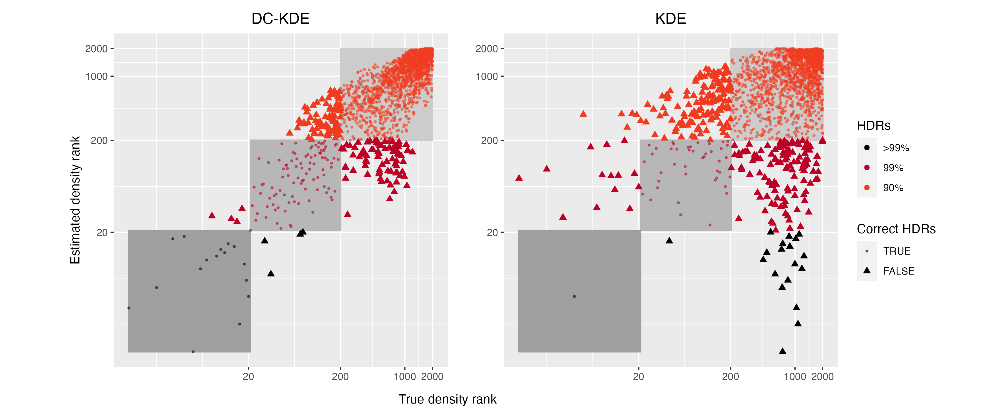
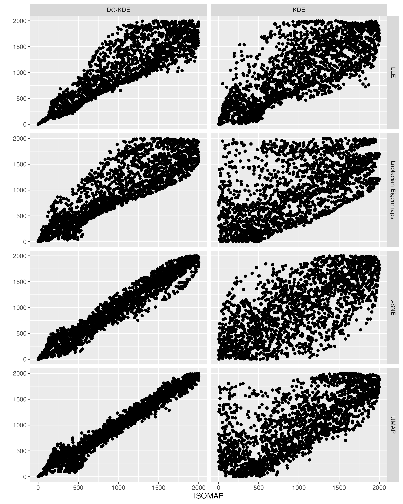
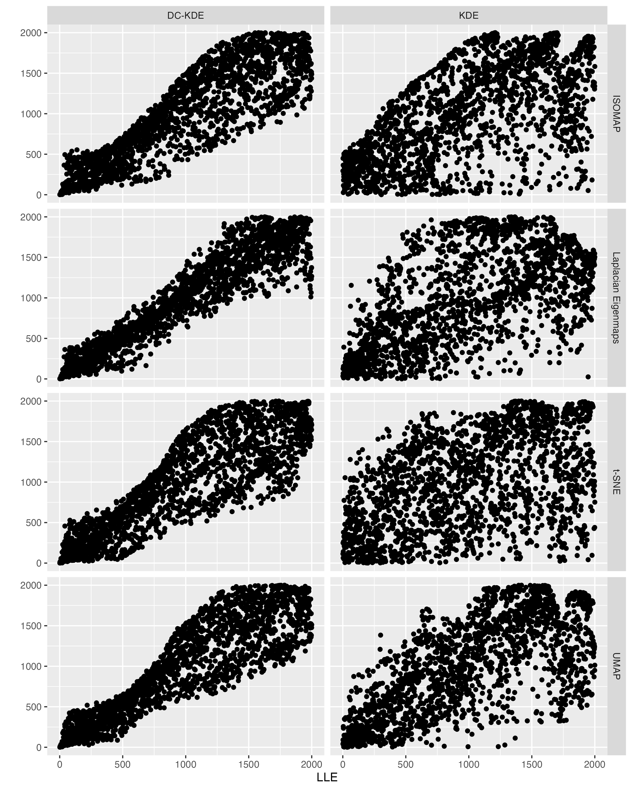

```{r setup, include=FALSE}
knitr::opts_chunk$set(
  echo = TRUE,
  cache = T,
  messages = FALSE,
  warning = FALSE,
  eval = TRUE
  # include = FALSE
)
options(tinytex.verbose = TRUE)
library(tidyverse)
library(here)
# library(hdrcde)
# library(car)
library(patchwork)
library(kableExtra)
# Jmisc::sourceAll(here::here("R/sources"))
# set.seed(1234)
```

\newpage

# Introduction

Multivariate kernel density estimation has gained lots of attention in exploratory data analysis. It is a non-parametric technique to estimate the data density based on weighted kernels centered at the data which usually belongs to a subset of $\mathbb{R}^d$. Applications of kernel density estimation [KDE; @Parzen1962-gt; @Chen2017-dw] include finding hot spots of traffic network in the GIS environment [@Xie2008-eb; @Okabe2009-nb], automatic detection in visual surveillance systems [@Elgammal2002-cw], wind power density detection [@Jeon2012-ac], prime prediction via Twitter messages [@Gerber2014-tq], and so on. However, when samples are assumed to be drawn from a Riemannian manifold embedded in a high-dimensional space of much more than $\mathbb{R}^d$, kernel density estimation has to be generalized to a non-Euclidean space and further approximation methods have to be adapted. @Pelletier2005-vu propose a kernel density estimator based on the Riemannian geodesic distance of the manifold but it is only applicable when the underlying manifold is known. Manifold learning algorithms could be applied to reduce the dimension and get an approximation of the manifold, but different manifold learning algorithms could induce different distortions of the same manifold. Therefore, we propose a distortion-corrected kernel density estimator for Riemannian manifolds embedded in more than $\mathbb{R}^d$. Our estimator could be applied to any reasonable manifold learning embedding from the high-dimensional sample data and fix the distortions at each point with estimated Riemannian geodesic distance and volume density function. This estimator could be further applied for unsupervised tasks such as anomaly detection where the outliers are the lowest density points.

<!-- Anomaly detection has been an important and diverse area where anomalies or outliers are detected in a given data. It often involves a data analysis process to uncover the unusual patterns and has been widely applied to machine learning [@Omar2013-lz], network intrusions identification [@Ahmed2016-co; @Bhuyan2013-ra], medical imaging [@Fernando2022-ef], fraudulent attacks [@Ahmed2016-dz], cyber-security [@Ten2011-co], energy consumption [@Cheng2021-dh], the last of which explored detecting households with anomalous electricity usage distributions instead of raw data. In the case of non-Euclidean sample space, the observations lie on a Riemannian manifold embedded in a very high-dimensional ambient space, which makes it computationally expensive or impossible to detect anomalies. To address this problem, we propose a kernel density estimator of the low-dimensional statistical manifold embedding and find outliers as the data with the lowest density estimates. -->

For a given kernel function, kernel density estimation is flexible to learn the shape of the underlying density of the data controlled by the bandwidth and the selection of bandwidth is crucial in KDE [@Jones1990-oe; @Terrell1992-ut]. 
<!-- There are extensive research on bandwidth selection, two main categories of which are cross-validation [@Jones1992-ta; @Sain1994-gr] and plug-in methods [@Wand1994-gc; @Duong2003-sp].  -->
Many bandwidth selection methods have been proposed in the literature, including the rule-of-thumb, cross-validation [@Jones1992-ta; @Sain1994-gr] and plug-in methods [See @Heidenreich2013-bl; @Scott2015-vl for details]. 
For univariate kernel density estimation, the bandwidth selection problem has been thoroughly investigated [See @Jones1992-ef; @Cao1994-st; @Jones1996-cb; @Wand1994-xu for reviews]. The generalization to multivariate case could mostly be found in @Duong2003-sp, @Duong2004-rh, and @Chacon2010-wm. In this paper, we focus on the multivariate kernel density estimation.

Note that a fixed bandwidth matrix $\pmb{H}$ is a global smoothing parameter for all data points. However, when the local data structure is not universal for all sample data, which is true in most applications, an adaptive bandwidth matrix that is varying rather than fixed at each data point is needed. 
The bandwidth is varied depending on either the location of the sample points [sample smoothing estimator; @Terrell1992-ut] or that of the estimated points [balloon estimator; @Terrell1992-ut]. In this paper, the densities are estimated at the sample points themselves, so we only need to consider the case where the bandwidth changes for each sample point and will refer to this as the *variable/adaptive kernel density estimation* [VKDE; Section 6.6 of @Scott2015-vl] unless otherwise stated.
However, these kernel density estimators are based on random samples in the Euclidean space.

For samples points lying on a manifold with the differentiable structure called the Riemannian manifold, @Pelletier2005-vu generalize the kernel density estimator based on the kernel weights from the geodesic distance between the estimated points and the sample points. The idea of the estimator is to use a strictly positive function of the geodesic distance on the manifold and then normalize it with the volume density function of the Riemannian manifold for curvature [@Henry2009-ll]. 
However, in many application scenarios, we tend to find that the sample points are not drawn directly from the manifolds because they are embedded in a much higher-dimensional space. Therefore, the kernel density estimator from @Pelletier2005-vu is not applicable because the geodesic distance and the volume density function are unknown.
This is when we introduce manifold learning to reduce the input data dimension. For these high-dimensional data set, various manifold learning algorithms including ISOMAP, LLE, Laplacian Eigenmaps, t-SNE, and UMAP (see details of these algorithms in @Cheng2021-dh), could be applied to get a low-dimensional embedding, which are used as approximations of the underlying manifold. 

In manifold learning, the underlying idea is that the data lies on a low-dimensional smooth manifold that is embedded in a high-dimensional space. One of the fundamental objectives of manifold learning is to explore the geometry of the dataset, including the distances between points and volumes of regions of data. These intrinsic geometric attributes of the data, such as distances, angles, and areas, however, can be distorted in the low-dimensional embedding, leading to failure in recovering the geometry of the manifold [@Goldberg2008-co]. To tackle this problem and measure the distortion incurred in manifold learning,
@Perrault-Joncas2013-pq propose the Learn Metric algorithm to augment any existing embedding output with geometric information in the Riemannian metric of the manifold itself. By applying this algorithm, the outputs of different manifold learning methods can be unified and compared under the same framework, which would highly benefit in improving the effectiveness of the embedding.
The Riemannian metric using the method of @Perrault-Joncas2013-pq gives some idea of the distortion of an embedding. Mapping the points through a non-linear function "stretches" some regions of space and "shrinks" others. The Riemannian gives us an idea of the direction and angle of this stretching at each point, which is informative for learning the manifold. 

By exploiting the connection between the estimated Riemannian metric and the Riemannian geodesic distance as well as the volume density function for curvature, we propose the main contribution of the paper, which is the variable distortion-corrected kernel density estimator (DC-KDE) for manifold learning embedding. Starting from the high-dimensional sample data, we apply manifold learning algorithms to get the low-dimensional embedding in the same dimensional space as the underlying manifold together with the estimated Riemannian matrix at each embedding point. Then the DC-KDE is used to estimate the density of the manifold and distortions induced by manifold learning methods are fixed with the estimated geometric information. Our distortion-corrected estimator is novel in filling the gap between the high-dimensional sample space and the density of the unknown manifold. These density estimates are useful in many other areas, including classification, clustering and anomaly detection. Similar to @Cheng2021-dh, the highest density region plots[@Hyndman1996-lk] could be generated using the kernel density estimates for outlier visualization, which brings a novel anomaly detection method for Riemannian manifolds.

The rest of the paper is organized as follows. In \autoref{kderm}, we present our distortion-corrected kernel density estimator for Riemannian manifolds. We start by introducing the multivariate kernel density estimate with adaptive bandwidth and the kernel density estimator for Riemannian manifolds. Then we provide justification for the use of Riemannian metric to correct the distortions in manifold learning embedding and further apply the proposed estimator for anomaly detection. \autoref{simulation} is composed of two simulations with the proposed anomaly detection algorithm; the first deals with 2-dimensional data from gaussian mixture model mapped into a 3-D twin peaks structure and the second with a 5-D semi-hypersphere data mapped in a 100-D space. Different manifold learning algorithms are applied to the high-dimensional data to get the low-dimensional embedding which are then used to estimate densities and detect anomalies.
\autoref{application} contains the application to visualize and identify anomalous households in the Irish smart meter dataset. Conclusions and discussions are presented in \autoref{conclusion}. Readers interested in the notions of Riemannian geometry mentioned in this paper could use \autoref{riemgeo} as a reference.

# Distortion Corrected Kernel density estimate on Riemannian manifolds {#kderm}

In this section, we introduce our method for kernel density estimation on manifolds that uses an embedding from a dimension reduction algorithm while correcting for the distortion induced by this embedding. Since some readers may be unfamiliar with the nuances of manifolds, we first discuss kernel density estimation for data in Euclidean space, then illustrate in \autoref{Pellet} how this generalizes to the estimator of @Pelletier2005-vu, when the data lie on some known manifold. In \autoref{MetLearn}, we describe the Learn Metric algorithm of @Perrault-Joncas2013-pq, which augments an embedding derived from a dimension reduction algorithm with an estimate of the Riemannian metric expressed in local coordinates. By combining elements from the work of @Pelletier2005-vu and @Perrault-Joncas2013-pq, we derive our own novel distortion corrected kernel density estimate in \autoref{DCKDE}. To keep this section as succinct as possible, we do not define concepts such as manifolds, charts, geodesic distance etc., but provide this information for readers unfamiliar with differential geometry in \autoref{riemgeo}.

In the following, we denote $M$ as the $d$-dimensional manifold from which our data are sampled. Points on this manifold are denoted $\pmb{p}$ in general, with $\pmb{p}_1,\dots,\pmb{p}_n$ denoting the observed sample. Often $\pmb{p}_i$ will be high-dimensional vectors such that $\pmb{p}_i\in\mathbb{R}^m$ with $m\gg d$, however this need not be the case. For instance, $\pmb{p}_i$ may be probability distributions on a statistical manifold. The methods we propose for estimating the density at each $\pmb{p}_i$ only require some sense of distance between the 'input' points, $d(\pmb{p}_i,\pmb{p}_j)$, such that we can apply dimension reduction algorithms to obtain an `output' embedding, $\pmb{y}_1,\dots,\pmb{y}_n$, where $\pmb{y}_i\in\mathbb{R}^d$. We will denote this embedding as $\pmb{y}_i=\psi(\pmb{p}_i)$. Finally, we denote by $\lambda$ the Lebesgue measure of $\mathbb{R}^d$, letting $\|\cdot\|$ be the usual Euclidean norm and following @Pelletier2005-vu, we make these assumptions about the kernel function $K:\mathbb{R}_+\rightarrow\mathbb{R}$,
\begin{align}
\label{eq:kernelcondition}
& (i) \int_{\mathbb{R}^{d}} K(\|\pmb{y}\|) \mathrm{d} \lambda(\pmb{y})=1;
(ii) \int_{\mathbb{R}^{d}} \pmb{y} K(\|\pmb{y}\|) \mathrm{d} \lambda(\pmb{y})=0;
(iii) \int_{\mathbb{R}^{d}}\|\pmb{y}\|^{2} K(\|\pmb{y}\|) \mathrm{d} \lambda(\pmb{y})<\infty; \\
& (iv) \supp K=[0; 1];
(v) \sup K(\|\pmb{y}\|)=K(0).
\end{align}
Note that these conditions are different from (and in some cases stricter than) those normally used for kernel density estimation. For instance, condition (iv) requires the support of the kernel to be bounded. The reasons for this will become clearer when we discuss the manifold setting in more detail. Also, for illustration purposes, in this section we pay particular attention to the uniform kernel for which $K(z)$ equals one if $0\leq z\leq1$ and zero otherwise. In our empirical section, more general kernel functions can be, and are, employed.

For data $\pmb{y}_i\in\mathbb{R}^d$ with $i=1,\dots,N$ and assuming a bandwidth matrix $r\pmb{I}$ where $r$ is a global bandwidth, then the usual kernel density estimator at a point $\pmb{y}$ is given by
\begin{equation}
\label{eq:vkde}
\hat{f}(\pmb{y})=\frac{1}{N}\sum\limits_{i=1}^N \frac{1}{r^d} K\left(\frac{\|\pmb{y}-\pmb{y}_i\|}{r}\right).
\end{equation}

The intuition behind this estimator is very clear for a uniform kernel. The density at a point $\pmb{y}$ is equal to the proportion of sample points that lie within a ball of radius $r$ centered at $\pmb{y}$, times a term that ensures the density integrates to 1. In general, the bandwidth matrix need not be proportional to the identity matrix. However, the intuition remains the same, only that the ball of radius $r$ centered at $\pmb{y}$ is found with respect to Mahalanobis distance rather than the usual Euclidean distance. For more on kernel density estimation in the Euclidean case, see @Scott2015-vl and references therein.

Kernel density estimators of this form can and have been applied directly on the output embedding $\pmb{y}$, and we will consider this approach as a benchmark in \autoref{simulation}. As a non-linear transformation, any dimension reduction algorithm `distorts' the density. To make this clear consider the simpler case computing the density after a change of variables $\psi:\mathbb{R}^d\rightarrow\mathbb{R}^d$, which involves a Jacobian term. A similar notion applies to a manifold embedding so that the density of the output vectors $\pmb{y}_i$ differs from the density on the manifold itself.  Furthermore, standard kernel density estimates applied directly on the output embedding will be sensitive to the choice of dimension reduction algorithm since each different algorithm will distort the density in its own. This motivates a kernel desnity estimate that corrects for the distortion induced by $\psi$.

## Kernel Density estimation on manifolds {#Pellet}

For kernel density estimation on a known manifold, @Pelletier2005-vu propose the following estimator,
\begin{equation}
\label{eq:denriem}
\hat{f}(\pmb{p}) = \frac{1}{N} \sum_{i=1}^{N} \frac{1}{r^d \theta_{\pmb{p}_i}(\pmb{p})} K\left(\frac{d_g(\pmb{p}, \pmb{p}_i)}{r}\right),
\end{equation}

where $d_g(\pmb{p}, \pmb{p}_i)$ denotes the geodesic distance between two points on the manifold $\pmb{p}$ and $\pmb{p}_i$ and $\theta_{\pmb{p}_i}(\pmb{p})$ is known as the volume density function. The intuition behind the term $K\left(\frac{d_g(\pmb{p}, \pmb{p}_i)}{r}\right)$ is relatively clear. For example, for a uniform kernel, the estimator at point $\pmb{p}$ will still depend on the proportion of sample points within a ball of radius $r$ centered at $\pmb{p}$. However in this case, the geodesic distance on the manifold is used, rather than Euclidean or Mahalanobis distance. An additional technical assumption is that $r$ is less than the injectivity radius of the manifold. A definition of the injectivity radius is given by @Chavel2006-mp and also provided in the appendix. For our purposes, it is sufficient to note that this assumption precludes the possibility that the radius of a ball around $\pmb{p}$ is so large that some points `fall inside' the ball more than once. For example on a sphere, a ball with radius greater than half the circumference of a great circle will wrap back around the sphere. This phenomenon also explains why the kernel function must be bounded for density estimation on manifolds.

The inclusion of the volume density function  $\theta_{\pmb{p}_i}(\pmb{p})$ is perhaps not as immediately clear, therefore, before providing formal details, we will briefly discuss the intuition behind the inclusion of this term. We have already highlighted that when using a uniform kernel, the kernel density estimate at a point $\pmb{p}$ directly depends on the proportion of sample points within a ball of radius $r$ around $\pmb{p}$. However, the volume of this ball must also be taken into account. In Euclidean space with the usual Lebesgue measure, a radius $r$ ball will always have the same volume regardless of its center. The same does not hold for manifolds and the volume density function ensures that the density estimate integrates to one. 

More formally, the volume density function can be explained as follows. Consider the exponential map around $\pmb{p}$, given by $exp_{\pmb{p}}(\pmb{q})$, mapping vectors in the tangent space, $\pmb{v}\in T_{\pmb{p}}M$, to points on the manifold, $\pmb{q}\in M$. Loosely, $\pmb{v}$ `points' in the direction of the geodesic between $\pmb{p}$ and $\pmb{q}$ and travelling along this geodesic at uniform speed $\|\pmb{v}\|$ takes place in one unit of time. Now, consider a chart $\varphi$ mapping points in the neighborhood of $\pmb{p}$, via the inverse of the exponential map, to these $\pmb{v}$ vectors, expressed in some local coordinate system. The volume density function is the square root of the determinant of the Riemannian metric expressed in this coordinate system. For more on the volume density function, see @Le_Brigant2019-lj.

## Riemannian metric estimation {#MetLearn}

To be able to apply the estimator of @Pelletier2005-vu to the case where the manifold is not known, but where coordinates $\pmb{y}_i$ for $i=1,\dots,n$ are obtained from a dimension reduction algorithm, requires an estimate of the Riemannian metric in the coordinate system. Formally, the Riemannian metric $g$ is a symmetric and positive definite tensor field which defines an inner product $\langle,\rangle_g$ on the tangent space $T_{\pmb{p}} M$ for every point $\pmb{p} \in M$. The inner product between two tangent vectors $u,v \in T_{\pmb{p}}M$, given by $\langle u,v \rangle_g$, can be used to define geometric quantities. For example, angles on a manifold are given by $\cos{\theta}=\frac{\langle u,v \rangle_g}{|u| |v|}$, while distances and volumes on manifolds are also defined with reference to the Riemannian metric. While the defined tangent vectors, the Riemannian metric and the geometric quantities are invariant to any specific choice of coordinates, they can still be expressed in terms of local coordinate systems. This is precisely the situation when data on a manifold are mapped to $d$-dimensional Euclidean vectors $\pmb{y}_1,\pmb{y}_2\dots,\pmb{y}_n$ via a dimension reduction algorithm. After this mapping, angles, distances and volumes in this Euclidean `output space' are not the same as on the manifold since dimension reduction algorithms introduce distortions. To alleviate this issue, @Perrault-Joncas2013-pq propose a method to augment $\pmb{y}_1,\pmb{y}_2\dots,\pmb{y}_n$ with $d\times d$ positive definite matrices, $\pmb{H}_1,\pmb{H}_2\dots,\pmb{H}_n$, at each data point. These matrices estimate the Riemannian metric in local coordinates defined by the dimension reduction algorithm. For example, the angle between $\pmb{p}_j$ and $\pmb{p}_k$ at $\pmb{p}_i$ depends (up to a first order approximation) on the inner product $(\pmb{y}_j-\pmb{y}_i)'\pmb{H}^{-1}_i(\pmb{y}_k-\pmb{y}_i)$ rather than the usual Euclidean inner product $(\pmb{y}_j-\pmb{y}_i)'(\pmb{y}_k-\pmb{y}_i)$. 

While full details are provided in @Perrault-Joncas2013-pq, we briefly describe the Learn Metric algorithm here. There are four main steps in the algorithm. First, a weighted neighborhood graph is constructed, with edges between $\pmb{p}_i$ and $\pmb{p}_j$ when $\pmb{p}_i$ is a K-nearest neighbor of $\pmb{p}_j$ or vice versa, and edge weights depending on the distance between $\pmb{p}_i$ and $\pmb{p}_j$ on the manifold. Second, the discrete Laplacian on this graph $\hat{\mathcal{L}}_{\varepsilon,n}$ is estimated [@Zhou2011-za], where $\varepsilon$ is the radius parameter for the nearest neighbor graph. Third, a dimension reduction method is applied to obtain the output embedding $\pmb{y}_1,\dots,\pmb{y}_n$. Fourth, the Riemannian metric at each point is estimated by exploiting the connection between the Riemannian metric and the Laplace Beltrami operator (to which the graph Laplacian at Step 2 is a discrete estimator). Full details on these four steps are provided in \autoref{alg:learnmetric}. This algorithm is implemented in a Python library *megaman* [@McQueen2016-xz] although our own results are based on a re-implementation of the algorithm in *R*. Two parameters, $c=0.25$ and $\sqrt{\varepsilon} = 0.4$, are set as suggested in the *megaman* library.

As pointed out by @Perrault-Joncas2013-pq, dimension reduction can be carried out such that the dimension of the output vectors is larger than the intrinsic manifold dimension $d$. In this case, the ranks of the matrices $\pmb{H}_i$ are equal to $d$. Using a larger embedding dimension is justified since it is in general not possible to embed a manifold of dimension $d$ globally into $d$-dimensional Euclidean space. In our simulated examples, we abstract from this issue by constructing examples that can be globally embedded into $d$-dimesional Euclidean space. In practice, to determine the dimension of the manifold, the *two-nearest neighbor estimator (TWO-NN estimator)* [@Facco2017-rl; @Denti2021-jl] can be used.  The *R* library *intRinsic* [@Denti2021-qc] implements this algorithm and is used in all examples involving real data where the intrinsic dimension is unknown.

\begin{algorithm}[!htb]
  \caption{Learn metric algorithm in \cite{Perrault-Joncas2013-pq} }
  \label{alg:learnmetric}
  \DontPrintSemicolon
  \SetAlgoLined
  \SetKwInOut{Input}{Input}\SetKwInOut{Output}{Output}\SetKwInOut{Parameter}{parameter}\SetKwInOut{OptParameter}{optimization parameter}
  \Input{ high-dimensional data $\pmb{x}_i \in \mathbb{R}^s$ for all $i=1,\ldots,N$ }
  \Output{ low-dimensional data $\pmb{y}_i \in \mathbb{R}^d$ and its Riemannian metric $\pmb{H}(\pmb{y}_i)$ for all $i=1,\ldots,N$ }
  \Parameter{ embedding dimension $d$, bandwidth parameter $\sqrt{\varepsilon}$, manifold learning algorithm }
  \OptParameter{ manifold learning parameters EMBED }
  \BlankLine
  \begin{algorithmic}[1]

  \STATE Construct a weighted neighborhood graph $\mathcal{G}_{w,\varepsilon}$ with weight matrix $\pmb{W}$ where $w_{i,j}=\exp(-\frac{1}{\varepsilon}\|\pmb{x}_i-\pmb{x}_j\|^2)$ for data points $\pmb{x}_i,\pmb{x}_j \in \mathbb{R}^s$;

  \STATE Calculate the $N\times N$ geometric graph Laplacian $\widetilde{\mathcal{L}}_{\varepsilon,N}$ by
  $$
  \widetilde{\mathcal{L}}_{\varepsilon,N} = 1/(c\varepsilon)(\widetilde{D}^{-1} \widetilde{W} - I_N),
  $$
  where $\widetilde{D}=diag{\widetilde{W}\pmb{1}}$, $\widetilde{W} = D^{-1}WD^{-1}$, and $D = diag{W\pmb{1}}$;

  \STATE Embed all data point $\pmb{X}\in \mathbb{R}^s$ to embedding coordinates $\pmb{Y}=(\pmb{y}^1,\dots,\pmb{y}^d)^\prime$ by any existing manifold learning algorithm EMBED;

  \STATE Obtain the matrix $\pmb{\tilde{H}}$ of all data point by applying the graph Laplacian $\widetilde{\mathcal{L}}_{\sqrt{\varepsilon},N}$ to the embedding coordinates matrix $\pmb{Y}$ with each element vector in $\pmb{\tilde{H}}$ being
  $$
    \pmb{\tilde{H}}^{i j} = \frac{1}{2} \left[\tilde{\mathcal{L}}_{\varepsilon, N}\left(\pmb{y}^i \cdot \pmb{y}^j\right) - \pmb{y}_i \cdot\left(\tilde{\mathcal{L}}_{\varepsilon, n} \pmb{y}^j\right) - \pmb{y}^j \cdot\left(\tilde{\mathcal{L}}_{\varepsilon, n} \pmb{y}^i\right)\right],
  $$
  where $i,j=1,\dots,d$ and the $\cdot$ calculation is the elementwise product between two vectors; 

  \STATE Calculate the Riemannian metric $\pmb{H}$ as the rank $d$ pseudo inverse of $\tilde{\pmb{H}}$ with 
  $$
    \pmb{H} = \pmb{U} diag{1/(\Lambda[1:d])} \pmb{U}^\prime,
  $$
  where $[\pmb{U}, \Lambda]$ is the eigendecomposition of matrix $\pmb{\tilde{h}}(x)$, and $U$ is the matrix of column eigenvectors ordered by the eigenvalues $\Lambda$ in descending order.

  \end{algorithmic}
\end{algorithm}

## Distortion corrected KDE {#DCKDE}

With all fundamentals introduced, we can now give our novel Distortion Corrected KDE (DC-KDE) as 
\begin{equation}
\label{eq:denestimator}
\hat{f}(\pmb{y}_j) = \frac{1}{N} \sum_{i=1}^{N} \frac{1}{r^d} \bigg(\frac{|\det \pmb{H}_j|}{|\det \pmb{H}_i|} \bigg)^{1/2} K\bigg( \frac{\| \pmb{H}^{-1/2}_i (\pmb{y}_j - \pmb{y}_i)\|}{r} \bigg).
\end{equation}

The estimator has a similar structure to Equation \@ref(eq:denriem) with some key differences. To understand these differences, it is first critical to appreciate that the coordinates $\pmb{H}^{-1/2}_i (\pmb{y}_j - \pmb{y}_i)$ give an embedding that is approximately isometric in a small neighborhood around the $i^{th}$ observed point (this insight is discussed at length is Section 6.2 of @Perrault-Joncas2013-pq). This is crucial for two reasons. First, this implies that the term $\| \pmb{H}^{-1/2}_i (\pmb{y}_j - \pmb{y}_i)\|$ approximates the geodesic distance between $\pmb{y}_i$ and $\pmb{y}_j$. Second, the estimator in Equation \@ref(eq:denriem) is valid only when the coordinate mapping is the logarithmic map around $\pmb{y}_i$, and it is this mapping that is approximated by $\pmb{H}^{-1/2}_i (\pmb{y}_j - \pmb{y}_i)$. For this reason there is a ratio of two determinants to ensure the density integrates to one, the first is a consequence of the mapping from the manifold to the coordinate system (from a dimension reduction algorithm), while the second is the transformation $\pmb{H}^{-1/2}_i (\pmb{y}_j - \pmb{y}_i)$ which ensures that the embedding approximates the logarithmic map. Also worth noting is the resemblance between the estimator and multivariate variable bandwidth estimation [@Breiman1977-qc; @Jones1990-oe; @Terrell1992-ut]. 

One limitation of the kernel density estimator is that the density can be estimated only at points where data have been observed since the estimator requires the Riemannian $\pmb{H}_j$. To estimate the density at points that do not correspond to observed data, any smoothed average of nearest neighbors can be used instead. We note that the particular downstream task that we are interested in is anomaly detection for which only the density estimates at observed sample points are required since anomalies are identified as the points with lowest density. The entire workflow is summarized in \autoref{fig:vkde}. The last two steps in \autoref{fig:vkde} are our main contributions, generating distortion-corrected KDE with adaptive Riemannian metric $\pmb{H}_i$ at each point and computing the highest density region plots based on the density estimates for anomaly detection. Compared to the anomaly detection with a general kernel density estimator in @Cheng2021-dh, the changes are also highlighted in blue. With this anomaly detection process, outliers based on lowest densities could be detected more accurately regardless of the distortion in manifold learning.

(ref:vkdecaption) The proposed schematic for anomaly detection with distortion corrected kernel density estimates.

```{r vkde, fig.align = 'center', out.width = "95%", fig.cap = "(ref:vkdecaption)", echo = FALSE, eval=TRUE}
knitr::include_graphics("figures/DC-KDE.png")
```


# Simulations {#simulation}

In this section, we examine two scenarios for both low and high dimensions to test our proposed distortion corrected KDE. For visualization purposes, \autoref{twodgaussian} presents an example of a two-dimensional manifold embedded in 3-dimensional ambient Euclidean space.  As a high-dimensional example, the second simulation in \autoref{fivedgaussian} is based on a 4-dimensional manifold embedded in a 100-dimensional ambient space. To estimate the density, we use the dimension reduction algorithms ISOMAP, LLE, Laplacian Eigenmaps, t-SNE, and UMAP. In general, we aim to highlight two advantages of our proposed distortion corrected KDE compared to KDE applied directly to the output coordinates. First, the density estimates are closer to the ground truth when distortion correction is used, and as a consequence, distortion correction is more adept at detecting anomalies. Second, we show how density estimation and anomaly detection are more robust to a different choice of dimension reduction method when distortion correction is used.

## Twin peaks example {#twodgaussian}

The simulation setup for the twin peaks example is to first generate vectors $\pmb{v}_1,\dots,\pmb{v}_N$ for $N=2000$ from a 2-dimensional Gaussian mixture model. The mixture has four components with different means
$\pmb{\mu_1}=(0.25, 0.25)^\prime, \pmb{\mu_2}=(0.25, 0.75)^\prime, \pmb{\mu_3}=(0.75, 0.25)^\prime, \pmb{\mu_4}=(0.75, 0.75)^\prime$ and the same variance-covariance matrix $\pmb{\Sigma}_i=diag(0.016, 0.016), i=1,2,3,4$. The mixture proportions
are equally set as $\pi_i=0.25, i=1,2,3,4$. The two dimensional data in \autoref{fig:metadensity} is mapped to a 'twin peaks' surface via the following 
\begin{equation}
\label{eq:twinpeak}
\begin{array}{lcl}
x_1 = v_1, \\
x_2 = v_2, \\
x_3 = \sin(\pi v_1) \tan (3 v_2).
\end{array}
\end{equation}

The three-dimensional twin peaks mapping is shown in \autoref{fig:twinpeaks3d}. The colors in both \autoref{fig:metadensity} and \autoref{fig:twinpeaks3d} indicate the true density of the data via the twin peaks mapping, with lower density points in darker colors scattered in the outer as well as center areas. 
<!-- We also considered the 'Swiss Roll' mapping and the results for this manifold are summarized in \autoref{swissrollappe}. -->

```{r metadensity, fig.align = 'center', out.width = "80%", fig.cap="Underlying data for the Gaussian mixture model of four kenels with means $(0.25, 0.25), (0.25, 0.75), (0.75, 0.25), (0.75, 0.75)$ and the same variance-covariance matrix $diag(0.016, 0.016)$. The colors indicate the true density of the data when they are mapped via the twin peaks function. Lower density points in darker colors are scattered both in the outer and center areas.", echo = FALSE}
knitr::include_graphics("figures/truedensity_twinpeaks_dc_labv.png")
```

(ref:twinpeaks3dcaption) Scatterplot of the 3-d twin peaks data with the same colors indicating the true density as in \autoref{fig:metadensity}.

```{r twinpeaks3d, fig.align = 'center', out.width = "80%", fig.cap="(ref:twinpeaks3dcaption)", echo = FALSE}
knitr::include_graphics("figures/scatterplot3d_twinpeaks_dc.png")
```

It is important to note that the *true density* on the manifold is not simply a Gaussian mixture, since the mapping in Equation \@ref(eq:twinpeak) distorts the distribution. To recover the true distribution requires the correct Jacobian term for the pushforward from $\pmb{v}$ to the volume form of twin peaks manifold. By treating the $\pmb{v}$ as an 'output' embedding from input points $\pmb{x}$ that lie on the true manifold and applying the Learn Metric algorithm, we can obtain $\pmb{\Gamma}_i$ for $i=1,\dots,n$ where $\pmb{\Gamma}_i$ is the Riemannian of the coordinate system given by $\pmb{v}$. This notation is distinct from $\pmb{H}_i$ which is the output of the Learn Metric algorithm for a coordinate system obtained via a dimension reduction algorithm. The true density on the manifold can be obtained as $f(\pmb{p}_i)=f(\pmb{v}_i)|\pmb{\Gamma}_i|^{1/2}$, where $f(\pmb{v}_i)$ is a the density of a four component mixture of normals. Knowledge of $\pmb{v}$ and $\pmb{\Gamma_i}$ will not be used when estimating the density but only to establish a 'ground truth' for densities on the manifold. \autoref{fig:metadensity} shows the simulated $\pmb{v}$ with color indicating the true density of data on the manifold. Anomalies are defined as points with the lowest densities shown in darker colors and with 'typical' points having the highest density shown in yellow. The anomalies are found around the edges of the plot, but there are is also a low density region between the means of the four mixture components. The objective is to determine whether we can correctly identify these features without any knowledge of the true density or the $\pmb{v}$. 


```{r tpoutliers, fig.align = 'center', out.width = "95%", fig.cap="Highest density region plots of five manifold learning embeddings of the twin peaks data in each row. The top 20 outliers, hightlighted in black and indexed in blue text, are found by the true manifold density (left panel), DC-KDE (middle panel) and KDE (right panel). DC-KDE finds more true outliers than KDE in all five rows.", echo = FALSE}
knitr::include_graphics("figures/Twin Peak2000_5levels_outliers_comparison_5ml_r0_5.png")
```

\autoref{fig:tpoutliers} summarizes the results. Each row of panels corresponds to a different dimension reduction technique, while the left, center and right columns correspond to density estimates for the ground truth density, distortion corrected KDE and KDE respectively. We set the bandwidth parameter in the DC-KDE \@ref(eq:denestimator) as $r=0.5$. Colors show the different estimated density at each point with anomalies shown in black with blue indexing, and higher density points shown in yellow. For many methods, the salient features of the ground truth distribution are clear regardless of whether distortion correction is applied, for example for ISOMAP, all three plots, identify a similar set of outliers and four high density regions. On the other hand for LLE, the left panel shows that dimension reduction pulls outliers on the manifold in towards the centre.  The distortion corrected KDE can account for this, while KDE without distortion correction on the other hand does not correctly identify the anomalies. For t-SNE, the ground truth and distortion corrected KDE identify four regions of high density, while a KDE estimate without distortion correction seems to identify a larger number of modes. This concurs with the common observation that t-SNE tends to output clusters even where such clusters may not be present in the underlying data.

```{r tpcors, echo=FALSE, message=FALSE, eval=T}
load("figures/CorrelationTable_Twin Peak2000_5ml_r0_5.rda")
col.max <- apply(cors, 2, max)
max.match <- rep(col.max, each = 2) == cors
data.frame(cors) %>% 
  mutate_if(is.numeric, format, digits = 3, nsmall = 3) %>% 
  kableExtra::kbl(caption = "Correlation between true density ranking and estimated density ranking for different manifold learning embeddings of the twin peak data. Distortion corrected KDE outperfoms for all dimension reduction algorithms and gives the higher rank correlation to the output of t-SNE and UMAP.", booktabs = TRUE, digits = 3, escape = FALSE) %>%
  # kable_styling(latex_options = "scale_down") %>%
  kable_paper(full_width = FALSE) %>%
  # column_spec(1, width = "6cm") %>% 
  column_spec(2, bold = max.match[,1]) %>%
  column_spec(3, bold = max.match[,2]) %>%
  column_spec(4, bold = max.match[,3]) %>%
  column_spec(5, bold = max.match[,4]) %>%
  column_spec(6, bold = max.match[,5])
```

We can gain further insight by comparing the correlation between ranks of true densities and estimated densities from KDE with and without density correction by \autoref{tab:tpcors}. Distortion correction improves the rank correlation for all dimension reduction algorithms. In particular, while applying KDE to the output of t-SNE and UMAP leads to a moderate correlation below 0.5, applying distortion correction improves these rank correlations to values close to 0.8.

```{r tpisomapden, fig.align = 'center', out.width = "100%", fig.cap="Scatterplot of log scale ranks of true density and estimated density ranks for DC-KDE (in the left panel) and KDE (in the right panel) based on ISOMAP embedding. The colors indicate different level of highest density regions and the shapes indicate whether the density estimators correctly classify the true anomalies. The shading contains all anomalies that are both truely and correctly identified. KDE without distortion correction gives more misclassified anomalies.", echo = FALSE}

```

```{r tptsneden, fig.align = 'center', out.width = "100%", fig.cap="Scatterplot of log scale ranks of true density and estimated density ranks for DC-KDE (in the left panel) and KDE (in the right panel) based on t-SNE embedding. KDE without distortion correction gives many more misclassified anomalies.", echo = FALSE}

```

In \autoref{fig:tpisomapden}, we plot ranks of the estimated density against the true density for the ISOMAP embedding with left panels showing results for distortion correction and the right panel showing results without distortion correction. Data are presented on a log scale to highlight anomalies. The bottom left shaded region contains all points that are truly anomalies and are identified as such (true positives), where an anomaly is defined as a point not falling within a $99\%$ highest density region. The middle shaded region contain anomalies that are true positives in the sense of not lying in a $90\%$ HDR. Points lying outside squares (shown as triangles) are incorrectly classified. For example, the three red triangles in the middle left of the left panel are truly anomalies since they lie outside the $99\%$ HDR, but are not classified as such (although they are true positives if a 90% HDR is used). Overall, the right panel contains many more misclassified anomalies, which shows that failing to apply distortion correction can have a severe impact on anomaly detection. \autoref{fig:tptsneden} shows the same plot but for t-SNE. The quality of t-SNE is worse than ISOMAP in this example therefore many more anomalies are misclassified. However, the difference between KDE with and without distortion correction is stark. These results highlight the importance of applying distortion correction especially when the quality of dimension reduction may not be high.

```{r tpisomapvs4ml, fig.align = 'center', out.width = "95%", fig.cap="Comparison of ranks of the estimated densities based on ISOMAP  and four other dimension reduction algorithms in each row. Distortion corrected KDE (on the left panel) and KDE (on the right panel) are compared and DC-KDE shows the robustness to the use of different dimension reduction methods.", echo = FALSE}

# 
# 
# knitr::include_graphics("figures/Twin Peak2000_density_compare_tsnevs4ml_radius8_r0_5_rank.png")
# 
```

Finally, \autoref{fig:tpisomapvs4ml} demonstrates the robustness of distortion correction methods to the use of dimension reduction algorithm. Each row of panels compares ranks of the estimated densities based on a dimension reduction algorithm to the estimated density based on ISOMAP. The left column shows results when distortion correction is applied, the right column when it is not applied. It can be seen that the rank correlation between estimates based on different dimension reduction algorithms is much higher when distortion correction is applied. This is critical since conclusions will be more robust to the choice of dimension reduction algorithm.

## Semi-hypersphere example embedded in 100-D space {#fivedgaussian}

```{r fivedmeta, fig.align = 'center', out.width = "70%", fig.cap="Scatterplot display of the animation of a 5-D tour path with shapes indexing two Gaussian mixture components and the colors showing the distance to the kernel cores. Distant points in darker colors could be seen as anomalies.", echo = FALSE}
knitr::include_graphics("figures/tourr_5d_semisphere.png")
```

As a high-dimensional experiment, we generate the underlying data from a 5-dimensional semi-hypersphere, embedded within 100-dimensional ambient space. To start with, we simulate vectors $(\pmb{v}_1, \dots, \pmb{v}_N)^\prime$ for $N=10,000$ points from a 4-dimensional Gaussian mixture model with two mixture components, $\mathcal{N}(\pmb{\mu}_1, \pmb{\Sigma}_1)$ and $\mathcal{N}(\pmb{\mu}_2, \pmb{\Sigma}_2)$, with the same means $\pmb{\mu}_1 = \pmb{\mu}_2 =(0, 0, 0, 0)^\prime$ and different variance-covariance matrices $\pmb{\Sigma}_1 = diag(1,1,1,1)$ and $\pmb{\Sigma}_2 = diag(2,2,2,2)$. The mixture proportions are set as $\pi_1=0.99$ and $\pi_2=0.01$. With this design, the observations from the second component tend to be outlying anomalies. The data are mapped to a hemisphere via the equation
$v_1^2 + v_2^2 + v_3^2 + v_4^2 + v_5^2 = r^2$ where $v_5>0$ and $r$ is set as $8$.
\autoref{fig:fivedmeta} shows scatterplot which is a single frame from a 5-D tour path[^1] animation using the R package *tourr* [@Wickham2011-ir]. The round and triangular point shapes indicate the two mixture components $\mathcal{N}(\pmb{\mu}_1, \pmb{\Sigma}_1)$ and
$\mathcal{N}(\pmb{\mu}_2, \pmb{\sigma}_2)$, and the colors indicate the distance between each point and the centre of the distribution. It can be seen that the most distant points are in darker colors and triangular shapes, meaning that the most anomalous observations are generated from the second mixture component.

[^1]: See the animation of the 5-D grand tour at https://github.com/ffancheng/kderm/blob/master/paper/figures/tourr_5d_animation.gif. 

To embed the 5-D hyper-semisphere into 100-D space, we append 95 zero columns to $\pmb{v}_i$ so that $\pmb{v}_i=(v_1, \dots, v_5, 0, \dots, 0), i=1,\dots,N$. Next, we rotate the $100$-dimensional vectors $(\pmb{v}_1, \dots, \pmb{v}_N)^\prime$ by multiplying by a randomly generated rotation matrix. To generate the rotation matrix we first simulate elements from a uniform $(0,1)$ distribution, stack them into a $100\times 100$ matrix $\pmb{A}$ and then take the R matrix from the QR decomposition of $\pmb{A}$. Rotating the vectors results in input vectors that are no longer sparse. Nonetheless, the intrinsic dimension of this is still $d=4$.

```{r fivedisomapden, fig.align = 'center', out.width = "95%", fig.cap="Rank comparison between the true density and estimated density from both DC-KDE and KDE. Four manifold learning methods are used rowwise. The point shapes indicates whether they are the true outleirs, and the grey shading highlights the top 1\\% rank region. The colors show the distance to the center of the semisphere, with darker points being distant from the center.", echo = FALSE}
knitr::include_graphics("figures/sim4d10000_density_comparison_4ml_radius10_k200_rankdensity_circleoutlier_with1rec.png")
```

Following similar steps to \autoref{twodgaussian}, we estimate the densities of the 4-D manifold and compare them with the ground truth density in \autoref{fig:fivedisomapden}. The bandwidth parameter for the DC-KDE estimator is set as $r=1$ for this example. In \autoref{fig:fivedisomapden}, the ranks of the estimated densities are shown against ranks of true densities (on the log scale) with panels on the left showing distortion corrected KDE and panels on the right showing KDE without distortion correction. The panels from top to bottom show four dimension reduction algorithms: ISOMAP, LLE, Laplacian Eigenmaps and UMAP. Note that we exclude t-SNE algorithm in this section because it is designed mainly for low-dimensional visualization purposes and is only applicable to an embedding dimension less than or equal to three.

Figure \autoref{fivedisomapden} is constructed in a similar fashion to \autoref{fig:tpisomapden} to show the effect of distortion correction on the detection of anomalies. As in \autoref{fig:fivedmeta}, the point shapes indicate which of the two mixture Gaussian mixture components an observation was generated from and the colors indicate the distance from the centre of the distribution with outliers shown in darker colors. Comparing the left and right panel for each row, we notice that KDE with distortion corrected, has fewer misclassified observations, and therefore outperforms KDE. For UMAP, almost all ground truth anomalies (points outside a $99\%$ HDR) are not correctly detected using KDE, while almost all anomalies are correctly detected after correcting for distortion. For DC-KDE in the left panel there are several triangles in a horizontal line, this arises,due to many points having an estimated density of close to zero (values less than $10^{-7}$) which leads to tied ranks. These low-density points are all detected as anomalies for all dimension reduction algorithms, which again shows the robustness of DC-KDE.

```{r fivedcors, echo=FALSE, message=FALSE, eval=T}
load("figures/CorrelationTable_4d_N10000_4ml_radius10_r1.rda")
col.max <- apply(cors, 2, max)
max.match <- rep(col.max, each = 2) == cors
data.frame(cors) %>% 
  mutate_if(is.numeric, format, digits = 3, nsmall = 3) %>% 
  kableExtra::kbl(caption = "Correlation between true density and estimated density for four manifold learning embeddings.", booktabs = TRUE, digits = 3, escape = FALSE) %>%
  # kable_styling(latex_options = "scale_down") %>% # automatically adjust the table to page width
  kable_paper(full_width = FALSE) %>%
  # column_spec(1, width = "6cm") %>% 
  column_spec(2, bold = max.match[,1]) %>%
  column_spec(3, bold = max.match[,2]) %>%
  column_spec(4, bold = max.match[,3]) %>%
  column_spec(5, bold = max.match[,4])
```

In \autoref{tab:fivedcors}, the correlations between ranks of true densities and estimated densites from DC-KDE and KDE are presented. For ISOMAP and LLE, KDE gives higher rank correlation by less than 0.01, but both density estimators have a very high correlation of more than 0.96. However, for Laplacian Eigenmaps and UMAP where there are more distortion in the dimension reduction process, the rank correlation for KDE is close to 0 while our distortion correction methods gives a relatively high correlation of 0.87 and 0.78 respectively.

```{r fourdhdrtable, echo=FALSE, message=FALSE, eval=T}
load("figures/hdrtable_4d_N10000_4ml_radius10_r1.rda")
hdrtable %>% 
  head(n = 2) %>% 
  `rownames<-` (c(">99\\% HDR", "99\\% HDR")) %>% 
  kableExtra::kbl(caption = "Percentage comparison of correct highest density regions in density estimation of four manifold learning embeddings.", booktabs = TRUE, digits = 3, escape = FALSE, align = "c",
                  col.names = c(rep(c("DC-KDE", "KDE"), 4))
                  ) %>%
  # kable_classic("striped") %>% 
  # kable_styling(latex_options = "scale_down") %>%
  kable_paper(full_width = FALSE) %>%
  # add_header_above(c("HDRs" = 1, rep(c("DC-KDE" = 1, "KDE" = 1), 4))) %>%
  add_header_above(c(" " = 1, "ISOMAP" = 2, "LLE" = 2, "Laplacian Eigenmaps" = 2, "UMAP" = 2)) %>% 
  # column_spec(1, bold = TRUE) %>% 
  column_spec(2, bold = hdrmax[,1]) %>% 
  column_spec(3, bold = hdrmax[,2]) %>% 
  column_spec(4, bold = hdrmax[,3]) %>% 
  column_spec(5, bold = hdrmax[,4]) %>% 
  column_spec(6, bold = hdrmax[,5]) %>% 
  column_spec(7, bold = hdrmax[,6]) %>% 
  column_spec(8, bold = hdrmax[,7]) %>% 
  column_spec(2*(1:4), border_left = T, background = grey(0.9))
```

Furthermore, when comparing across different dimension reduction algorithms in \autoref{fig:fivedisomapden}, almost all top outliers are correctly classified in the shading areas, which again shows the robustness of the proposed distortion correction methods to the use of dimension reduction algorithms. 
\autoref{tab:fourdhdrtable} further illustrutes the percentage of correctly classified anomalies in the $>99\%$ and $99\%$ highest density regions. Compared with KDE, the percentages are always higher when distortion correction methods are used. The percentages with distortion correction are very close for ISOMAP, LLE and Laplacian Eigenmaps with a value of around $83\%$ while slightly lower for UMAP at around $77\%$. This could be due to the severe distortion usually induced by the UMAP algorithm, which can be seen from the $0\%$ in KDE when no distortion correction is used.


# Application {#application}

<!-- ## Irish smart meter dataset -->

In this application, we use the smart meter data from the *CER Smart Metering Project - Electricity Customer Behaviour Trial, 2009-2010* in Ireland [@cer2012-data] between 14 July 2009 and 31 December 2010. The CER dataset[^2] records the half-hourly electricity consumption of individual residential and commercial properties, but not including energy for cooling or heating systems. We selected the $3,639$ residential data with no missing values during the data collection period for a total of $535$ days.

[^2]: accessed via the Irish Social Science Data Archive - www.ucd.ie/issda.

For the electricity consumption data of residential individuals, it would be worthwhile to explore the distribution of electricity demand rather than the raw consumption data to study the usage patterns of different households or different periods or the week [@Hyndman2018-ia].
@Cheng2021-dh propose two non-Euclidean distance estimators to be used in manifold learning algorithms in case of statistical manifolds with each observation as a distribution. The same Irish smart meter data is used for identifying outliers with kernel density estimation, but they fail to consider the distortion and information loss in the 2-dimensional embeddings. Therefore, we propose in this paper to apply distortion corrected KDE for anomaly detection as the downstream task of dimension reduction. Again, we use ISOMAP, LLE, Laplacian Eigenmaps, t-SNE and UMAP for dimension reduction to get the 2-D embedding for kernel density estimation and anomaly detection. To this end, we compare the density estimates from KDE with and without distortion correction and show how robust the anomalies are to different dimension reduction algorithms with the use of distortion correction. We use the highest density regions plots to visualize the density estimates. However, for this real data set with unknown structure, the ground truth densities are unknown and it is not possible to tell which anomalies are the true ones. Therefore, we will further examine the distributions of the anomalous households to study the typical or anomalous electricity usage patterns.

Although full details for data processing and dimension reduction are provided in @Cheng2021-dh, we briefly describe the procedures here. First, for each household and each of the $336$ half-hourly periods of the week, we build the empirical distributions and apply the total variation distance estimator for statistical manifold learning, which gives a 2-dimensional embedding for each dimension reduction method. Then we apply the kernel density estimator with distortion corrected for each method to the low-dimensional embedding and compare it with the KDE results in the Section 4.4 of @Cheng2021-dh. The bandwidth parameter $r$ is set as 1 in Equation \@ref(eq:denestimator).

 ```{r electricityembedding, fig.align = 'center', out.width = "90%", fig.cap="Highest density region plots of the 2-D embedding for $3,639$ households, with each point representing the distribution of one household and colors indicating the density estimated from DC-KDE (left panel) and KDE (right panel). The black points with blue text indexing are the top 20 anomalous households found by each dimension reduction method in each row.", echo=FALSE, eval=F}
# knitr::include_graphics("figures/")
```

<!-- The results are summarized in \autoref{fig:electricityembedding}.
TODO -->

<!-- In this section, we first calculated the same empirical distributions of the $336$ half-hourly periods of the week for each household, and apply the total variation distance estimator proposed in @Cheng2021-dh in the statistical manifold learning to get the 2-D embedding of all households. Equation \@ref(eq:denestimator) is then used to obtain density estimates with the pointwise variable Riemannian metric as the bandwidth matrix and detect outliers. The data processing steps have been clearly
stated in the application section of @Cheng2021-dh and they are skipped here. Unlike the simulations in \autoref{simulation}, we know nothing about the true density of the electricity distributions for all periods of the week and all households, so it is impossible to compare the estimated densities with the true meta data density as in \autoref{fig:fivedisomapden}. However, we could generate all the density estimates with the existing KDE method with fixed bandwidth, which is an optimal method for density estimation, and compare the densities from our proposed method with them.
 -->
```{r electricityoutliers, fig.align = 'center', out.width = "90%", fig.cap="Electricity usage plots of all 535 days for the most typical household and two anomalies in rows and KDE with distortion correction (left panel) and KDE (right panel) in columns.", echo = FALSE, eval=T}
knitr::include_graphics("figures/kde_2densities_raw_electricity.png")
```

\autoref{fig:electricityoutliers} shows the electricity usage data of three households for both density estimation methods respectively, with the top one being the most typical household with the highest density and the bottom two being the top two outliers with the lowest densities.
The typical households in the top row are similar except that there are a few spikes for household $1472$ when using KDE. As for the anomalies, distortion corrected KDE tends to capture the unusual electricity demand when the usage is very low or high in volume. It could also capture the unusual usage pattern when there are sudden spikes in ID 3243 or very high base electricity usage for the middle time periods in ID 2838. In contrast, KDE without distortion correction is more sensitive to spikes even when the spikes happen in a certain time window in 7049, or when the usage has an obvious time-of-week pattern with a few low electricity usage periods.

```{r electricityhdrsfixed, fig.align = 'center', out.width = "90%", fig.cap="Quantile region plots of electricity demand against the time of week for one typical household 1321 and two anomalies, 3243 and 2838. The quantile regions displayed in the plot are 99.0\\%, 95.0\\%, 75\\%, and 50\\%. Household 1321 has a repeated period-of-the-week electricity usage pattern slightly different for weekdays and weekends.", echo = FALSE, eval=T}
knitr::include_graphics("figures/hdr_electricity_hdrbox_3id_7dow.png")
```

```{r electricityhdrsvkde, fig.align = 'center', out.width = "90%", fig.cap="Quantile region plots of electricity demand against the time of week for one typical household 1472 and two anomalies, 7049 and 5136. The day-of-the-week patterns is much more different for Household 7049 compared with 5136, the latter of which does not have the obvious meal time related usage patterens.", echo = FALSE, eval=T}
knitr::include_graphics("figures/electricity_hdrbox_3id_7dow.png")
```

Further insights could be gained by comparing the quantile region plots of electricity demand against the time of the week for the same typical or anomalous households in \autoref{fig:electricityhdrsfixed} and \autoref{fig:electricityhdrsvkde}. Again the distribution of both typical households in the top panel has shown a repeated period-of-the-week usage pattern, with higher usage during mealtime on all seven days of the week and slightly higher usage for weekends.
This repeated pattern in a week window is also obvious for the typical household ID 1321 from DC-KDE. As for the distributions for outliers, the middle row outliers from variable bandwidth have spikes only on Tuesday and Sunday noons, while the fixed bandwidth has an increasing electricity demand across the day of the week. The bottom row outliers both have a repeated time usage pattern, but the electricity usage amount is higher with the highest median above 3kWh. These findings show the difference in finding typical and anomalous households with different kernel density estimation methods.

# Conclusions {#conclusion}

In this paper, we propose a novel distortion correction method to estimate the density of an embedding from manifold learning algorithms and further identify outliers based on the densities. Compared with KDE, our distortion corrected KDE makes use of geometric information for each data point to correct the distortion induced by the embedding. The Riemannian metric is estimated with the Learn Metric algorithm to approximate the geodesic distance and volume density function locally at each point. We compare our proposed method with KDE by two simulation settings, a 2-D manifold embedded as a 3-D twin peaks shape and a 4-D manifold mapped in a 100-D ambient space, and show that DC-KDE could generate more accurate kernel density estimation is more robust to the choice of dimension redution algorithm.

As an empirical example, we explore the distributions of $3,639$ households and $336$ time periods of the week in the Irish smart meter data. Five manifold learning algorithms, including ISOMAP, LLE, Laplacian Eigenmaps, t-SNE, and UMAP, are applied to get the 2-D embedding, followed by density estimation with KDE and DC-KDE. Without the ground truth density, we compare both density estimates by looking at the distributions of the most typical households with the highest densities and the anomalous households with the top two lowest densities. Both methods could identify the typical households with certain usage patterns, while the outliers are anomalous in different ways.

There are several open questions to be explored. The first involves the selection of bandwidth parameters for kernel density estimation, which has been explored in many KDE-related literatures. The second one is related to the quality of the embedding from dimension reduction methods. Although our distortion correction method is fairly robust to different choices of manifold learning methods, in certain cases, when the data structure is too complex and the distortion is too severe to correct, the quantitive relationship between embedding quality and density estimation accuracy is not immediate clear. The embedding quality could be measured using one of the metrics discussed in the online supplementary material of @Cheng2021-dh, but when the ground truth densities are unknown, which is usually the case with real-world data set, it is hard to tell wherther the distortion are corrected in the right way. The density estimates on the edges of the whole data structure could alos be explored because most outer area points tend to be detected as outliers. However, the outperformance of DC-KDE than KDE has been shown in the higher dimensional simulation data and the electricity usage data, which are more related to real-life data sets.

<!-- kernel types discussion? -->

# Acknowledgment {-}

This research was supported in part by the Monash eResearch Centre and eSolutions-Research Support Services through the use of the MonARCH HPC Cluster. The first author acknowledges the financial support of the Monash Graduate Scholarship (MGS) and the Monash International Tuition Scholarship (MITS) at the Monash University.

<!-- \clearpage -->

<!-- \section{Appendix: Notions about Riemannian geometry}\label{riemgeo} -->

<!-- %\pagenumbering{arabic} -->

<!-- %\def\thepage{A\arabic{page}} -->

\appendix

# Appendix: Notions about Riemannian geometry {#riemgeo}

In this appendix, we present some notions about the Riemannian geometry used in this paper.

## Differentiable manifolds

In topology, a *homeomorphism* is a bijective map between two topological spaces that is continuous in both directions. A *Hausdorff space* is a topological space where any two distinct points can be separated by disjoint neighborhoods. And a $d$-dimensional (topological) *manifold* $M$ is a connected Hausdorff space $(M, \mathcal{T}_M)$ where the neighborhood $U$ for each point $p$ is homeomorphic to an open subset $V$ of the Euclidean space $\mathbb{R}^d$. Such a homeomorphism $\varphi: U \rightarrow V$ together with $U$ gives a (coordinate) *chart*, denoted as $(U, \varphi)$, with the corresponding local coordinates $(x^1(p),\dots, x^d(p)) := \varphi(p)$. Further, a collection of charts $\{U_\alpha, \varphi_\alpha\}$ ranging over the manifold $M$ is called an *atlas*, denoted as $\mathcal{A}$. 

The manifold $M$ is a *differentiable manifold* if there exists an atlas of $M$, $\{U_\alpha, \varphi_\alpha\}$, such that the *transition maps* between any two charts, 
$$
\varphi_\beta \circ \varphi_\alpha^{-1}: \varphi_\alpha(U_\alpha \cap U_\beta) \rightarrow \varphi_\beta(U_\alpha \cap U_\beta),
$$ are differentiable of class $C^\infty$ (smooth).
Let $\varphi$ be an injective map: $E \rightarrow \varphi(E)$. Then $\varphi$ is an *embedding* of $E$ into $M$ if and only if
$\varphi: E \rightarrow \varphi(E)$ is a homeomorphism, and $\varphi(E)$ is called an embedded submanifold of $M$ with the subspace topology.

## Tangent vector and tangent space

The tangent vector at point $p$ can be intuitively viewed as the velocity of a curve passing through point $p$ or as the directional derivatives at $p$. Here we define the tangent vector via the velocity of curves.

For any point $p \in M$, let $\gamma_1: (-\epsilon_1, \epsilon_1)\rightarrow M$ and $\gamma_2: (-\epsilon_2, \epsilon_2)\rightarrow M$ be two smooth curves passing through $p$, i.e. $\gamma_1(0) = \gamma_2(0) = p$. We say $\gamma_1$ and $\gamma_2$ are *equivalent* if and only if there exists a chart $(U,\varphi)$ at $p$ such that 
$$
(\varphi \circ \gamma_1)^\prime(0) = (\varphi \circ \gamma_2)^\prime(0).
$$ 
A *tangent vector* to a manifold $M$ at point $p$, denoted as $v_p$, is any equivalent class of the differentiable curves initialized at $p$. The set of all tangent vectors at $p$ defines the *tangent space* of $M$ at $p$, denoted as $T_pM$. The tangent space is a vector space of dimension $d$, equal to the dimension of $M$, and it does not depend on the chart $\varphi$ locally at $p$. The collection of all tangent spaces defines the *tangent bundle*, $TM = \cup_{p \in M}T_pM$. 

Tangent vectors can also be seen as the directional derivatives at $p$. For a given coordinate chart $\varphi=(x^1,\dots,x^d)$, the tangent vectors defining partial
derivatives are denoted as $\frac{\partial}{\partial x^1}(p),\dots,\frac{\partial}{\partial x^d}(p)$, which defines a *basis* of the tangent space.
The tangent space $T_pM$ also admits a dual space $T^\star_pM$ called the *cotangent space* with the corresponding *cotangent vectors* $z_p: T^\star_pM \rightarrow \mathbb{R}^d$ and a basis denoted as $dx^1(p),\dots,dx^d(p)$.

## Riemannian metric and geodesic distance

A Riemannian metric $g_p$ defined on the tangent space $T_pM$ at each point $p$ is a local inner product $T_pM \times T_pM \rightarrow \mathbb{R}$, where $g_p$ is a $d\times d$ symmetric positive definite matrix and varies smoothly at $p$. Generally, we
omit the subscript $p$ and refer to $g$ as the Riemannian metric. The inner product between two vectors $u, v \in T_pM$ is written as $\langle u, v \rangle_g = g_{ij}u^iv^j$ using the Einstein summation convention where implicit summation over all indices, $\sum_{i,j} g_{ij}u^iv^j$, is assumed. A differentiable manifold $M$ endowed with the Riemannian metric $g$ on each tangent space $T_pM$ is called a *Riemannian manifold* $(M,g)$.

The Riemannian metric $g$ can be used to define the norm of a vector $u$, $\|u\| = \sqrt{\langle u,v \rangle_g}$, and the angle between two vectors $u$ and $v$, $\cos\theta = \frac{\langle u,v \rangle_g}{\|u\| \|v\|}$, which are the geometric quantities induced by $g$. It could also be used to define the line element $dl^2 = g_{ij}dx^i dx^j$ and the volume element $dV_g = \sqrt{\det(g)}dx^1 \dots dx^d$, where $(x^1,\dots,x^d)$ are the local coordinates of the chart $(U, \varphi)$. 
For a curve $\gamma: I \rightarrow M$, the length of the curve is
$$
l(\gamma) = \sqrt{\int_0^1 \|\gamma^\prime(t)\|^2_g dt} = \sqrt{\int_0^1 g_{ij} \frac{dx^i}{dt} \frac{dx^j}{dt} dt},
$$
where $\gamma(I) \subset U$. The volume of $W \subset U$ is defined as
$$
Vol(W) = \int_W \sqrt{\det(g)}dx^1 \cdots dx^d,
$$
which is also called the *Riemannian measure* on $M$.

The *geodesics* of $M$ are the smooth curves that locally joins the points along the shortest path on the manifold. Intuitively, geodesics are the *straightest possible curves* in a Riemannian manifold [Section 7.2.3 of @Nakahara2018-zs].
A curve $\gamma: I \rightarrow M$ is a geodesic if for all indices $i,j,k$, the second-order ordinary differential equation is satisfied, 
$$
\frac{d^2 x^i}{dt^2} + \Gamma^i_{jk} \frac{d x^j}{dt} \frac{dx^k}{dt} = 0,
$$ 
where $\{x^i\}$ are the coordinates of the curve $\gamma$ and $\Gamma^i_{jk}$ is the *Christoffel symbol* defined by 
$$
\Gamma^i_{jk} = \frac{1}{2} \sum_l g^{il} (\frac{\partial g_{il}}{\partial x^k} 
+ \frac{\partial g_{kl}}{\partial x^j} - \frac{\partial g_{jk}}{\partial x^l}).
$$ 
The geodesics have a constant speed with norm $\| \gamma^\prime(t) \|$, and they are the local minimizers of the arc
length functional $l:\gamma \rightarrow \sqrt{\int_0^1 \| \gamma^\prime(t) \|_g^2 dt}$ when the curves are defined over the interval $[0,1]$. 
The *geodesic distance* $d_g$ is the length of the shortest geodesic between two points on the manifold. For a point $p \in M$, when the geodesic distance starting at $p$ is not minimized, we call such set of points the *cut locus* of $p$, and the distance to the cut locus is the *injectivity radius* at $p \in M$. Therefore, the injectivity radius of the Riemannian manifold $(M,g)$, $\textit{inj}_gM$, is the infimum of the injectivity radii over all points on the manifold.

<!-- ## Isometry -->

## Exponential map and logarithmic map

Denote $B(p, r) \subset M$ as an open ball centered at point $p$ with raidus $r$. Then $B(0_p, r) = exp_p^{-1}(B(p,r))$ is an open neighborhood of $0_p$ in the tangent space at $p$, $T_pM$, where $exp_p$ is the *exponential map* at point $p$. The exponential map maps a tangent vector $u \in B(0_p, r)$ to the endpoint of the geodesic $\gamma: I \rightarrow M$ satisfying $\gamma(0)=p, \gamma^{\prime}(0)=u$, and $\gamma(1)=exp_p(u)$. It is a differentiable bijective map of differentiable inverse (i.e. *diffeomorphism*). Intuitively, the exponential map moves point $p$ to an endpoint  at speed $u$ after covering the length of $\|u\|$ along the geodesic in one time unit.

The inverse of the exponential map is called the *logarithm map*, denoted as $\log_p(q):= \exp^{-1}_p(q)$, which gives the tangent vector to get from point $p$ to $q$ in one unit time. Also define the *geodesic ball* centered at $p$ of radius $r > 0$ as the image by the exponential map of $B(0_p, r) \subset T_pM$ with $r < \textit{inj}_gM$. Then we could interpolate a geodesic $\gamma$ between two points $p$ and $q$ with the exponential map and the logarithmic map, $\gamma(t) = \exp_p(t\log_p(q))$, and the geodesic distance is given by $d_g(p,q) = \|\log_p(q)\|_g$. 
<!-- [TODO: reference in appendix]. -->

## Pushforward and pullback metric

Pushforward and pullback are two notions corresponding to the notions of tangent and cotangent vectors. 
Let $\phi: M \rightarrow E$ be a smooth map between the Riemannian manifold $(M,g)$ to another smooth manifold $E$. Then the differential of $\phi$ at point $p$ is a linear map $d\phi_p: T_pM \rightarrow T_{\phi (p)}E$, which pushes the tangent vector $u \in T_pM$ at point $p$ forward to the tangent vector $\phi_*u \in T_{\phi (p)}E$ at the mapping point $\phi(p)$.
The image of the tangent vector $u \in T_pM$ under the differential $d\phi_p$, denoted as $d\phi_p u$ is called the pushforward of $u$ by the map $\phi$.
Then pushforward metric $h=\varphi_*g$ of the Riemannian metric $g$ along $\varphi$ is given by the inner product
$$
\langle \phi_*u,\phi_*v \rangle_{\varphi*g} = \langle d\phi_p \phi_*u, d\phi_p \phi_*v \rangle_{g}.
$$ 

<!--  is a linear map $f_*:TM \rightarrow TE$, which maps the tangent vectors $u$ at point $p \in M$ to the tangent vectors $f_*u$ at the mapping point $f(p) \in E$.
For two tangent vectors $u, v \in T_{f(p)}E$, we have
$$
\langle u,v \rangle_{\varphi*g} = \langle df_p^{-1}u, df_p^{-1}v \rangle_{g},
$$ 
where $df_p^{-1}$ is the Jacobian of $f^{-1}$.  -->

The tangent vectors $\phi_*u$ are equivalent to the velocity vector of a curve $\gamma: I\rightarrow M$ passing through point $p$ at time zero with a constant speed $\gamma^{\prime}(0)=u$,
$$
d\phi_p(\gamma^{\prime}(0)) = (\phi \circ \gamma)^\prime (0).
$$
Similarly, the pullback maps the cotangent vectors $z_{f(p)}$ at $f(p) \in E$ to cotangent vectors at $p \in M$ acting on tangent vectors $u \in T_pM$. The linear map is called the pullback by $\phi$ and is often denoted as $\phi^*$.


<!-- # Appendix: Simulation of $S^1$ for manifold density estimation {#s1simulation} -->

<!-- To start with, we demonstrate the use of the proposed DC-KDE on a $1$-dimensional example. For a $S^1$ curve centered at $O$ with radius $1$, the coordinated of points on the curve could be expressed in polar coordinates $(1, \alpha)$ or Cartesian coordinates $(x, \sqrt{1-x^2})$.  -->

<!-- The first simulation starts with a $1$-dimensional example.  -->

<!-- Manifold: $S^1$ with center 0 and radius $r=1$ -->

<!-- Polar coordinates: $(r, \theta)$ -->

<!-- Uniformly distributed angle: $\theta \sim U(0, \pi/2)$ with $f(\theta) = 2 / \pi$ for $\theta \in [0, \pi /2]$. -->

<!-- Cartesian coordinates: $(x, y)$ where $x = \cos(\theta) \in [0, 1]$ and $y = \sin(\theta) \in [0, 1]$ -->

<!-- Density of $\theta$: $f(\theta) = 2 / \pi$ -->

<!-- Density of $x$: $f(x) = \frac{2}{\pi \sqrt{1-x^2}}$ -->

<!-- The CDF of X is given by -->
<!-- $$ -->
<!-- \begin{aligned} -->
<!-- P(X \leq x) =& P(\cos(\theta) \leq x) \\ -->
<!-- =& P(\theta \geq \arccos(x)) \\ -->
<!-- =& \int_{\arccos(x)}^{\pi/2} f(\theta) d\theta \\ -->
<!-- =&  \frac{2}{\pi} (\frac{\pi}{2} - \arccos(x) ) \\ -->
<!-- =& 1 - \frac{2}{\pi} \arccos(x). -->
<!-- \end{aligned} -->
<!-- $$ -->
<!-- Then the density of X is the derivative of the CDF w.r.t. $x$  -->
<!-- $$ -->
<!-- \begin{aligned} -->
<!-- f(x) =& -\frac{2}{\pi} (-\frac{1}{\sqrt{1 - x^2}}) \\ -->
<!-- =& \frac{2}{\pi \sqrt{1 - x^2}}. -->
<!-- \end{aligned} -->
<!-- $$ -->

<!-- Given $(x, y) \in \mathbb{R}^2$ as sample points from $S^1$, we could -->
<!-- estimate the density of each sample point $X_i \in S^1, i = 1, \dots, N$ -->
<!-- and compare it with its true density $f(x)$. -->
<!-- We use the density estimator in @Pelletier2005-vu. For point $p \in S^1$, the density at $p$ is estimated by -->
<!-- $$ -->
<!-- f_N(p) = \frac{1}{N} \sum_{i=1}^{N} \frac{1}{r^d \theta_{X_i}(p)} K(\frac{d_g(p, X_i)}{r}), -->
<!-- $$ -->
<!-- where $d=1$, $r$ is the bandwidth, $\theta_{X_i}(p)$ is the volume density function at sample point $X_i$, and $d_g(p, X_i)$ is the geodesic distance between $p$ and $X_i$ along the manifold $S^1$. -->


<!-- Since the manifold is known ($S^1$), we know the geodesic distance is the arc length between two points on the manifold, which is given by $L(\gamma) = r(\beta - \alpha)$ with $r=1$. Therefore, the geodesic distance is -->
<!-- $$ -->
<!-- d_g(p, X_i) = \arccos(p) - \arccos(X_i) -->
<!-- $$ -->
<!-- As stated in @Pelletier2005-vu, in terms of *geodesic normal coordinates* at $X_i$, the volume density function $\theta_{X_i}(p)$ equals the determinant of the metric $g$ expressed in these coordinates at the logarithm map $\exp_{X_i}^{-1}(p)$, i.e. $|g(\exp_p^{-1}(x_i))|$. -->

<!-- [When using normal coordinates(orthogonal basis) for tangent vector in $T_{X_i}S^1$, the exponential map has *geodesic normal coordinates*.] -->

<!-- The Riemannian metric $g$ for $S^1$ is given by the inner products on the tangent spaces of $S^1$. For each $X_i \in M$, -->
<!-- $$ -->
<!-- g_{X_i}: T_{X_i}M \times T_{X_i}M \rightarrow \pmb{R}, -->
<!-- $$ -->
<!-- is smooth in a local neighborhood $U$ of $M$. -->

<!-- Then the volume density function $\theta_{X_i}(p)$ is the inner product of the tangent vectors produced by the logarithm map from $X_i$ to $p$, which is given by -->
<!-- $$ -->
<!-- \theta_{X_i}(p) = \sqrt{|\cos(d_g(p,q))|} = \sqrt{|\cos(\arccos(p) - \arccos(X_i))|}. -->
<!-- $$ -->
<!-- Therefore, the estimator for $p \in S^1$ is given by -->
<!-- $$ -->
<!-- f_N(p) = \frac{1}{N} \sum_{i=1}^{N} \frac{1}{r \sqrt{|\cos(\arccos(p) - \arccos(X_i))|}} K\bigg(\frac{\|\arccos(p) - \arccos(X_i))\|}{r}\bigg), -->
<!-- $$ -->
<!-- where the bandwidth $r$ is selected with the plug-in bandwidth selector implemented by the R package *ks*. -->

<!-- ### How to derive volume density function $\theta_{X_i}(p)$ -->

<!-- #### Example of $S^2$ in @Henry2009-om. -->

<!-- Let $S^2$ be the two-dimensional sphere of radius 1 and $p \in S^2$. Let $v$ and $w$ be vectors such that $\|v\| = \|w\| = 1$ and $\{v, w, p\}$ is the orthonormal basis of $\mathbb{R}^3$. Consider the exponential chart $(U, \Psi)$ induced by the parametrisation $\Psi^{-1}: B_\pi(0) \rightarrow S^2 \backslash \{-p\}$ given by -->
<!-- $$ -->
<!-- \Psi^{-1}(s,t) = \cos(r)p + \frac{\sin(r)}{r}(sv+tw), -->
<!-- $$ -->
<!-- if $(s,t) \neq (0,0)$ and $\Psi^{-1}(0,0)=p$ where $r=\sqrt{s^2 + t^2}$. -->
<!-- Note that $r=d_g(p,q)$ if $q = \exp_p(sv+tw)$. -->
<!-- Then we take the partial derivatives of $\Psi^{-1}(s,t)$ with respect to the basis of the tangent space, $s$ and $t$, and have that -->
<!-- $$ -->
<!-- A(s,t) = \frac{\partial}{\partial \Psi_1} \bigg|_{\Psi^{-1}(s,t)} = \frac{-\sin{(r)}s}{r}p + \frac{\cos(r)rs^2+t^2\sin(r)}{r^3}v + \frac{(\cos(r)r-\sin(r))st}{r^3}w, -->
<!-- $$ -->
<!-- $$ -->
<!-- B(s,t) = \frac{\partial}{\partial \Psi_2} \bigg|_{\Psi^{-1}(s,t)} = \frac{-\sin{(r)}t}{r}p + \frac{(\cos(r)r-\sin(r))st}{r^3}v + \frac{\cos(r)rt^2+\sin(r)s^2}{r^3}w. -->
<!-- $$ -->
<!-- The coefficients for $v$ and $w$ gives the local coordinates of two tangent vectors. -->
<!-- Further, since the riemannian metric is defined as the inner product between two tangent vectors, each component of the riemannian metric could be calculated as $g(A(s,t), A(s,t)), g(A(s,t), B(s,t)), g(B(s,t), B(s,t))$. -->
<!-- Therefore, we obtain that the volume density on the sphere is -->
<!-- $$ -->
<!-- \theta_p(q) = \bigg| \det g_q\bigg( \frac{\partial}{\partial \Psi_i}\bigg|_q, \frac{\partial}{\partial \Psi_j}\bigg|_q \bigg) \bigg|^{1/2}  -->
<!-- = \frac{|\sin(d_g(p,q))|}{d_g(p,g)}, -->
<!-- $$ -->
<!-- for $q \neq p, -p$, and $\theta_p(p) = 1$. -->

<!-- #### $S^1$ -->

<!-- Similarly in $S^1$, we could let $\{v, p\}$ be the orthonormal basis of $\mathbb{R}^2$. Then the exponential chart is induced by the parametrization -->
<!-- $$ -->
<!-- \Psi^{-1}(s) = \cos(r)p + \frac{\sin(r)}{r}sv, -->
<!-- $$ -->
<!-- and $\Psi^{-1}(0) = p$ where $r = s$. Again $r = d_g(p,q)$ if $q = \exp_p(sv)$. Then we have -->
<!-- $$ -->
<!-- A(s,t) = \frac{\partial}{\partial \Psi_1} \bigg|_{\Psi^{-1}(s,t)} = - \sin(r)p + \cos(r)v. -->
<!-- $$ -->
<!-- So the riemannian metric is $g_q = \cos(r)$ and further, -->
<!-- $$ -->
<!-- \theta_p(q) = \sqrt{|\cos(r)|} = \sqrt{|\cos(d_g(p,q))|}, -->
<!-- $$ -->
<!-- where the geodesic distance is $d_g(p,q) = \arccos(p) - \arccos(q)$, and $\theta_p(p) = 1$. -->


# Appendix: Rank comparison plots for twin peaks mapping {#twinpeaksappe}

This appendix contains the comparison plots for the density rank between DC-KDE and KDE using different manifold learning algorithms, similar to \autoref{fig:tpisomapden}, \autoref{fig:tptsneden}, and \autoref{fig:tpisomapvs4ml}. By comparing these plots, it could be concluded that DC-KDE could categorize the density ranks into highest density regions more accurately than KDE. By correcting the distortion in different manifold learning embeddings, DC-KDE is more robust in identifying the lowest density regions, which are usually used to detect anomalies.

```{r tplleden, fig.align = 'center', out.width = "100%", fig.cap="Scatterplot of true density and estimated density ranks of LLE embedding for DC-KDE and KDE, with colors indicating the absolute rank errors weighted by the sum of true and estimated ranks. DC-KDE shows a strong linear positive relationship with a higher rank correlation compared to KDE.", echo = FALSE}
knitr::include_graphics("figures/Twin Peak2000_densityrank_comparison_lle_radius8_r0_5_logrank_rec_colprob_smallblocks3_crossfalse.png")
```

```{r tpleden, fig.align = 'center', out.width = "100%", fig.cap="Scatterplot of true density and estimated density ranks of Laplaxian Eigenmaps embedding for DC-KDE and KDE, with colors indicating the absolute rank errors weighted by the sum of true and estimated ranks. DC-KDE shows a strong linear positive relationship with a higher rank correlation compared to KDE.", echo = FALSE}

```

```{r tpumapden, fig.align = 'center', out.width = "100%", fig.cap="Scatterplot of true density and estimated density ranks of UMAP embedding for DC-KDE and KDE, with colors indicating the absolute rank errors weighted by the sum of true and estimated ranks. DC-KDE shows a strong linear positive relationship with a higher rank correlation compared to KDE.", echo = FALSE}

```


```{r tpllevs4ml, fig.align = 'center', out.width = "95%", fig.cap="Comparison of outliers found by one manifold learning method compared to the other four for DC-KDE (on the left panel) and KDE (on the right panel). The four colors and shapes represents the four gaussian kernels in the 2-D meta data. Outliers found by DC-KDE are more consistent regardless of the manifold learning embedding.", echo = FALSE}
# 


knitr::include_graphics("figures/Twin Peak2000_density_compare_tsnevs4ml_radius8_r0_5_rank.png")

```


<!-- \clearpage -->

<!-- # Appendix: Simulation with swiss roll mapping {#swissrollappe}

In this appendix, we demonstrate the simulation results for the data in \autoref{twodgaussian} with the swiss roll mapping.

One of the most famous examples in manifold learning is the swiss roll data, with the mapping function in Equation \@ref(eq:swissroll). The two-dimensional meta data $(\pmb{X}_1, \pmb{X}_2)^\prime$ is transformed into the three-dimensional data $(\pmb{X}, \pmb{Y}, \pmb{Z})^\prime$, shown in \autoref{fig:swissroll3d}. The four colors in the mappings represent the four Gaussian kernels used to generate the meta data $(\pmb{X}_1, \pmb{X}_2)^\prime$. 
\begin{equation}
\label{eq:swissroll}
\left\{
\begin{array}{lcl}
X = X_1 \cos{X_1}, \\
Y = X_2, \\
Z = X_1 \sin{X_1}.
\end{array}
\right.
\end{equation}

(ref:swissroll3dcaption) Scatterplot of the 3-d swiss roll data with colors indicating the true density via the swiss roll mapping in \autoref{eq:swissroll}.

```{r swissroll3d, fig.align = 'center', out.width = "80%", fig.cap="(ref:swissroll3dcaption)", echo = FALSE}

```

```{r sroutliers, fig.align = 'center', out.width = "95%", fig.cap="Highest density region plots of five manifold learning embeddings of the swiss roll data. Colors are indicating densities from left: true densities from the Gaussian mixture model; middle: KDE with Riemannian matrix as variable bandwidth; and right: KDE with fixed bandwidth. Variable KDE performs better in finding kernel structures with ISOMAP, LLE, and Laplacian Eigenmaps, and in locating outliers with ISOMAP and LLE. The t-SNE and UMAP embeddings are highly distorted and the outliers found are clustered.", echo = FALSE}
knitr::include_graphics("figures/Swiss Roll_outliers_comparison_4ml_3cases_riem0_08.png")
```

Now we are able to apply different manifold learning algorithms to $(\pmb{X}, \pmb{Y}, \pmb{Z})^\prime$ and reduce the dimension back to $d=2$, and further estimate the density of the 2-D embedding. According to the density estimates, we could rank the data points and then identify which observations lie in the highest density region of specified coverage, eg. 1%, 5%, 50%, 99%, \>99%. For each of the five manifold learning methods, namely ISOMAP, LLE, Laplacian Eigenmaps, t-SNE, and UMAP, \autoref{fig:sroutliers} presents the 2-D embedding plot in the same row, with the colors indicating the densities levels,
the left column for true densities from the Gaussian mixture model, the middle column for highest density region plots with densities from our proposed variable KDE method, and the right for similar HDR plots with densities from KDE with fixed bandwidth. The top twenty outliers with the lowest densities are highlighted in black with point indexes in blue. From \autoref{fig:metadensity} and the data generating process, we know that there are four highest density regions. However, in all
manifold learning embeddings colored with true densities (left column in \autoref{fig:sroutliers} ), except for LLE, the number of highest density regions are not the same as the meta data. When comparing the number of HDRs for variable and fixed bandwidth (middle and right column in \autoref{fig:sroutliers} ), our proposed method with variable bandwidth outperforms fixed bandwidth for ISOMAP, LLE, and Laplacian Eigenmaps (top three rows in \autoref{fig:sroutliers} ). In terms of the top 20 outliers found rowwise, variable bandwidth could find most outliers lying on the left area of the embedding in ISOMAP and UMAP, and both methods in LLE embedding could find the outliers in the outer area, but for the other methods, both variable and fixed bandwidth are not detecting true outliers accurately. For t-SNE and UMAP embedding, the embedding structure is highly distorted and the points are clustered together in a discontinuous way, which is also shown in the clustered outliers.

```{r srcors, echo=FALSE, message=FALSE, eval=T}
load("figures/CorrelationTable_Swiss Roll_4ml_riem0_08.rda")
col.max <- apply(cors, 2, max)
max.match <- rep(col.max, each = 2) == cors
data.frame(cors) %>% 
  mutate_if(is.numeric, format, nsmall = 3, digits = 3) %>% 
  kableExtra::kbl(caption = "Correlation between true density ranking and estimated density ranking for different manifold learning embeddings of the swiss roll data. Variable bandwidth KDE outperfoms for LLE and UMAP, and LLE gives the highest rank correlation.", booktabs = TRUE, digits = 3, escape = FALSE) %>%
  # kable_styling(latex_options = "scale_down") %>%
  kable_paper(full_width = FALSE) %>%
  # column_spec(1, width = "6cm") %>% 
  column_spec(2, bold = max.match[,1]) %>%
  column_spec(3, bold = max.match[,2]) %>%
  column_spec(4, bold = max.match[,3]) %>%
  column_spec(5, bold = max.match[,4]) %>%
  column_spec(6, bold = max.match[,5])
```

To further compare the accuracy of the estimated densities for all data points, we calculate the correlation between the rank of true densities and the estimated densities and present in \autoref{tab:srcors}. It can be seen that the rank correlation of our proposed method with variable bandwidth is higher for LLE and UMAP, although the correlation for UMAP is very close to zero. The highest correlation comes from our method in LLE embedding, which is mainly due to it being closest to the
rectangular structure of the meta data shown in \autoref{fig:metadensity}. For Laplacian Eigenmaps, our method has wrongly estimated the left area with lower densities even though their true densities are very high in yellow, leading to a negative
correlation. The negative correlation would occur typically when the highest or lowest true density areas are not well estimated. As for the estimates in highly distorted embedding, including ISOMAP, t-SNE, and UMAP, the rank correlations are quite low. This shows that our proposed method could improve the kernel density estimate of manifold learning embedding by considering the distortion using the Riemannian metric.
However, if the distortion is too severe, eg. ISOMAP, or when the embedding is discontinuous, eg. t-SNE and UMAP, the density estimates are not as reliable for outlier detection.
 -->
<!-- Since there are four kernels in the meta data and darker points are the defined outliers, we could derive that for ISOMAP and LLE, variable kernel density estimates could detect the number of kernels more accurately than the KDE with fixed bandwidth. As for t-SNE and UMAP, both embeddings are quite close to each other with points clustered together, but the mixture of kernel structure is not as clear as LLE. Instead, we could roughly compare the location of outliers. For t-SNE, the middle plot has indexed more true outliers than the bottom plot; while for UMAP, both the middle and bottom plot fail to find the true outliers, but the outliers from fixed bandwidth are more scattered along with the curved embedding. -->

