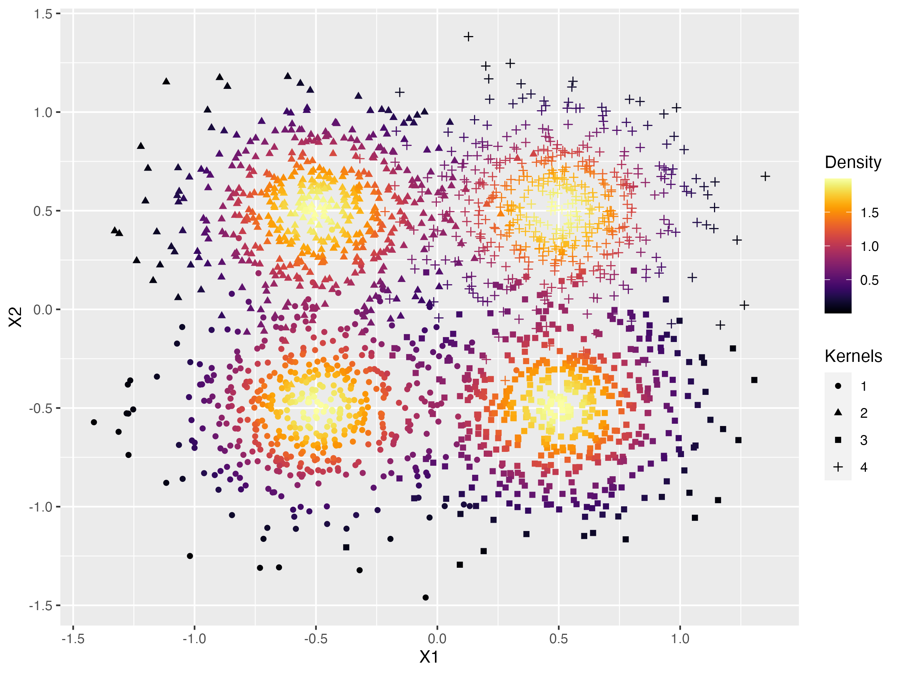

```{r setup, include=FALSE}
knitr::opts_chunk$set(
  echo = TRUE,
  cache = FALSE,
  messages = FALSE,
  warning = FALSE,
  eval = TRUE
  # include = FALSE
)
options(tinytex.verbose = TRUE)
library(tidyverse)
library(dimRed)
library(reticulate)
library(here)
library(viridis)
library(hdrcde)
library(igraph)
library(matrixcalc)
library(akima)
library(car)
library(ggforce)
library(ks)
library(patchwork)
library(copula)
library(plotly)
Jmisc::sourceAll(here::here("R/sources"))
# set.seed(123)
```


# Introduction
	
	Background (anomaly detection with density) with summarized contribution

		Anomaly detection on very high-dimensional data. Applications. Main contribution.

	Anomaly detection using densities, other methods for anomaly detection. Based manifold learning embeddings, density estimates

	Density estimation methods, KDE with distortion, 2-D variable kernel denstiy estimate with Riemannian matrix

	- Main contributions: better anomaly detection

		fix distortion with Riemmannian matrix

		anomaly detection using density estimates

		kernel density estimate is not accurate

		improve density estimation with distortion in the embedding plot


The rest of the paper is organized as follows.
In \autoref{vkde}, we present the proposed algorithm to detect anomalies based on variable kernel density estimates of manifold embeddings. In this section, we provide justification for the use of Riemannien matrix as the bandwidth of variable kernel density estimation, including the comparison with fixed bandwidth.
\autoref{simulation} is composed with two simulations with the proposed algorithm; the first deals with a 2-dimensional meta data and the second with a 100-dimensional meta data.
\autoref{application} contains the application to visualize and identify anomalies in the [TODO] data.
Conclusions and discussions are presented in \autoref{conclusion}.


# Variable kernel density estimation with manifold embeddings {#vkde}

	Idea: whole process for the main contribution

	Kernel density estimate with variable bandwidth
	
## Notations


## Two dimensional kernel density estimation

In general a multivariate kernel density estimate looks something like this

$$
\hat{f}(\mathbf{x})=\sum\limits_{i=1}^N K_{\mathbf{H}}(\mathbf{x}-\mathbf{x}_i)
$$

where if a Gaussian kernel is used

$$
K_{\mathbf{H}}(\mathbf{x}-\mathbf{x}_i)=(2\pi)^{-d/2}|\mathbf{H}|^{-1/2}\exp\left[-\frac{1}{2}(\mathbf{x}-\mathbf{x}_i)'\mathbf{H}^{-1}(\mathbf{x}-\mathbf{x}_i)\right]
$$

The matrix $\mathbf{H}$ is called the bandwidth matrix and is very important.  You will often read that the bandwidth matrix is about smoothing and it is.  But an alternative way to think of kernel estimation is that kernel densities 'borrow strength' from nearby points and the bandwidth determines what is "nearby".  If the bandwidth is large then all points are "nearby" and we get an overly smooth kernel density estimate.  The interesting thing about a bandwidth matrix is that it allows for different notions of what is "nearby" along different coordinates and even along diagonal directions.


    Riemannian matrix could be used to measure distortion

    Use riemannian matrix as variable bandwidth
        Bandwidth is a symmetric positive-definite square matrix, similar to riemannian matrix

## Use riemannian matrix as variable bandwidth

The Riemannian estimated using the method of Perrault Joncas and Meila gives some idea of the distortion of an embedding (or so they claim). Mapping the points through a non-linear function "stretchs" some regions of space and "shrinks" others. The Riemannian gives us an idea of the direction and angle of this stretching.  The Riemannian is quite a technical concept but an important thing to understand is that the estimate that comes out of Perrault Joncas algorithm is a square matrix.

We saw how points that are far apart in the embedding may not have been so far apart on the original manifold.  The Riemannian gives us some way of correcting this.  Similarly a bandwidth matrix in a kernel density estimate is all about determining the "directions" in which there should be more or less "closeness".  So the basic idea is to replace the kernel density estimate with

$$
\hat{f}(\mathbf{x})=\sum\limits_{i=1}^N K_{\mathbf{H}_i}(\mathbf{x}-\mathbf{x}_i)\\
K_{\mathbf{H}_i}(\mathbf{x}-\mathbf{x}_i)=(2\pi)^{-d/2}|\mathbf{H}_i|^{-1/2}\exp\left[-\frac{1}{2}(\mathbf{x}-\mathbf{x}_i)'\mathbf{H}_i^{-1}(\mathbf{x}-\mathbf{x}_i)\right]
$$

where $H_i$ is either the Riemannian or the inverse of the Riemannian (I am not totally sure which one).  Notice that the bandwidth matrix is different for each point.  This makes it a kernel density estimate with local smoothing, which is quite interesting, but we should take care to understand the properties of such things.  
<!-- There is a paper by Terrel and Scott from Annals of Statistics in 1992 where they talk about this (it is called "variable kernel density estimation"). Some other search terms to find relevant papers might be "adaptive" or "varying bandwidth". I don't know if anyone has had the idea of bringing all these ideas together with manifold learning and the estimate of the Riemannian - we should do a thorough literature search.  However, if no one has already done this I think it is a very interesting way to do anomaly detection for very high dimensional data. -->


    	- Manifold learning distortion

    		dimension reduction using manifold learning
    		Riemannian matrix to measure topological distortion
    		distortion is informative for true embedding

The aim of the project is not to evaluate different manifold learning algorithms.  Although ISOMAP worked OK here it is still distorted and in real examples you will never 'know' that the data are uniform on the sphere.  Instead the idea of this project is to do kernel density estimation in a way that takes distortion into account.


# Simulation {#simulation}

To examine our proposed algorithm, we now run two scenarios for both low and high dimensions. For visualization purpose, \autoref{twodgaussian} presents a 2-D meta data example. We first simulated the data of size $N=2000$ from a mixture of four Gaussian kernels with the same covariance but different means, each consisting of $500$ points. Different mapping functions are then applied to the 2-D meta data so that they now lie on a 3-D feature space, which gives the input data for different manifold learning algorithms, including ISOMAP, LLE, Laplacian Eigenmaps, t-SNE, and UMAP. The embedded dimension is set as $D=2$, same as the meta data dimension. This enables us to compare the manifold learning embedding with the true meta data. We could now apply the algorithm described in [TODO]. Similarly, the second simulation in \autoref{fivedgaussian} is based on a 5-D meta data embedded in a 100-D space and the corresponding embedding dimension is $D=5$.

## 2-D Meta data from a Gaussian Mixture Model {#twodgaussian}

We first generate a 2-dimensional data of size $N=2000$ from a Gaussian mixture model of four kernels. The means of four kernels are $(0.25, 0.25), (0.25, 0.75), (0.75, 0.25), (0.75, 0.75)$ and the variance-covariance matrix is $\big(\begin{smallmatrix} 0.02&0\\ 0&0.02 \end{smallmatrix}\big)$. \autoref{fig:metadensity} shows the 2-dimensional meta data and the colors indicate the true density of all data points, with brighter colors showing high densities and dark colors showing low densities. We then define outliers as points with lowest densities shown in black and typical points with highest densities shown in yellow. Based on the true density plot, the outliers are scattered in the middle and the outer area of the whole structure, while typical points are near the means of four kernels. This is the baseline to be compared with outliers from variable kernel density estimates.

```{r metadensity, fig.align = 'center', out.width = "80%", fig.cap="True density of the Gaussian mixture model of four kenels with means $(0.25, 0.25), (0.25, 0.75), (0.75, 0.25), (0.75, 0.75)$ and variance-covariance matrix $\\big(\\begin{smallmatrix} 0.02&0\\ 0&0.02 \\end{smallmatrix}\\big)$", echo = FALSE}

```

Given the 2-D meta data, multiple mapping functions could be applied to embed the data in a 3-D space. One of the most famous example in manifold learning is the swiss roll data, with the mapping function as below. 
$$
\left\{ 
\begin{array}{lcl}
X = X_1 \times \cos{X_1}, \\
Y = X_2, \\
Z = X_1 \times \sin{X_1}.
\end{array}
\right.
$$
Now we are able to apply different manifold learning algorithms to reduce the dimension back to 2, and further estimate the density of the embedding to detect anomalies. According to the density estimates, we could rank the data points and then identify which observations lie in an highest density region of specified coverage, eg. 1%, 50%, 99%, >99%. The top outliers with lowest densities are also indexed in blue, which we call *true outliers*. For each of the four manifold learning methods, namely ISOMAP, LLE, t-SNE, and UMAP, \autoref{fig:sroutliers} presents in one column the 2-D embedding plot, with the colors indicating the densities, the top row for true densities from the Gaussian mixture model, the middle row for highest density region plots with densities from our proposed variable KDE, and the bottom for similar HDR plots with densities from KDE with fixed bandwidth. Since there are four kernels in the meta data and darker points are the defined outliers, we could derive that for ISOMAP and LLE, variable kernel density estimates could detect the number of kernels more accurately than the KDE with fixed bandwidth. As for t-SNE and UMAP, both embeddings are quite close to each other with points clustered together, but the mixture of kernel structure is not as clear as ISOMAP and UMAP. Instead, we could roughly compare the location of outliers. For t-SNE, the middle plot have indexed more true outliers than the bottom plot; while for UMAP, both the middle and bottom plot fail to find the true outliers, but the outliers from fixed bandwidth are more scattered along the curved embedding.

```{r sroutliers, fig.align = 'center', out.width = "95%", fig.cap="Highest density region plots of four manifold learning embeddings of the swiss roll data. Colors are indicating densities from top: true densities from the Gaussian mixture model; middle: KDE with Riemannian matrix as variable bandwidth; and bottom: KDE with fixed bandwidth. Variable KDE preforms better in finding kernel structures with ISOMAP and LLE, and in locating outliers with t-SNE. Both methods are not detecting outliers accurately when using UMAP.", echo = FALSE}
knitr::include_graphics("figures/outliers_comparison_4ml_3cases.png")
```

```{r mappings, fig.align = 'center', out.width = "80%", fig.cap="3-D Mappings of the meta data with colors indicating four kernels. Left: swiss roll mapping. Right: twin peak mapping.", echo = FALSE}
knitr::include_graphics("figures/mappings_sr_tp.png")
```

For comparison, we use the same meta data with different mapping function, twin peak mapping, with the corresponding 3-D data is shown in \autoref{fig:mappings}. The four colors in both mappings represents the four gaussian kernels in the meta data. Similar to \autoref{fig:sroutliers}, four manifold learnings are obtained and used to detect outliers with two bandwidth selection methods in \autoref{fig:tpoutliers}.

```{r tpoutliers, fig.align = 'center', out.width = "95%", fig.cap="Highest density region plots of four manifold learning embeddings of the twin peak data. Variable KDE preforms better in finding kernel structures with ISOMAP and LLE, and in locating outliers with t-SNE and UMAP.", echo = FALSE}
knitr::include_graphics("figures/twin_peak_outliers_comparison_4ml_3cases.png")
```

<!-- Multiple mapping functions: swiss roll, twin peak -->

<!-- Manifold learning results for the mapped 3-D data -->

<!--     ISOMAP, LLE, Laplacian Eigenmaps, t-SNE, UMAP (useful ones, and the one with too severe distortion) -->

<!-- Outlier plot based on density estimates -->

<!--     Fixed bandwidth -->

<!--     Pointwise adaptive bandwidth using Riemmanien -->

<!--     Comparison -->

<!--         Rank of densities with the true density (f=f_1/4 + f_2/4 + f_3/4 + f_4/4) -->
<!--         Sum of squared errors in the density estimates -->


## 5-D data embedding in 100-D space {#fivedgaussian}

4-D from mixture Gaussian kernels (99% from N(0,1), 1% from N(0, 5) to add outliers), 1-D from semi-sphere, all other 95-D as 0, then rotate using the R matrix from QR decomposition to get the 100-D input for manifold learning)


# Application {#application}

	Dataset

	Goal and process

	Results (Plots and tables)

	Analysis and summary

# Conclusion {#conclusion}

	Summary of the contribution and conclusion

	Details about the process

	Shortcoming and other references for future direction (improvement on density estimation, other kernels, densities on edges, bad embeddings with inaccurate distortions, multi-dimensional kernel density estimate)


<!-- ## Using dimension reduction algorithms -->

<!-- Now we can try to see what happens when we use an actual dimension reduction algorithm, for instance ISOMAP -->

<!-- ```{r isomap, echo=TRUE,message=FALSE, eval=FALSE} -->
<!-- dat<-dimRedData(cbind(x,y,z)) #Prepare data to use in dimRed -->
<!-- emb<-embed(dat,"Isomap") #Isomap embedding -->
<!-- plot(hdrscatterplot(emb@data@data[,1],emb@data@data[,2])) #HDR plot -->
<!-- ``` -->

<!-- Which seems to not distort things too much.  The HDR plot still identifies outliers (because it has to) but they are just scattered around the corners in a very non-systematic way.  -->

<!-- For something that leads to a lot of distortion have a look t t-SNE. -->


<!-- ```{r tsneplot, echo=TRUE,message=FALSE, eval=FALSE} -->
<!-- emb_tsne<-embed(dat,"tSNE") #tSNE embedding -->
<!-- plot(hdrscatterplot(emb_tsne@data@data[,1],emb_tsne@data@data[,2])) #HDE plot -->
<!-- ``` -->
