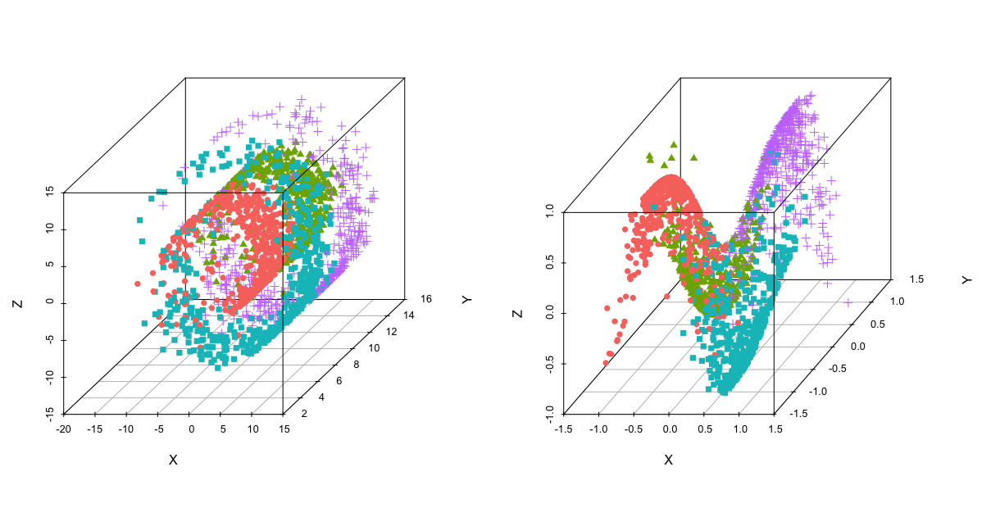
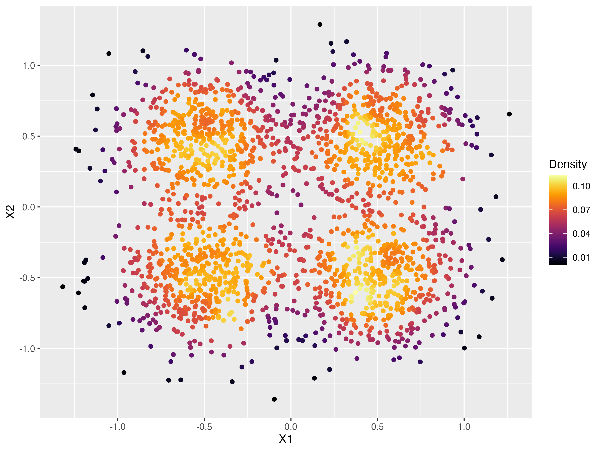
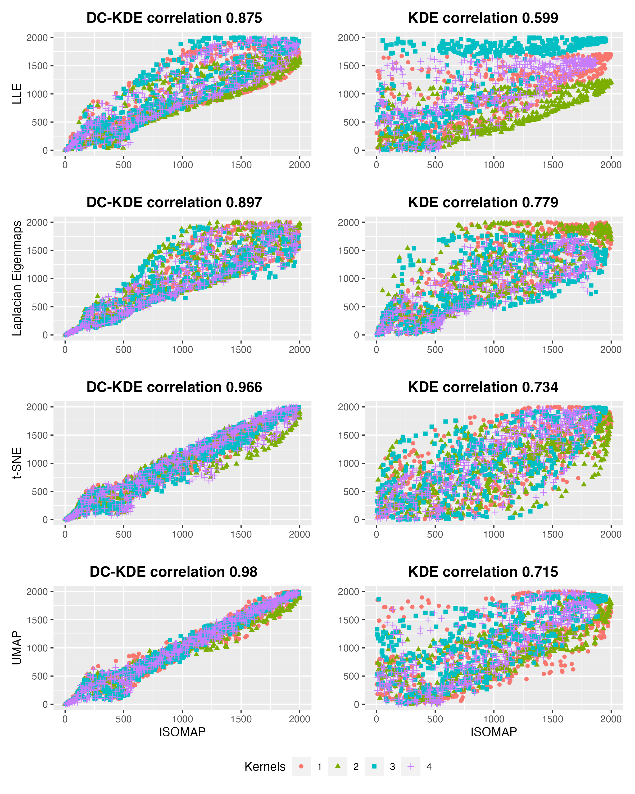

```{r setup, include=FALSE}
knitr::opts_chunk$set(
  echo = TRUE,
  cache = T,
  messages = FALSE,
  warning = FALSE,
  eval = TRUE
  # include = FALSE
)
options(tinytex.verbose = TRUE)
library(tidyverse)
library(here)
# library(hdrcde)
# library(car)
library(patchwork)
library(kableExtra)
# Jmisc::sourceAll(here::here("R/sources"))
# set.seed(1234)
```

\newpage

# Introduction

Multivariate kernel density estimation has gained lots of attention in exploratory data analysis. It is a non-parametric technique to estimate the data density based on weighted kernels centered at the data which usually belongs to a subset of $\mathbb{R}^d$. Applications of kernel density estimation [KDE; @Parzen1962-gt; @Chen2017-dw] include finding hot spots of traffic network in the GIS environment [@Xie2008-eb; @Okabe2009-nb], automatic detection in visual surveillance systems [@Elgammal2002-cw], wind power density detection [@Jeon2012-ac], prime prediction via Twitter messages [@Gerber2014-tq], and so on. However, when samples are assumed to be drawn from a Riemannian manifold embedded in a high-dimensional space of much more than $\mathbb{R}^d$, kernel density estimation has to be generalized to a non-Euclidean space and further approximation methods have to be adapted. @Pelletier2005-vu propose a kernel density estimator based on the Riemannian geodesic distance of the manifold but it is only applicable when the underlying manifold is known. Manifold learning algorithms could be applied to reduce the dimension and get an approximation of the manifold, but different manifold learning algorithms could induce different distortions of the same manifold. Therefore, we propose a distortion-corrected kernel density estimator for Riemannian manifolds embedded in more than $\mathbb{R}^d$. Our estimator could be applied to any reasonable manifold learning embedding from the high-dimensional sample data and fix the distortions at each point with estimated Riemannian geodesic distance and volume density function. This estimator could be further applied for unsupervised tasks such as anomaly detection where the outliers are the lowest density points.

<!-- Anomaly detection has been an important and diverse area where anomalies or outliers are detected in a given data. It often involves a data analysis process to uncover the unusual patterns and has been widely applied to machine learning [@Omar2013-lz], network intrusions identification [@Ahmed2016-co; @Bhuyan2013-ra], medical imaging [@Fernando2022-ef], fraudulent attacks [@Ahmed2016-dz], cyber-security [@Ten2011-co], energy consumption [@Cheng2021-ex], the last of which explored detecting households with anomalous electricity usage distributions instead of raw data. In the case of non-Euclidean sample space, the observations lie on a Riemannian manifold embedded in a very high-dimensional ambient space, which makes it computationally expensive or impossible to detect anomalies. To address this problem, we propose a kernel density estimator of the low-dimensional statistical manifold embedding and find outliers as the data with the lowest density estimates. -->

For a given kernel function, kernel density estimation is flexible to learn the shape of the underlying density of the data controlled by the bandwidth and the selection of bandwidth is crucial in KDE [@Jones1990-oe; @Terrell1992-ut]. 
<!-- There are extensive research on bandwidth selection, two main categories of which are cross-validation [@Jones1992-ta; @Sain1994-gr] and plug-in methods [@Wand1994-gc; @Duong2003-sp].  -->
Many bandwidth selection methods have been proposed in the literature, including the rule-of-thumb, cross-validation [@Jones1992-ta; @Sain1994-gr] and plug-in methods [See @Heidenreich2013-bl; @Scott2015-vl for details]. 
For univariate kernel density estimation, the bandwidth selection problem has been thoroughly investigated [See @Jones1992-ef; @Cao1994-st; @Jones1996-cb; @Wand1994-xu for reviews]. The generalization to multivariate case could mostly be found in @Duong2003-sp, @Duong2004-rh, and @Chacon2010-wm. In this paper, we focus on the multivariate kernel density estimation.

Note that a fixed bandwidth matrix $\pmb{H}$ is a global smoothing parameter for all data points. However, when the local data structure is not universal for all sample data, which is true in most applications, an adaptive bandwidth matrix that is varying rather than fixed at each data point is needed. 
The bandwidth is varied depending on either the location of the sample points [sample smoothing estimator; @Terrell1992-ut] or that of the estimated points [balloon estimator; @Terrell1992-ut]. In this paper, the densities are estimated at the sample points themselves, so we only need to consider the case where the bandwidth changes for each sample point and will refer to this as the *variable/adaptive kernel density estimation* [VKDE; Section 6.6 of @Scott2015-vl] unless otherwise stated.
However, these kernel density estimators are based on random samples in the Euclidean space.

For samples points lying on a manifold with the differentiable structure called the Riemannian manifold, @Pelletier2005-vu generalize the kernel density estimator based on the kernel weights from the geodesic distance between the estimated points and the sample points. The idea of the estimator is to use a strictly positive function of the geodesic distance on the manifold and then normalize it with the volume density function of the Riemannian manifold for curvature [@Henry2009-ll]. 
However, in many application scenarios, we tend to find that the sample points are not drawn directly from the manifolds because they are embedded in a much higher-dimensional space. Therefore, the kernel density estimator from @Pelletier2005-vu is not applicable because the geodesic distance and the volume density function are unknown.
This is when we introduce manifold learning to reduce the input data dimension. For these high-dimensional data set, various manifold learning algorithms including ISOMAP, LLE, Laplacian Eigenmaps, t-SNE, and UMAP (see details of these algorithms in @Cheng2021-ex), could be applied to get a low-dimensional embedding, which are used as approximations of the underlying manifold. 

In manifold learning, the underlying idea is that the data lies on a low-dimensional smooth manifold that is embedded in a high-dimensional space. One of the fundamental objectives of manifold learning is to explore the geometry of the dataset, including the distances between points and volumes of regions of data. These intrinsic geometric attributes of the data, such as distances, angles, and areas, however, can be distorted in the low-dimensional embedding, leading to failure in recovering the geometry of the manifold [@Goldberg2008-co]. To tackle this problem and measure the distortion incurred in manifold learning,
@Perrault-Joncas2013-pq propose the Learn Metric algorithm to augment any existing embedding output with geometric information in the Riemannian metric of the manifold itself. By applying this algorithm, the outputs of different manifold learning methods can be unified and compared under the same framework, which would highly benefit in improving the effectiveness of the embedding.
The Riemannian metric using the method of @Perrault-Joncas2013-pq gives some idea of the distortion of an embedding. Mapping the points through a non-linear function "stretches" some regions of space and "shrinks" others. The Riemannian gives us an idea of the direction and angle of this stretching at each point, which is informative for learning the manifold. 

By exploiting the connection between the estimated Riemannian metric and the Riemannian geodesic distance as well as the volume density function for curvature, we propose the main contribution of the paper, which is the variable distortion-corrected kernel density estimator (DC-KDE) for manifold learning embedding. Starting from the high-dimensional sample data, we apply manifold learning algorithms to get the low-dimensional embedding in the same dimensional space as the underlying manifold together with the estimated Riemannian matrix at each embedding point. Then the DC-KDE is used to estimate the density of the manifold and distortions induced by manifold learning methods are fixed with the estimated geometric information. Our distortion-corrected estimator is novel in filling the gap between the high-dimensional sample space and the density of the unknown manifold. These density estimates are useful in many other areas, including classification, clustering and anomaly detection. Similar to @Cheng2021-ex, the highest density region plots[@Hyndman1996-lk] could be generated using the kernel density estimates for outlier visualization, which brings a novel anomaly detection method for Riemannian manifolds.

The rest of the paper is organized as follows. In \autoref{kderm}, we present our distortion-corrected kernel density estimator for Riemannian manifolds. We start by introducing the multivariate kernel density estimate with adaptive bandwidth and the kernel density estimator for Riemannian manifolds. Then we provide justification for the use of Riemannian metric to correct the distortions in manifold learning embedding and further apply the proposed estimator for anomaly detection. \autoref{simulation} is composed of two simulations with the proposed anomaly detection algorithm; the first deals with 2-dimensional data from gaussian mixture model mapped into a 3-D twin peaks structure and the second with a 5-D semi-hypersphere data mapped in a 100-D space. Different manifold learning algorithms are applied to the high-dimensional data to get the low-dimensional embedding which are then used to estimate densities and detect anomalies.
\autoref{application} contains the application to visualize and identify anomalous households in the Irish smart meter dataset. Conclusions and discussions are presented in \autoref{conclusion}. Readers interested in the notions of Riemannian geometry mentioned in this paper could use \autoref{riemgeo} as a reference.

# Kernel density estimate on Riemannian manifolds - Tas {#kdermtas}

In this section we introduce our method for kernel density estimation on manifolds that uses an embedding from a dimension reduction algorithm and the Metric Learning algorithm of @Perrault-Joncas2013-pq. We will do so by first introducing kernel density estimation for data in Euclidean space, then illustrating how this generalises to the estimator of @Pelletier2005-vu, when the data lie on some known manifold. Finally, we describe how our own proposed method generalises the estimator of @Pelletier2005-vu to the case where the underlying manifold is unknown. Denoting $\lambda$ as the Lebesgue measure of $\mathbb{R}^d$, letting $||.||$ be the usual Euclidean norm and following @Pelletier2005-vu we make these assumptions about the kernel function $K:\mathbb{R}_+\rightarrow\mathbb{R}$ 
\begin{align}
\label{eq:kernelcondition}
& (i) \int_{\mathbb{R}^{d}} K(\|\pmb{x}\|) \mathrm{d} \lambda(\pmb{x})=1;
(ii) \int_{\mathbb{R}^{d}} \pmb{x} K(\|\pmb{x}\|) \mathrm{d} \lambda(\pmb{x})=0;
(iii) \int_{\mathbb{R}^{d}}\|\pmb{x}\|^{2} K(\|\pmb{x}\|) \mathrm{d} \lambda(\pmb{x})<\infty; \\
& (iv) \supp K=[0; 1];
(v) \sup K(||\pmb{x}||)=K(0).
\end{align}
Note that these conditions are different (and in some cases stricter) that those normally used for kernel density estimation. For instance condition (iv) requires the support of the kernel to be bounded. The reasons for this will become clearer when we discuss the manifold setting in more detail. Also, for illustration purposes, in this section we pay particular attention to the uniform kernel for which $K(z)$ equals one if $0\leq z\leq1$ and zero otherwise. In our empirical section more general kernel functions can be, and are, employed.

Assume the data $\pmb{x}_i\in\mathbb{R}^d$ for $i=1,\dots,N$ and assuming a bandwidth matrix $r\bm{I}$ where $r$ is a global bandwidth, then the usual kernel density estimator at a point $\pmb{x}$ is given by

\begin{equation}
\label{eq:vkde}
\hat{f}(\pmb{x})=\frac{1}{N}\sum\limits_{i=1}^N \frac{1}{r^d} K\left(\frac{||\pmb{x}-\pmb{x}_i||}{r}\right).
\end{equation}

The intuition behind this estimator is very clear for a uniform kernel. The density at a point $\pmb{x}$ is equal to the proportion of sample points that lie within a ball of radius $r$ centered at $\pmb{x}$, times a term that ensures the density integrates to 1. In general, the bandwidth matrix need not be proportional to the identity matrix. However, the intuition remains the same, only that the ball of radius $r$ centered at $\pmb{x}$ is found with respect to Mahalanobis distance rather than the usual Euclidean distance. For more on kernel density estimation in the Euclidean case see @Scott2015-vl and references therein.

To extend this to the case where data are on a manifold $\pmb{p}_i\in\mathcal{M}$, for $i=1,\dots,N$, @Pelletier2005-vu propose the following estimator,

\begin{equation}
\label{eq:denriem}
\hat{f}(\pmb{p}) = \frac{1}{N} \sum_{i=1}^{N} \frac{1}{r^d \theta_{\pmb{p}_i}(\pmb{p})} K\left(\frac{d_g(\pmb{p}, \pmb{p}_i)}{r}\right),
\end{equation}

where $d_g(\pmb{p}, \pmb{p}_i)$ denotes the geodesic distance between two points on the manifold $\pmb{p}$ and $\pmb{p}_i$ and $\theta_{\pmb{p}_i}(\pmb{p})$ is known as the volume density function. The intuition behind the term $K\left(\frac{d_g(\pmb{p}, \pmb{p}_i)}{r}\right)$ is relatively clear. For example, for a uniform kernel the estimator at point $\pmb{p}$ will still be depend on the proportion of sample points within a ball of radius $r$ centered at $\pmb{p}$. However in this case, the geodesic distance on the manifold is used, rather than Euclidean or Mahalanobis distance. An additional technical assumption is that $r$ is less than the injectivity radius of the manifold. A definition of the injectivity radius is given by @Chavel2006-mp and also provided in the appendix. For our purposes, it is sufficient to note that this assumption precludes the possibility that the radius of a ball around $\pmb{p}$ is so large that some points `fall inside' the ball more than once. For example on a sphere, a ball with radius greater than half the circumference of a great circle will wrap back around the sphere. This phenomenon also explains why the kernel function must be bounded for density estimation on manifolds.

The inclusion of the volume density function  $\theta_{\pmb{p}_i}(\pmb{p})$ is perhaps not as immediately clear, therefore before providing formal details we will briefly discuss the intuition behind including this term. We have already highlighted that when using a uniform kernel, the kernel density estimate at a point $\pmb{p}$ directly depends on the proportion of sample points within a ball of radius $r$ around $\pmb{p}$. However the volume of a ball of radius $r$ around $\pmb{p}$ must also be taken into account. In Euclidean space with the usual Lebesgue measure, a radius $r$ ball will always have the same volume regardless of its center. The same does not hold for manifolds and the volume density function ensures that the density estimate integrates to one.

More formally, the volume density function can be explained as follows. Consider the exponential map around $\pmb{p}$, given by $exp_{\pmb{p}}(\pmb{q})$, mapping vectors in the tangent space $\pmb{v}\in T_{\pmb{p}}M$ to points the manifold $\pmb{q}\in M$ . Loosely, $\pmb{v}$ `points' in the direction of the geodesic between $\pmb{p}$ and $\pmb{q}$ and along this geodesic at uniform speed $||\pmb{v}||$ takes place in one unit of time. Now, consider a chart $\varphi$ mapping points in the neighbourhood of $\pmb{p}$, via the inverse of the exponential map, to these $\pmb{v}$ vectors, expressed in some local coordinate system. The volume density function is the square root of the determinant of the Riemannian metric expressed in this coordinate system. For more on the volume density function see @Le_Brigant2019-lj.

## Distortion corrected KDE

To come...

# Kernel density estimate on Riemannian manifold embedding {#kderm}

<!-- In this section, we introduce the proposed kernel density estimator on the embedding of Riemannian manifolds.  -->
For multivariate data, variable kernel density estimator with adaptive bandwidth matrix at each sample point can be used to capture the local structure of the data. @Pelletier2005-vu generalize the multivariate kernel density estimator to Riemannian manifolds. However, it is not applicable when the underlying manifold is unknown or when the manifold is mapped in a much higher dimensional space. Therefore, we propose a distortion-corrected kernel density estimator as in Equation \@ref(eq:denestimator0) based on the low-dimensional manifold learning embedding, $\pmb{y}_i \in \mathbb{R}^d, i = 1, 2, \dots, N$, of the high-dimensional data,
\begin{equation}
\label{eq:denestimator0}
\hat{f}(\pmb{p}) = \frac{1}{N} \sum_{i=1}^{N} \frac{1}{r^d} \bigg(\frac{|\det \pmb{H}(\pmb{y}_i)|}{|\det \pmb{H}(\pmb{p})|} \bigg)^{-1/2} K\bigg( \frac{ \pmb{H}^{-1/2}(\pmb{y}_i) (\pmb{p} - \pmb{y}_i)}{r} \bigg),
\end{equation}
where $\pmb{H}(\pmb{y}_i), i = 1, 2, \dots, N$ is the pointwise adaptive Riemannian matrix of dimension $d \times d$.
The proposed estimator could be used as an estimate of the true manifold density, with the local distortion corrected by the volume density function at each point. These densities could further be used for unsupervised tasks including anomaly detection when outliers are defined as the points with the lowest densities.

<!-- to detect anomalies based on the kernel density estimates of manifold learning embeddings where the Riemannian matrix is used as the pointwise variable bandwidth to measure the direction and angle of the distortion of the low-dimensional embeddings. @Perrault-Joncas2013-pq gives us an idea of how to measure the direction and angle of the distortion using the Riemannian metric which is a positive definite square matrix for each data point. To learn the distribution of the low-dimensional embedding, we use the kernel density estimation with the bandwidth matrix being the Riemannian metric. The outliers could then be defined as the points with the lowest density estimates.  -->

To start with, we introduce the multivariate kernel density estimation method with variable bandwidth matrix and Pelletier's kernel density estimator for Riemannian manifolds. Then we propose our distortion-corrected estimator, followed by details about how to estimate the Riemannian metric using the Learn Metric algorithm from @Perrault-Joncas2013-pq. Finally, we show how to use these densities to carry out anomaly detection tasks for high dimensional data that lies on Riemannian manifolds.

<!-- ## Notations -->

<!-- Denote the $s$-dimensional input data with observations $X_i, i = 1, 2, \dots, N$, where $x_i \in \mathbb{R}^s$. The underlying manifold $M$ has the true density $f$. Manifold learning takes the input data and finds its $d$-dimensional representation of data that lie on the manifold $M$, with output data points $Y_i, i = 1, 2, \dots, N$, where $Y_i \in \mathbb{R}^d$ and $d \ll s$. The Riemannian metric of the embedding is denoted as $H_i, i = 1, 2, \dots, N$. In kernel density estimate, the pointwise variable bandwidth matrix $H_i$ is used to estimate the density of the embedding, $\hat{f}$. -->

## Multivariate kernel density estimation {#mvkde}

Kernel density estimation is one of the most popular methods to calculate the probability density function from a sample data. @Scott2015-vl covers a wide range of techniques for estimating the kernel densities of multivariate data.
In general, given multivariate random samples $\pmb{X}_1, \dots, \pmb{X}_N \in \mathbb{R}^d$
<!-- $\pmb{X}_i=(X_{i1}, X_{i2}, \dots, X_{id})^\prime \in \mathbb{R}^d$, $i = 1, 2, \dots, N$  -->
drawn from a density $f$, the variable kernel density estimate [@Breiman1977-qc; @Jones1990-oe; @Terrell1992-ut] of $f$ at point $\pmb{x}=(x^1, x^2, \dots, x^d)^\prime \in \mathbb{R}^d$ is given by
\begin{equation}
\label{eq:vkde}
\hat{f}(\pmb{x};\pmb{H}_i)=\frac{1}{N}\sum\limits_{i=1}^N K_{\pmb{H}_i}(\pmb{x}-\pmb{X}_i).
\end{equation}
where $K(\pmb{x})$ is the kernel function, $\pmb{H}_i$ is called the bandwidth matrix and it is a symmetric positive definite matrix of dimension $d\times d$, and $K_{\pmb{H}_i}(\pmb{x}) = |\pmb{H}_i|^{-1/2} K(\pmb{H}_i^{-1/2}\pmb{x})$.
When using the standard gaussian kernel, we have $K(\pmb{x}) = (2\pi)^{-d/2}\exp(-\frac{1}{2}\pmb{x}'\pmb{x})$ and hence
\begin{equation}
\label{eq:kernel}
K_{\pmb{H}_i}(\pmb{x}-\pmb{X}_i)=(2\pi)^{-d/2}|\pmb{H}_i|^{-1/2}\exp\left[-\frac{1}{2}(\pmb{x}-\pmb{X}_i)'\pmb{H}_i^{-1}(\pmb{x}-\pmb{X}_i)\right],
\end{equation} 
with $|\pmb{H}_i|$ being the determinant of matrix $\pmb{H}_i$.
Intuitively, KDE smooths out each data point $\pmb{X}_i$ into a smooth bump with the shape determined by the kernel function. Then an average over all data points is taken as the estimated density $\hat{f}$. KDE is a local smooth estimator because the nearby points contributes more to the density value compared to points far away from the estimated data point $\pmb{x}$.

The choice of the bandwidth matrix $\pmb{H}_i$ is crucial in the accuracy of $\hat{f}$ because it controls the smoothing across the sample data. For a given kernel function $K(\pmb{x})$, the shape of the local smoothing at each point is determined. Then the performance of the density estimate $\hat{f}$ depends on the choice of $\pmb{H}_i$. When $\pmb{H}_i$ is too small, the density estimates will apprear to be wiggly. On the contrary, when $\pmb{H}_i$ is too large, the density estimates might smooth out some local features of $f$. So the accuracy of $\hat{f}$ depends strongly on the bandwidth matrix.
Compared to a global fixed $\pmb{H}$, a variable bandwidth matrix is able to account for the pointwise-adaptive local structure and generate an estimate more applicable to the case where the distortion at each point is different in the low-dimensional manifold learning embedding.

<!-- Many bandwidth selection methods have been proposed in the literature, including the rule-of-thumb, cross-validation and plug-in methods [See @Heidenreich2013-bl; @Scott2015-vl for details]. For univariate kernel density estimation, the bandwidth selection problem has been thoroughly investigated [See @Jones1992-ef; @Cao1994-st; @Jones1996-cb; @Wand1994-xu for reviews]. The generalization to multivariate case could mostly be found in @Duong2003-sp, @Duong2004-rh, and @Chacon2010-wm. In this paper, we focus on the multivariate kernel density estimation.
 -->

<!-- Note that a fixed bandwidth matrix $\pmb{H}$ is a global smoothing parameter for all data points. However, when the local data structure is not universal for all sample data, an adaptive bandwidth matrix that is varying rather than fixed at each data point is needed. The bandwidth is varied depending on either the location of the sample points or that of the estimated points [Section 6.6 of @Scott2015-vl]. In this paper, the densities are estimated at the sample points themselves, so we only need to consider the case where the bandwidth changes for each sample point $\pmb{X}_i$ and will refer to this as the *variable/adaptive kernel density estimation(VKDE)* unless otherwise stated. 
 -->
<!-- In multivariate VKDE, the estimator in Equation \@ref(eq:vkde) is similar to that in \@ref(eq:kde) except that the bandwidth is a variable matrix $\pmb{H}_i$ for each $\pmb{X}_i$,
\begin{equation}
\label{eq:vkde}
\hat{f}(\pmb{x};\pmb{H}_i)=\frac{1}{N}\sum\limits_{i=1}^N K_{\pmb{H}_i}(\pmb{x}-\pmb{X}_i).
\end{equation} -->

For computational purposes, @Duong2007-up implements the kernel density estimates for data from 1 to 6 dimensions in the R package *ks*. 
However, for variable kernel density estimation where the bandwidth is no longer a constant matrix, the *ks* implementation is limited to 2-dimension and the bandwidth can either be a diagonal matrix or a vector of the diagonal elements, which limits the full flexibility of the kernel function.
More importantly, the estimator in Equation \@ref(eq:vkde) is only applicable when the sample space is Euclidean. In the cases of a Riemannian manifold, the manifold has a differentiable structure, which has to be taken into account when considering the neighborhood of a sample point. Therefore, we need to consider the probability density estimation on a Riemannian manifold and adapts the techiniques on Euclidean samples to a non-Euclidean setting. This is discussed in \autoref{riemest}.

## Kernel density estimator on Riemannian manifolds {#riemest}

Consider a compact Riemannian manifold $(M, g)$ of dimension $d$ without boundary and a probability distribution with density $f$ on the manifold. Assume $(M, d_g)$ as a complete metric space, where $d_g$ is the geodesic distance induced by the Riemannian metric $g$ and the strictly positive injectivity radius of the manifold $inj_g(M)$ [@Chavel2006-mp]. Denote $\pmb{X}_i \in \mathbb{R}^d, i = 1, 2, \dots, N$, as i.i.d. random objects on $M$ with density $f$. To estimate the density of the manifold, @Pelletier2005-vu propose a kernel density estimator for $f$ at point $\pmb{p}\in M$ as
\begin{equation}
\label{eq:denriem}
\hat{f}(\pmb{p}) = \frac{1}{N} \sum_{i=1}^{N} \frac{1}{r^d \theta_{\pmb{X}_i}(\pmb{p})} K(\frac{d_g(\pmb{p}, \pmb{X}_i)}{r}),
\end{equation}
where $r$ is the global bandwidth satisfying $r \leq r_0$ for fixed $r_0$ such that $0\leq r_0\leq inj_g(M)$, $K: \mathbb{R}_{+} \rightarrow \mathbb{R}$ is a non-negative map, and $\theta_{\pmb{X}_i}(\pmb{p})$ is the volume density function on the manifold for point $\pmb{X}_i$. The estimator in \@ref(eq:denriem) is also proved to be consistent with the kernel density estimators in the Euclidean case and converges at the same rate as the Euclidean estimator [@Henry2009-ll].

Denote $\lambda$ as the Lebesque measure of $\mathbb{R}^d$. The kernels $K$ in \@ref(eq:denriem) are functions of the geodesic distance of the manifold $d_g$ and they satisfy the following conditions [@Pelletier2005-vu]:
\begin{align}
\label{eq:kernelcondition}
& (i) \int_{\mathbb{R}^{d}} K(\|x\|) \mathrm{d} \lambda(x)=1;
(ii) \int_{\mathbb{R}^{d}} x K(\|x\|) \mathrm{d} \lambda(x)=0;
(iii) \int_{\mathbb{R}^{d}}\|x\|^{2} K(\|x\|) \mathrm{d} \lambda(x)<\infty; \\
& (iv) \supp K=[0; 1];
(v) \sup K(x)=K(0).
\end{align}
Note that conditon (iv) implies that the support of the kernel is between 0 and 1, which is guaranteed by the condition on the bandwidth, $r\leq inj_g(M)$. Under such condition, for each $\pmb{p} \in M$, there exists a normal coordinate neighborhood of $\pmb{p}$ containing an open ball $B(\pmb{p}, r) \in T_{\pmb{p}}M$ centered at $\pmb{p}$ with radius $r$.

Now consider the volume density function $\theta_{\pmb{X}_i}(\pmb{p})$ in the estimator.
For any tangent vector $u \in T_{\pmb{p}}M$, let $\gamma(u): t \rightarrow \exp_p(\frac{tu}{\|u\|})$ denote a curve passing through $u$, and let $w_i, i=1,\dots,d$ be Jacobi fields along $\gamma$ such that $w_i(0)=0$ for all $i=1,\dots,d$ and $\frac{Dw_1}{dt}(0)=\frac{u}{\|u\|}$. Then $\frac{Dw_i}{dt}(0)$ forms an orthonomal basis of the tangent space $T_{\pmb{p}}M$. 
The volume density function on $M$, $\theta_{\pmb{p}}(u): T_{\pmb{p}}M \rightarrow \mathbb{R}$ is defined in @Le_Brigant2019-lj as 
\begin{equation}
\label{eq:volden}
\theta_{\pmb{p}}(u) = \|u\|^{d-1} \det(w_1(\|u\|),\dots,w_d(\|u\|)).
\end{equation}

For the exponential map $\exp_{\pmb{p}}: T_{\pmb{p}}M \rightarrow M$ induced by pullback of a volume form $\exp_{\pmb{p}}^*\textit{Vol}$ on $T_{\pmb{p}}M$, $\theta_{\pmb{p}}$ is its density with respect to the Lebesgue measure of the Euclidean structure on $T_{\pmb{p}}M$, which gives 
$$
d\exp_{\pmb{p}}^*\textit{Vo}l(u) = \theta_{\pmb{p}}(u)du,
$$
in normal coordinates [@Le_Brigant2019-lj]. The volume density function is motivated by how a measure $du$ changes under the change of coordinates. The volume form is variant to the exponential map except that the manifold is flat. Therefore, a multiplicative corrected term called the volume density function has to be added in the estimator so that it will integral to 1. It is closely related to the integration on manifolds and plays an important part in studying the density of manifolds.

@Pelletier2005-vu mention that the volume density function $\theta_{\pmb{p}}(\pmb{q})$ defined for $\pmb{q}$ in a neighborhood of $\pmb{p}$ on the manifold, with the geodesic normal coordinates at $\pmb{p}$, is equal to the determinant of the Riemannian metric $g$ expressed in the coordinates at the logarithm map of $\pmb{q}$, $\exp_{\pmb{p}}^{-1}(\pmb{q})$.
Note that this is true only when using the geodesic normal coordinates. If the mapping function is not exponential/logarithm map, the volume density function is calculated otherwise. Therefore, the Riemannian manifold density estimator in @Pelletier2005-vu only works when the true manifold $M$ is known.
Further, the fixed bandwidth assumes that the smoothing is the same across the entire manifold and there is no local distortion at each sample point, which needs to be corrected using an adaptive bandwidth matrix when distortion exists.

## Distortion-corrected kernel density estimator for manifold embedding {#dckde}

In application, we usually find the observations lying on a $d$-dimensional manifold embedded in a much higher $s$-dimensional space, where $d \ll s$. Instead of sampling from the underlying manifold $M$, we could sample from the high-dimensional data only and apply dimension reduction techniques such as manifold learning to find a $d$-dimensional representation of $M$.
Notice that this representation is not necessarily isometry to $M$, and the underlying manifold tends to be unknown in real data sets. We could use the low-dimensional embedding as an approximation of the true manifold $M$. However, the pointwise distortion induced by the manifold learning process needs to be taken care of to accurately estimate the density of the manifold. Therefore, the kernel density estimator in Equation \@ref(eq:denriem) no longer applies because of the unknown geodesic distance $d_g$ and the volume density function $\theta_{\pmb{X}_i}(\pmb{p})$.
Further, the bandwidth matrix should be adaptive to each sample point to take the distortion into account.

Motivated by the estimator in \@ref(eq:denriem), we restate below our proposed distortion-corrected kernel density estimator (DC-KDE) of $f$, same as \@ref(eq:denestimator0), based on the manifold learning embedding $\pmb{y}_i, i = 1, 2, \dots, N$,
\begin{equation}
\label{eq:denestimator}
\hat{f}(\pmb{p}) = \frac{1}{N} \sum_{i=1}^{N} \frac{1}{r^d} \bigg(\frac{|\det \pmb{H}(\pmb{y}_i)|}{|\det \pmb{H}(\pmb{p})|} \bigg)^{-1/2} K\bigg( \frac{ \pmb{H}^{-1/2}(\pmb{y}_i) (\pmb{p} - \pmb{y}_i)}{r} \bigg),
\end{equation}
where $r$ is a global bandwidth scalar, $\pmb{H}(\pmb{y}_i), i = 1, 2, \dots, N$, is the pointwise variable Riemannian matrix and it is positive definite with dimension $d\times d$, $\bigg(\frac{|\det \pmb{H}(\pmb{y}_i)|}{|\det \pmb{H}(\pmb{p})|} \bigg)^{1/2}$ is the estimated volume density function when using the coordinates from any manifold learning mapping, $\pmb{H}^{-1/2}(\pmb{y}_i) (\pmb{p} - \pmb{y}_i)$ is the first-order estimated geodesic distance with the distortion corrected by the Riemannian metric $\pmb{H}(\pmb{y}_i)$
<!-- , and $C = \sum_{i=1}^{N} \sqrt{\det(\pmb{H}(\pmb{y}_i))} \Delta y^1(\pmb{y}_i)\dots \Delta y^d(\pmb{y}_i)$ is a correction term for the volume between the surface when estimating over the sample points so that the integral of the density is 1 -->
. We will now state below how to calculate each term in the estimator. And the only problem left is the estimation of the Riemannian metric at each embedding point, to be discussed in \autoref{riemmetric}.

By the definition of the volume density function in Equation \@ref(eq:volden), we could calculate how the volume change under the change of coordinates. When using the logarithm map, the coordinates of points on the manifold are transformed into their coordinates in the tangent space, i.e. geodesic normal coordinates. In this case, @Pelletier2005-vu gives the volume density function from the manifold to the tangent space, which is equal to the determinant of the Riemannian metric expressed in the geodesic normal coordinates at the logarithm map, $|\det g(\exp^{-1}_{\pmb{p}}(\pmb{q})) |$. 
In order to estimate the density of the true manifold, we first map the high-dimensional data to a low-dimensional embedding, then we apply a kernel density estimator to the embedding. Since the logarithm map of the manifold is also unknown, the volume density function in @Pelletier2005-vu is no longer valid. Instead, we need a volume density function independent of the chart. 

For $\pmb{p} \in M$, denote an open ball centered at $\pmb{p}$ with radius $r$ as $B(\pmb{p},r)$ and the open neighborhood of $0_{\pmb{p}} \in T_{\pmb{p}}M$ can be denoted as $B(0_{\pmb{p}},r)=\exp_{\pmb{p}}^{-1}(B(\pmb{p},r))$. Consider the Riemannian metrics $g^{\prime}$ and $g^{\prime \prime}$ in $B(0_{\pmb{p}},r)$, with $g^{\prime} = \exp^{\ast}_{\pmb{p}}(g)$ being the pullback of $g$ induced by the exponential map and $g^{\prime \prime}$ being the canonical metric induced by $g_{\pmb{p}}$ in $B(0_{\pmb{p}},r)$. 
Let $u \in B(0_{\pmb{p}},r)$ be a tangent vector and for any given chart $(\bar{U}, \bar{\psi})$ of $B(0_{\pmb{p}},r)$, we have $u \in \bar{U}$. 
The volumes of the parallelepiped spanned by the basis $\{(\partial / \partial\bar{\psi}_1|_u), \dots, (\partial / \partial\bar{\psi}_d|_u)\}$ are given by $| \det g^{\prime}((\partial / \partial\bar{\psi}_i|_u), (\partial / \partial\bar{\psi}_j|_u)) |^{1/2}$ with respect to $g^{\prime}$, and $| \det g^{\prime \prime}((\partial / \partial\bar{\psi}_i|_u), (\partial / \partial\bar{\psi}_j|_u)) |^{1/2}$ with respect to $g^{\prime \prime}$. The quotient of these two volumes is then independent of the chart $(\bar{U}, \bar{\psi})$ [@Henry2009-om]. 
Therefore, given a point $\pmb{q} \in B(\pmb{p},r)$ and a tangent vector $u = \exp^{-1}_{\pmb{p}}(\pmb{q}) \in B(0_{\pmb{p}},r)$, for any chart $(\bar{U}, \bar{\psi})$ of $B(0_{\pmb{p}},r)$ that contains $u$, @Henry2009-om defines the volume density function on the Riemannian manifold $(M,g)$ as
\begin{equation}
\label{eq:volumedensityratio}
\theta_p(q) = \frac{| \det g^{\prime}((\partial / \partial\bar{\psi}_i|_u), (\partial / \partial\bar{\psi}_j|_u)) |^{1/2} }{ | \det g^{\prime \prime}((\partial / \partial\bar{\psi}_i|_u), (\partial / \partial\bar{\psi}_j|_u)) |^{1/2} } \\ .
\end{equation}
The volume density function is only defined for points satisfying $d_g(\pmb{p},\pmb{q}) < inj_gM$ so that there exists an open ball $B(\pmb{p},r) \in T_{\pmb{p}}M$. And $\theta_{\pmb{p}}(\pmb{q})=1$ for all $\pmb{p},\pmb{q} \in \mathbb{R}^d$ when the manifold $M$ is $\mathbb{R}^d$ with the canonical metric.

Now we consider the case with the manifold learning embedding. Consider the chart $(U, \psi)$ induced by an orthonormal basis of the tangent space of the embedding $T_{\pmb{y}_i}E$ and a normal neighborhood of $\pmb{y}_i$. Given a query point $\pmb{p} \in B(\pmb{y}_i,r)$, the volume of the parallelepiped is spanned by the same basis.
Then the volume density function is given by 
\begin{equation}
\label{eq:volumedensityest}
\theta_{\pmb{y}_i}(\pmb{p}) = \bigg(\frac{|\det \pmb{H}(\pmb{y}_i)|}{|\det \pmb{H}(\pmb{p})|} \bigg)^{1/2},
\end{equation} 
where $\pmb{H}$ is the estimated Riemannian metric for the unknown manifold.
Again, the volume density function is not defined for all $\pmb{p}$ but for points within the geodesic ball satisfying $\pmb{p} \in B(\pmb{y}_i,r)$, which is related to the support of $K$ being $[0,1]$ in Condition (v) of \@ref(eq:kernelcondition).

As for the geodesic distance $d_g$ in \@ref(eq:denriem), we propose a distortion-fixed geodesic distance with the use of estimated Riemannian metric as
\begin{equation}
\label{eq:dgestimate}
\hat{d}_g(\pmb{p}, \pmb{y}_i) = \pmb{H}^{-1/2}(\pmb{y}_i) (\pmb{p} - \pmb{y}_i),
\end{equation}
where $\pmb{H}(\pmb{y}_i)$ is the estimated Riemannian metric at embedding point $\pmb{y}_i$.

For two points $\pmb{p},\pmb{q} \in M$, the geodesic distance between $\pmb{p}$ and $\pmb{q}$ is defined as the length of the shortest curve from $\pmb{p}$ to $\pmb{q}$ along the manifold.
The geodesic distance is intrinsic, which means it is a coordinate-independent quantity. The Riemannian metric functions as the correction term for different coordinates of manifold learning embedding. 
By using the first-order distance estimator, $\hat{d}_g(\pmb{p}, \pmb{y}_i)$ serves as a good approximation of the true geodesic distance $d_g$ with the distortion corrected at each embedding point $\pmb{y}_i$. Compared with the graph distance, the shortest path between point in the neighborhood graph $G$, our proposed $\hat{d}_g$ is better because we use the same graph $G$ for all manifold learning embeddings but the distances between different nodes in $G$ might not be the same due to the distortion.

<!-- As pointed out by @Perrault-Joncas2013-pq, the naive distance $\|\pmb{p}-\pmb{q}\|$ underestimates $d_g$, and the graph shortest distance $d_G$ overestimates $d_g$ by the triangle inequality. By using only the first-order correction in $\hat{d}_g$, our estimator is also affected by the estimated Riemannian metric. In order to correct for the estimation error in $\pmb{H}(\pmb{y}_i)$, we further divide the density estimator in \@ref(eq:denestimator) by a constant term $C$ so that the integral of the kernel is equal to 1. The constant term in $1$-d is given by the *area under the curve (AUC)*, and can be named as the *volume between the surface (VBS)* in higher dimension. We use the volume estimator in Section 6.4 of @Perrault-Joncas2013-pq to sum over all embedding points $\pmb{y}_i$ and the estimated point $\pmb{p}$ so that for $\pmb{Z} = \{\pmb{y}_1, \dots, \pmb{y}_N, \pmb{p}\}$, we have -->
<!-- \begin{equation} -->
<!-- \label{eq:vbs} -->
<!-- C(\pmb{p}) = \sum_{i=1}^{N+1} \sqrt{\det(\pmb{H}(\pmb{z}_i))} \Delta z^1(\pmb{z}_i)\dots \Delta z^d(\pmb{z}_i), -->
<!-- \end{equation} -->
<!-- where $\pmb{z}_i=(z^1(\pmb{z}_i),\dots, z^d(\pmb{z}_i))$. The distortions are corrected for the tangent plane of the embedding points. Since we aim to estimate the density of the manifold for the embedding of sample points, $\pmb{p}$ is equal to $\pmb{y}_i$, for $i=1,\dots,N$. Therefore, we have -->
<!-- \begin{equation} -->
<!-- \label{eq:vbsyi} -->
<!-- C = \sum_{i=1}^{N} \sqrt{\det(\pmb{H}(\pmb{y}_i))} \Delta y^1(\pmb{y}_i)\dots \Delta y^d(\pmb{y}_i). -->
<!-- \end{equation} -->

Now we have all the components needed to estimate the density of manifold learning embedding in Equation \@ref(eq:denestimator) except for the Riemannian metric. The Riemannian metric is a key to correct the distortion from the manifold learning algorithms and we discuss its estimation in \autoref{riemmetric}.

## Riemannian metric estimation {#riemmetric}

An important goal of manifold learning is to recover the local or global features of the data. However, manifold learning algorithms usually fail to generate an isometric embedding.
In order to recover the geometry of the manifold, @Perrault-Joncas2013-pq propose a method to augment any existing reasonable embedding and allow for the computation of geometric values to be calculated with an estimated Riemannian metric. Instead of developing a new manifold learning method, they aim to fix the geometric distortion in the embedding. It is worth noticing that the Riemannian metric from @Perrault-Joncas2013-pq is a $d\times d$ positive definite matrix variable at each data point. The estimated Riemannian metric completes our proposed kernel density estimation in \autoref{dckde} and enables us to take the geometric distortion into consideration when estimating the densities of the manifold.

The Riemannian metric $g$ is a symmetric and positive definite tensor field which defines an inner product $\langle,\rangle_g$ on the tangent space $T_{\pmb{p}} M$ for every point $\pmb{p} \in M$. If the inner product of the tangent space is known for a given geometry, the Riemannian metric is a good measure to recover the geometry of the manifold. For each point $\pmb{p} \in M$ in any embedding coordinate system, the Riemannian metric $g$ is a $d\times d$ symmetric positive definite matrix, where $d$ is the dimension of the manifold.

The inner product between two vectors $u,v \in T_{\pmb{p}}M$, given by $\langle u,v \rangle_g=g_{ij}u^iv^j$[^1], can be used to define some geometric quantities, such as the vector norm $|u|=\sqrt{\langle u,u \rangle_g}$ and the angle between two vectors $\cos{\theta}=\frac{\langle u,v \rangle_g}{|u| |v|}$ in the tangent space.
The line element and volume element of the full manifold or a subset of the manifold can also be computed from $g$. The arc length of a curve $c$ along the manifold is defined as
$$
l(c)=\int_a^b \sqrt{g_{ij} \frac{dx^i}{dt} \frac{dx^j}{dt}} dt,
$$ 
where $(x^1,\dots,x^d)$ are the coordinates of chart $(U,x)$ and $c(t)$ is a function that maps $[a,b]$ to $M$. While the volume of $V\subset M$ is computed by 
$$
Vol(V)=\int_V \sqrt{|\det g|} dx^1\dots dx^d.
$$ 
Both the concepts of distance and volume are relevant to kernel density estimation as we have shown in Equation \@ref(eq:volumedensityratio), \@ref(eq:volumedensityest), \@ref(eq:dgestimate), and \@ref(eq:vbs).

[^1]: Here the Einstein notation is used where superscripts denote summation over $i$ and $j$.

@Perrault-Joncas2013-pq propose the Learn Metric algorithm to augment any manifold learning embedding with the estimated Riemannian metric. There are mainly four steps in the algorithm: weighted neighborhood graph construction; geometric graph Laplacian calculation; manifold learning; and Riemannian metric calculation. We restate these four steps in Algorithm \@ref(alg:learnmetric). 
By applying an existing manifold learning algorithm to the high-dimensional input data $\pmb{X}\in \mathbb{R}^s$ with $N$ observations, a low-dimensional embedding $\pmb{Y} \in \mathbb{R}^d$ can be computed. Most manifold learning methods involve the construction of the nearest neighbor graph based on which the Laplace-Beltrami operator $\Delta_M$ is built. The Laplacian is quite useful because it can be coordinate-free while containing all the important geometry.
@Perrault-Joncas2013-pq have stated one way to compute the approximated $\Delta_M$ with a discrete consistent estimator, the geometric graph Laplacian $\hat{\mathcal{L}}_{\varepsilon,n}$ [@Zhou2011-za], where $\varepsilon$ is the radius parameter for the nearest neighbor graph.
The graph Laplacian estimator together with the embedding $\pmb{Y}$ could further be used to achieve the augmented embedding with the Riemannian metric, $(\pmb{Y}, \pmb{H})$.
This algorithm is implemented in a Python library *megaman* [@McQueen2016-xz]. It is designed to apply the manifold learning methods to large-scale data sets, as well as compute the Riemannian metric of the manifold. We have re-implemented the algorithm in *R*. 

As pointed out by @Perrault-Joncas2013-pq, if the embedding dimension is larger than the manifold intrinsic dimension $d$, the rank of the embedding metric $\pmb{H}(p)$ is equal to $d$; otherwise, the Riemannian metric will be returned. 
To ensure that the estimated Riemannian metric is returned as a $d\times d$ matrix, for unknown manifold dimension, we apply the intrinsic dimension (id) selection algorithm called *two-nearest neighbor estimator (TWO-NN estimator)* [@Facco2017-rl; @Denti2021-jl] to derive id estimator from a Poisson point process. @Facco2017-rl point out that of the distances between a point and its second and first neareast neighbors follow a Pareto distribution with scale parameter $1$ and shape parameter $d$, the intrinsic dimension of the manifold [@Facco2017-rl]. By fitting a Pareto distribution to proper transformed data, the intrinsic dimension could be estimated. An *R* library named *intRinsic* [@Denti2021-qc] has implemented this algorithm and we are going to apply it to when $d$ is unknown.

\begin{algorithm}[!htb]
  \caption{Learn metric algorithm in \cite{Perrault-Joncas2013-pq} }
  \label{alg:learnmetric}
  \DontPrintSemicolon
  \SetAlgoLined
  \SetKwInOut{Input}{Input}\SetKwInOut{Output}{Output}\SetKwInOut{Parameter}{parameter}\SetKwInOut{OptParameter}{optimization parameter}
  \Input{ high-dimensional data $\pmb{x}_i \in \mathbb{R}^s$ for all $i=1,\ldots,N$ }
  \Output{ low-dimensional data $\pmb{y}_i \in \mathbb{R}^d$ and its Riemannian metric $\pmb{H}(\pmb{y}_i)$ for all $i=1,\ldots,N$ }
  \Parameter{ embedding dimension $d$, bandwidth parameter $\sqrt{\varepsilon}$, manifold learning algorithm }
  \OptParameter{ manifold learning parameters EMBED }
  \BlankLine
  \begin{algorithmic}[1]

  \STATE Construct a weighted neighborhood graph $\mathcal{G}_{w,\varepsilon}$ with weight matrix $\pmb{W}$ where $w_{i,j}=\exp(-\frac{1}{\varepsilon}\|\pmb{x}_i-\pmb{x}_j\|^2)$ for data points $\pmb{x}_i,\pmb{x}_j \in \mathbb{R}^s$;

  \STATE Calculate the $N\times N$ geometric graph Laplacian $\widetilde{\mathcal{L}}_{\varepsilon,N}$ by
  $$
  \widetilde{\mathcal{L}}_{\varepsilon,N} = 1/(c\varepsilon)(\widetilde{D}^{-1} \widetilde{W} - I_N),
  $$
  where $\widetilde{D}=diag{\widetilde{W}\pmb{1}}$, $\widetilde{W} = D^{-1}WD^{-1}$, and $D = diag{W\pmb{1}}$;

  \STATE Embed all data point $\pmb{X}\in \mathbb{R}^s$ to embedding coordinates $\pmb{Y}=(\pmb{y}^1,\dots,\pmb{y}^d)^\prime$ by any existing manifold learning algorithm EMBED;

  \STATE Obtain the matrix $\pmb{\tilde{H}}$ of all data point by applying the graph Laplacian $\widetilde{\mathcal{L}}_{\sqrt{\varepsilon},N}$ to the embedding coordinates matrix $\pmb{Y}$ with each element vector in $\pmb{\tilde{H}}$ being
  $$
    \pmb{\tilde{H}}^{i j} = \frac{1}{2} \left[\tilde{\mathcal{L}}_{\varepsilon, N}\left(\pmb{y}^i \cdot \pmb{y}^j\right) - \pmb{y}_i \cdot\left(\tilde{\mathcal{L}}_{\varepsilon, n} \pmb{y}^j\right) - \pmb{y}^j \cdot\left(\tilde{\mathcal{L}}_{\varepsilon, n} \pmb{y}^i\right)\right],
  $$
  where $i,j=1,\dots,d$ and the $\cdot$ calculation is the elementwise product between two vectors; 

  \STATE Calculate the Riemannian metric $\pmb{H}$ as the rank $d$ pseudo inverse of $\tilde{\pmb{H}}$ with 
  $$
    \pmb{H} = \pmb{U} diag{1/(\Lambda[1:d])} \pmb{U}^\prime,
  $$
  where $[\pmb{U}, \Lambda]$ is the eigendecomposition of matrix $\pmb{\tilde{h}}(x)$, and $U$ is the matrix of column eigenvectors ordered by the eigenvalues $\Lambda$ in descending order.

  \end{algorithmic}
\end{algorithm}

## Outlier detection on manifold learning embedding

Now we are able to generate kernel density estimates of the underlying manifold using the estimator in Equation \@ref(eq:denestimator). The densities could be further applied to unsupervised learning tasks such as clustering and anomaly detection. As one way to utilize the kernel density estimates, we propose an algorithm for anomaly detection in \@ref(alg:kdeanomaly). 
There are mainly four steps involved in the algorithm. The first step is to apply the Learn metric algorithm described in \@ref(alg:learnmetric) to the input high-dimensional data $x_i,i=1,\ldots,N$ where $x_i\in \mathbb{R^s}$ to get the low-dimensional embedding $y_i$, where $y_i\in \mathbb{R^d}$ and the Riemannian metric $\pmb{H}_i$ with dimension $d\times d$ for each observation. Two parameters $\sqrt{\varepsilon} = 0.4$ and $c=0.25$ are given for Gaussian kernels. Then we could use the pointwise Riemannian metric to calculate the kernel density estimate with our proposed estimator in Equation \@ref(eq:denestimator). The top outliers of size $n\_outliers$ are obtained by ordering the embedding points $y_i$ according to their density estimates $f(\pmb{y}_i)$.

\begin{algorithm}[!htb]
  \caption{Anomaly detection with distortion-corrected kernel density estimates}
  \label{alg:kdeanomaly}
  \DontPrintSemicolon
  \SetAlgoLined
  \SetKwInOut{Input}{Input}\SetKwInOut{Output}{Output}\SetKwInOut{Parameter}{parameter}
  \Input{ high-dimensional data $\pmb{x}_i$ for all $i=1,\dots,N$ }
  \Output{ outliers embedding coordinates $\pmb{y}_1, \dots, \pmb{y}_{n\_outliers}$ with their estimated densities $f_1, \dots, f_{n\_outliers}$ }
  \Parameter{ number of outliers $n\_outliers$, embedding dimension $d$ }
  \BlankLine
  \begin{algorithmic}[1]
  \STATE Estimate the intrinsic dimension $d$ with the TWO-NN algorithm if $d$ is not given;
  \STATE For all $i=1,\dots,N$, compute the $d$-dimensional embeddings $\pmb{y}_i$ with any existing manifold learning algorithms and the corresponding Riemannian metric $\pmb{H}(\pmb{y}_i)$ using the Learn Metric algorithm with inputs $d$ and $\sqrt{\varepsilon} = 0.4$ and $c=0.25$ for heat kernels;
  \STATE Compute the kernel density estimates $\hat{f}(\pmb{y}_i)$ for all $i=1,\dots,N$ using the DC\_KDE in \ref{eq:denestimator};
  \STATE Reorder the embedding coordinates $\pmb{Y}$ from smallest to largest according to the density estimates $\hat{f}$ and subset the top \textit{n\_outliers} points as the outliers.
  \end{algorithmic}
\end{algorithm}

If the embedding dimension $d=2$, the HDR plots [@Hyndman1996-lk] could be used to identify the relative location of outliers in the embedding plot and find which observations lie in the highest density region of specified coverage, eg. 1%, 50%, 99%, \>99%.

The proposed schematic is shown in Figure \@ref(fig:vkde). The last two steps in Figure \@ref(fig:vkde) are the main contributions of Algorithm \@ref(alg:kdeanomaly), generating distortion-corrected KDE with adaptive Riemannian metric $\pmb{H}_i$ at each point and computing the highest density region plots based on the density estimates for anomaly detection. Compared to the anomaly detection with a general kernel density estimator in @Cheng2021-ex, the changes are also highlighted in blue. With this anomaly detection algorithm, outliers based on lowest densities could be detected more accurately regardless of the distortion in manifold learning.

(ref:vkdecaption) The proposed schematic for anomaly detection with distortion-corrected kernel density estimates.

```{r vkde, fig.align = 'center', out.width = "95%", fig.cap = "(ref:vkdecaption)", echo = FALSE, eval=TRUE}

```

# Simulations {#simulation}

In this section, we examine two scenarios for both low and high dimensions to test our proposed algorithm. For visualization purposes, \autoref{twodgaussian} presents a 2-D meta data example. We first simulate the data of size $N=2,000$ from a mixture of four Gaussian kernels with the same covariance but different means, each consisting of $500$ points. Different mapping functions are then applied to the 2-D meta data to be mapped in a 3-D feature space, which gives the higher-dimensional input for different manifold learning algorithms, including ISOMAP, LLE, Laplacian Eigenmaps, t-SNE, and UMAP. The embedded dimension is set as $d=2$, the same as the meta data dimension.
This enables us to compare the manifold learning embedding with the true meta data. We could now apply Algorithm \@ref(alg:kdeanomaly) to get the density estimates of all data points and further detect anomalies. As a high-dimensional example, the second simulation in \autoref{fivedgaussian} is based on a 5-D meta data of size $N=2,000$ embedded in a 100-D space and the corresponding embedding dimension is $d=5$.

## 3-D mapping from a 2-D Gaussian Mixture Model {#twodgaussian}

We first generate a 2-dimensional data of size $N=2000$ from a Gaussian mixture model with four components with different means
$\pmb{\mu_1}=(0.25, 0.25)^\prime, \pmb{\mu_2}=(0.25, 0.75)^\prime, \pmb{\mu_3}=(0.75, 0.25)^\prime, \pmb{\mu_4}=(0.75, 0.75)^\prime$ and the same variance-covariance matrix $\pmb{\Sigma}_i=diag(0.016, 0.016), i=1,2,3,4$. The mixture proportions
are equally set as $\pi_i=0.25, i=1,2,3,4$.
<!-- $\big(\begin{smallmatrix} 0.02&0\\ 0&0.02 \end{smallmatrix}\big)$. -->
Then the mixture Gaussian mixture density function is a weighted linear combination of the four component Gaussian densities as 
\begin{equation}
\label{eq:gmm}
P(\pmb{X}=\pmb{x}) = \sum_{i=1}^{4}\pi_i \frac{1}{(2\pi)^{d/2}|\pmb{\Sigma}_i|^{-1/2}} \exp{\{-\frac{1}{2} (\pmb{x}-\pmb{\mu_i})^\prime \pmb{\Sigma}_i^{-1} (\pmb{x}-\pmb{\mu_i}) \}}.
\end{equation} 

```{r mappings, fig.align = 'center', out.width = "80%", fig.cap="3-D Mappings of the meta data with colors and shapes indicating the four kernels. Left: swiss roll mapping. Right: twin peak mapping.", echo = FALSE}

```

Given the 2-D meta data, multiple mapping functions could be applied to embed the data in a 3-D space. We use the same 2-D meta data in \autoref{fig:metadensity} with a different mapping function, twin peaks
mapping in Equation \@ref(eq:twinpeak), with the corresponding 3-D structure shown in the right plot of \autoref{fig:mappings}. For simplicity, the simulation results for the swiss roll mapping in te left plot is shown in the Appendix \autoref{swissrollappe}.
\begin{equation}
\label{eq:twinpeak}
\left\{ 
\begin{array}{lcl}
X = X_1, \\
Y = X_2, \\
Z = \sin(\pi X_1) \tanh (3 X_2).
\end{array}
\right.
\end{equation}

```{r metadensity, fig.align = 'center', out.width = "80%", fig.cap="True density of the Gaussian mixture model of four kenels with means $(0.25, 0.25), (0.25, 0.75), (0.75, 0.25), (0.75, 0.75)$ and the same variance-covariance matrix $diag(0.016, 0.016)$. The colors indicate the density of the data and lower density points in darker colors are scattered both in the outer and center areas. The shapes indicate the four kernels.", echo = FALSE}

```

We use the multivariate KDE with a fixed plug-in bandwidth in \autoref{mvkde} as the optimal density estimates of the manifold to test the proposed DC-KDE. To compare both density estimation methods, it is essential to know the *true density* of the 2-D manifold. The Gaussian mixture distribution is known from \@ref(eq:gmm), however, it is not the density of the manifold because of the mapping function in \autoref{eq:twinpeak} distorts the distribution and the manifold of the density is no longer the Gaussian mixture density. Therefore, we apply DC-KDE to the 3-D twin peaks data and set the embedding as the 2-D meta data (true manifold) to first calculate the true density of the manifold. We use this technique to obtain the true density of the manifold throughout the simulation process.

\autoref{fig:metadensity} shows the 2-dimensional meta data and the colors indicate the true density of all data points calculated from \@ref(eq:gmm), with brighter colors showing higher densities and darker colors showing lower densities. We then define outliers as points with lowest densities shown in black and typical points with highest densities shown in yellow. Based on the true density plot, the outliers are scattered in the middle and the outer area of the whole structure, while typical points are near the means of four kernels. These are *true outliers* to be compared with outliers from the kernel density estimates.


```{r tpoutliers, fig.align = 'center', out.width = "95%", fig.cap="Highest density region plots of four manifold learning embeddings of the twin peak data. Variable KDE preforms better in finding kernel structures with ISOMAP and LLE, and in locating outliers with t-SNE and UMAP.", echo = FALSE}
knitr::include_graphics("figures/Twin Peak2000_5levels_outliers_comparison_5ml_r0_5.png")
```

Similar to \autoref{fig:sroutliers}, different manifold learning embeddings are obtained and used to detect outliers with true densities and two bandwidth selection methods shown in \autoref{fig:tpoutliers}.
In general, the four highest density regions in yellow are identified in almost all manifold learning embeddings except for ISOMAP with fixed bandwidth and t-SNE. For ISOMAP, our proposed variable KDE, compared with the true density, gives the most accurate mixture kernel structure with the lowest estimated densities (darker colored points) in the outside and the center of the embedding, and the kernel means (yellow points) with highest densities are also clearly identified. In contrast, the fixed bandwidth KDE failed to identify the lowest density area in the center. Both variable and fixed bandwidth KDE are quite close with LLE and Laplacian Eigenmaps, but in Laplacian Eigenmaps embedding, the top outliers are indexed in the middle instead of the true outer areas due to the large distortion in the middle. For t-SNE and UMAP, there are four clusters in the embedding and UMAP does a better job in finding the HDRs than t-SNE. Also due to the clusters in the embedding, the outliers
found in UMAP are clustered.

```{r tpcors, echo=FALSE, message=FALSE, eval=T}
load("figures/CorrelationTable_Twin Peak2000_5ml_r0_5.rda")
col.max <- apply(cors, 2, max)
max.match <- rep(col.max, each = 2) == cors
data.frame(cors) %>% 
  mutate_if(is.numeric, format, digits = 3, nsmall = 3) %>% 
  kableExtra::kbl(caption = "Correlation between true density ranking and estimated density ranking for different manifold learning embeddings of the twin peak data. Variable bandwidth KDE outperfoms for LLE and UMAP, and LLE gives the highest rank correlation.", booktabs = TRUE, digits = 3, escape = FALSE) %>%
  # kable_styling(latex_options = "scale_down") %>%
  kable_paper(full_width = FALSE) %>%
  # column_spec(1, width = "6cm") %>% 
  column_spec(2, bold = max.match[,1]) %>%
  column_spec(3, bold = max.match[,2]) %>%
  column_spec(4, bold = max.match[,3]) %>%
  column_spec(5, bold = max.match[,4]) %>%
  column_spec(6, bold = max.match[,5])
```

We can gain further insight by comparing the correlation between ranks of true densities and estimated densities from variable and fixed bandwidth KDE by \autoref{tab:tpcors}. Again the highest correlations appear from embedding with higher quality, including ISOMAP, Laplacian Eigenmaps, and UMAP. The rank correlations between variable and fixed bandwidth are equivalent to the third decimal place in Laplacian Eigemaps and UMAP. As for t-SNE, the four clusters in the embedding are less separated than in UMAP and our proposed method has misidentified the kernel cores, leading to a lower rank correlation in variable bandwidth. Since the embeddings from twin peak data generally capture the rectangular structure in the meta data than those from the swiss roll data, the rank correlations are much higher in \autoref{tab:tpcors} than in \autoref{tab:srcors}, with the lowest correlation being `r round(min(cors), 3)`. This again suggests that the accuracy of outlier detection is highly related to the quality of manifold learning embedding.

```{r tpisomapden, fig.align = 'center', out.width = "95%", fig.cap="Scatterplot of true density and estimated density ranks of ISOMAP embedding for KDE with both variable and fixed bandwidth. DC-KDE shows a strong linear positive relationship.", echo = FALSE}

```

In \autoref{fig:tpisomapden}, we plot the estimated density against the true density of the ISOMAP embedding for KDE with variable and fixed bandwidth, with colors and shapes showing the four kernels in the meta data. The linear positive relationship between the true densities and variable KDEs on the left handside is stronger than that of the fixed bandwidth KDEs. Combined with the top-right subplot in \autoref{fig:tpoutliers}, we could tell that most points are underestimated near the true kernel cores, which also suggests that the fixed bandwidth tries to smooth across all the data points and fails to
fix the local distortions in the manifold learning process like the proposed pointwise variable bandwidth.

```{r tpisomapvs4ml, fig.align = 'center', out.width = "95%", fig.cap="Comparison of outliers found by ISOMAP and other four manifold learning methods for DC-KDE (on the left panel) and KDE (on the right panel). The four colors and shapes represents the four gaussian kernels in the 2-D meta data. Outliers found by DC-KDE are more consistent regardless of the manifold learning embedding.", echo = FALSE}

```

Finally, \autoref(fig:tpisomapvs4ml) is used to show the robustness of the density estimates using DC-KDE regardless of the embedding method. By plotting the density ranks of LLE, Laplacian Eigenmaps, t-SNE, and UMAP against ISOMAP, we could tell that the rank correlation from DC-KDE is higher that that from KDE, meaning that the rank of DC-KDE are more consistent with the manifold learning methods. Compared with KDE where the density ranks varies with the embedding methods even for the same manifold, DC-KDE is more robust when the distortions are fixed.

## 100-D mapping from a 5-D semi-hypersphere {#fivedgaussian}

```{r fivedmeta, fig.align = 'center', out.width = "70%", fig.cap="Scatterplot display of the animation of a 5-D tour path with shapes indexing the Gaussian mixture component and the colors showing the distance to the kernel cores.", echo = FALSE}
knitr::include_graphics("figures/tourr_5d_semisphere.png")
```

As a high-dimensional experiment, we generate the meta data from a 5-dimensional semi-hypersphere, transform it into a 100-dimensional space, and then embed it in $d=5$ with manifold learning. First, we simulate $N=2,000$ points,
$(\pmb{X}_1, \pmb{X}_2, \pmb{X}_3, \pmb{X}_4)^\prime$, from a 4-dimensional Gaussian mixture model with two mixture components,
$\mathcal{N}(\pmb{\mu}_1, \pmb{\Sigma}_1)$ and $\mathcal{N}(\pmb{\mu}_2, \pmb{\Sigma}_2)$, where $\pmb{\mu}_1 = \pmb{\mu}_2 =(0, 0, 0, 0)^\prime$, $\pmb{\Sigma}_1 = diag(1,1,1,1)$, and $\pmb{\Sigma}_1 = diag(2,2,2,2)$.
In order to manually add anomalies to be distant points from the means, the mixture proportions are set as $\pi_1=0.99$ and $\pi_2=0.01$. The fifth dimension is calculated to satisfy the five-dimensional semi-hypersphere surface equation
$X_1^2 + X_2^2 + X_3^2 + X_4^2 + X_5^2 = r^2$ where $X_5>0$ and $r$ is set as $7$. The Gaussian mixture densities could be calculated using Equation \@ref(eq:gmm) as the true density of the 5-d meta data.
\autoref{fig:fivedmeta} shows a scatterplot display when animating a 5-D tour path with the R package *tourr* [REFERENCE]. The round and triangular point shapes index the two mixture components $\mathcal{N}(\pmb{\mu}_1, \pmb{\Sigma}_1)$ and
$\mathcal{N}(\pmb{\mu}_2, \pmb{\sigma}_2)$, and the colors shows the distance between the simulated $4-D$ data point from Gaussian mixture model and the kernel means $(0, 0, 0, 0)^\prime$. The more distant from the point to the kernel cores, the lower the true densities, which shows in a darker color in \autoref{fig:fivedmeta}. It can be seen that the most distant points are in a triangular shape, meaning that they are simulated from $\mathcal{N}(\pmb{\mu}_2, \pmb{\Sigma}_2)$. The dark colors also indicate that they are the true outliers because of their low densities.

Then we initial the other 95 dimensions in the high-dimensional space as zero columns and further rotate the $100$-dimensional data of size $N$(denote the transpose of the data matrix as $\pmb{X}_0$ with dimension $100 \times N$) to get rid of the zeros so that it could be passed to the manifold learning algorithms. The rotation matrix is derived from the QR decomposition of a $100\times 100$ matrix $\pmb{A}$ with all components randomly generated from a uniform distribution $\mathcal{U}(0,1)$. For any real matrix $\pmb{A}$ of dimension $p\times q$, the QR decomposition could decompose the matrix into the multiplication of two matrix $\pmb{Q}$ and $\pmb{R}$ so that $\pmb{A} = \pmb{QR}$, where the dimension of $Q$ is a matrix with unit norm orthogonal vectors, $\pmb{Q}^\prime \pmb{Q} = \pmb{I}$, and $\pmb{R}$ is an upper triangular matrix. Matrix $\pmb{Q}$ satisfies
$\pmb{X}_0^\prime \pmb{X}=(\pmb{QX}_0)^\prime(\pmb{QX}_0)$, meaning that the pairwise Euclidean distances between data points in
$\pmb{X}_0^\prime$ is equivalent to that of $(\pmb{QX}_0)^\prime$.
Therefore, we use matrix $Q$ as the rotation matrix for where the rotated data matrix $\pmb{X} = (\pmb{QX}_0)^\prime$ of dimension $N \times 100$ is now the input data for the manifold learning algorithms. Again, we set the embedding dimension to be equal to the meta data dimension $d=5$.

```{r fivedisomapden, fig.align = 'center', out.width = "95%", fig.cap="Scatterplot of true density and estimated density of different embeddings for KDE with both variable and fixed bandwidth. The point shapes indicates the two Gaussian mixture components and the colors shows the distance to the kernel cores.", echo = FALSE}
knitr::include_graphics("figures/fived_density_comparison_4ml_riem20.png")
```

In \autoref{fig:fivedisomapden}, the estimated densities are compared with the true density on the x-axis for four manifold learning embeddings, ISOMAP, LLE, Laplacian Eigenmaps, and UMAP. Note that we exclude t-SNE algorithm in this section because it is designed mainly for low-dimensional visualization purposes, and it is only applicable to embedding dimensions within three. Similar to \autoref{fig:fivedmeta}, the point shapes show the two mixture component in the meta data, and the colors represent the distance to the kernel means, with distant outliers shown in darker colors. For well-estimated densities, the true
outliers with low true densities will also have low estimated densities, which suggests that darker-colored points should appear in the bottom-left corner in \autoref{fig:fivedisomapden}. This is true for both ISOMAP and LLE, partly true for Laplacian Eigenmaps, but not in UMAP where these outliers have relatively high density estimates. For variable bandwidth KDE, there is a strong positive linear relationship with the true densities for ISOMAP, LLE, and Laplacian Eigenmaps, and
the relationship is stronger than the fixed bandwidth. This suggests that our proposed KDE with variable bandwidth is more accurate than the fixed bandwidth in estimating the manifold learning embedding densities.
In KDE with fixed bandwidth, the bandwidth is often too large to smooth across all data points, especially when there is severe distortion in the embedding data. By introducing the pointwise variable Riemannian metric in kernel density estimation, it is reasonable to believe that it could fix the distortion introduced by these three manifold learning algorithms.

```{r fivedcors, echo=FALSE, message=FALSE, eval=T}
load("figures/CorrelationTable_fived_4ml_riem20.rda")
col.max <- apply(cors, 2, max)
max.match <- rep(col.max, each = 2) == cors
data.frame(cors) %>% 
  mutate_if(is.numeric, format, digits = 3, nsmall = 3) %>% 
  kableExtra::kbl(caption = "Correlation between true density and estimated density for four manifold learning embeddings.", booktabs = TRUE, digits = 3, escape = FALSE) %>%
  # kable_styling(latex_options = "scale_down") %>% # automatically adjust the table to page width
  kable_paper(full_width = FALSE) %>%
  # column_spec(1, width = "6cm") %>% 
  column_spec(2, bold = max.match[,1]) %>%
  column_spec(3, bold = max.match[,2]) %>%
  column_spec(4, bold = max.match[,3]) %>%
  column_spec(5, bold = max.match[,4])
```

# Application {#application}

## Irish smart meter dataset

In this application, we use the smart meter data from the *CER Smart Metering Project - Electricity Customer Behaviour Trial, 2009-2010* in Ireland [@cer2012-data] between 14 July 2009 and 31 December 2010. The CER dataset[^2] records the half-hourly electricity consumption of individual residential and commercial properties, not including energy for cooling or heating systems. We selected the $3,639$ residential data with no missing values during the data collection period for a total of
$535$ days.

[^2]: accessed via the Irish Social Science Data Archive - www.ucd.ie/issda.

For the electricity consumption data of residential individuals, it would be worthwhile to explore the distribution of electricity demand rather than the raw consumption data to study the usage patterns of different households or different periods or the week [@Hyndman2018-ia].
@Cheng2021-ex propose two non-Euclidean distance estimators to enable manifold learning algorithms in statistical manifolds with each observation as a distribution. @Cheng2021-ex use the same smart meter data for identifying outliers with kernel bandwidth estimation but fail to consider the distortion and information loss in the 2-dimensional embeddings given that the input data dimension is much higher. By introducing the Riemannian metric as the bandwidth matrix, we could take into account the distortion in the 2-D embedding and further improve the accuracy of the density estimation.

In this section, we first calculated the same empirical distributions of the $336$ half-hourly periods of the week for each household, and apply the total variation distance estimator proposed in @Cheng2021-ex in the statistical manifold learning to get the 2-D embedding of all households. Algorithm \@ref(alg:kdeanomaly) is then used to obtain density estimates with the pointwise variable Riemannian metric as the bandwidth matrix and detect outliers. The data processing steps have been clearly
stated in the application section of @Cheng2021-ex and they are skipped here. Unlike the simulations in \autoref{simulation}, we know nothing about the true density of the electricity distributions for all periods of the week and all households, so it is impossible to compare the estimated densities with the true meta data density as in \autoref{fig:fivedisomapden}. However, we could generate all the density estimates with the existing KDE method with fixed bandwidth, which is an optimal method for density estimation, and compare the densities from our proposed method with them.

```{r electricityoutliers, fig.align = 'center', out.width = "90%", fig.cap="Electricity usage plots of all 535 days for the most typical household and two anomalies in rows and two bandwidth selection methods in columns.", echo = FALSE, eval=T}
knitr::include_graphics("figures/kde_2densities_raw_electricity.png")
```

\autoref{fig:electricityoutliers} shows the electricity usage data of three households for both density estimation methods respectively, with the top one being the most typical household with the highest density and the bottom two being the top two outliers with the lowest densities.
The typical households in the top row are close except that there are a few spikes for the one with fixed bandwidth. As to the anomalies, variable bandwidth tends to capture the unusual electricity demand volume when the usage is very low or high. It could also capture the unusual usage pattern when there are sudden spikes in ID 3243 or very high base electricity usage for the middle time periods in ID 2838. In contrast, fixed bandwidth KDE is more sensitive to spikes even when the spikes happen in a certain time window in 7049, or when the usage has an obvious time-of-week pattern with a few low electricity usage periods.

```{r electricityhdrsfixed, fig.align = 'center', out.width = "90%", fig.cap="Two smart-meter demand examples, ID 1003 and ID 1539, from the Irish smart meter data set.", echo = FALSE, eval=T}
knitr::include_graphics("figures/hdr_electricity_hdrbox_3id_7dow.png")
```

```{r electricityhdrsvkde, fig.align = 'center', out.width = "90%", fig.cap="Two smart-meter demand examples, ID 1003 and ID 1539, from the Irish smart meter data set.", echo = FALSE, eval=T}
knitr::include_graphics("figures/electricity_hdrbox_3id_7dow.png")
```

Further insights could be gained by comparing the quantile region plots of electricity demand against the time of the week for the same typical or anomalous households in \autoref{fig:electricityhdrsfixed} and \autoref{fig:electricityhdrsvkde}. Again the distribution of both typical households in the top panel has shown a repeated period-of-the-week usage pattern, with higher usage during mealtime on all seven days of the week and slightly higher usage for weekends.
However, this repeated pattern in a week window is clearly for the typical household ID 1321. As for the distributions for outliers, the middle row outliers from variable bandwidth have spikes only on Tuesday and Sunday noons, while the fixed bandwidth has an increasing electricity demand across the day of the week. The bottom row outliers both have a repeated time usage pattern, but the electricity usage amount is higher with the highest median above 3kWh. These findings show the difference in finding typical and anomalous households with different bandwidth selections.

# Conclusion {#conclusion}

In this paper, we propose a new method to estimate the density of manifold learning embedding and further identify outliers based on the densities. The Riemannian metric measure the direction and angle of the distortion when mapping data points through a non-linear function in manifold learning algorithms. By introducing the Riemannian metric as the pointwise variable bandwidth matrix in kernel density estimation, the local distortion in the low-dimensional embedding could be used to estimate densities, leading to a more accurate description of the data distributions. We compare our proposed method with fixed bandwidth KDE by two simulation settings, 2-D meta data mapped as a 3-D swiss roll or twin peaks data and 5-D semi-hypersphere mapped in 100-D space, and show that variable bandwidth could improve the density estimation given a good manifold learning embedding.

As an empirical example, we explore the distributions of different households and time periods of the week in the Irish smart meter data. Five manifold learning algorithms, including ISOMAP, LLE, Laplacian Eigenmaps, t-SNE, and UMAP, are applied to get the 2-D embeddings, and KDE with both variable and fixed bandwidth are used to get the density estimates. We compare both density estimates by looking at the distributions of the most typical households with the highest densities and the most anomalous households with the lowest densities. Both methods could identify the typical households with certain usage patterns, while the outliers are anomalous in different ways.

There are several open questions to be explored. The first involves the selection of tuning parameters for the manifold algorithm so that a maximal level of embedding quality is achieved, where embedding quality is measured using one of the metrics discussed in the online supplementary material of @Cheng2021-ex. The scaling of the Riemannian metric to get the closest range of the true densities is also worth exploring. The scale of distortion in each point in manifold learning could vary a lot. If we could smooth across all data points, eg. multiply the Riemannian matrix with the ratio between its determinant
and the sum of all Riemannian matrix determinants, the global density estimates could be potentially smoothed. The density estimates on the edges of the whole data structure could be improved because most outer area points tend to be detected as outliers. The choice of manifold learning algorithms also has a large impact on the embedding accuracy, which we have seen will affect the density estimation and outlier detection. However, the outperformance of VKDE with Riemannian bandwidth than the fixed bandwidth has been shown in the higher dimensional simulation data and the electricity usage data, which are more related
to real-life data sets.

<!-- Shortcoming and other references for future direction (improvement on density estimation, other kernels, densities on edges, bad embeddings with inaccurate distortions, multi-dimensional kernel density estimate). -->

<!-- Discuss simulation with non-uniform meta data. -->

<!-- The aim of the project is not to evaluate different manifold learning algorithms.  Although ISOMAP worked OK here it is still distorted and in real examples, you will never 'know' that the data are uniform on the sphere.  Instead, the idea of this project is to do kernel density estimation in a way that takes distortion into account.
-->

# Acknowledgment {-}

This research was supported in part by the Monash eResearch Centre and eSolutions-Research Support Services through the use of the MonARCH HPC Cluster. The first author acknowledges the financial support of the Monash Graduate Scholarship (MGS) and the Monash International Tuition Scholarship (MITS) at the Monash University.

<!-- \clearpage -->

<!-- \section{Appendix: Notions about Riemannian geometry}\label{riemgeo} -->

<!-- %\pagenumbering{arabic} -->

<!-- %\def\thepage{A\arabic{page}} -->

\appendix

# Appendix: Notions about Riemannian geometry {#riemgeo}

In this appendix, we present some notions about the Riemannian geometry used in this paper.

## Differentiable manifolds

In topology, a *homeomorphism* is a bijective map between two topological spaces that is continuous in both directions. A *Hausdorff space* is a topological space where any two distinct points can be separated by disjoint neighborhoods. And a $d$-dimensional (topological) *manifold* $M$ is a connected Hausdorff space $(M, \mathcal{T}_M)$ where the neighborhood $U$ for each point $p$ is homeomorphic to an open subset $V$ of the Euclidean space $\mathbb{R}^d$. Such a homeomorphism $\varphi: U \rightarrow V$ together with $U$ gives a (coordinate) *chart*, denoted as $(U, \varphi)$, with the corresponding local coordinates $(x^1(p),\dots, x^d(p)) := \varphi(p)$. Further, a collection of charts $\{U_\alpha, \varphi_\alpha\}$ ranging over the manifold $M$ is called an *atlas*, denoted as $\mathcal{A}$. 

The manifold $M$ is a *differentiable manifold* if there exists an atlas of $M$, $\{U_\alpha, \varphi_\alpha\}$, such that the *transition maps* between any two charts, 
$$
\varphi_\beta \circ \varphi_\alpha^{-1}: \varphi_\alpha(U_\alpha \cap U_\beta) \rightarrow \varphi_\beta(U_\alpha \cap U_\beta),
$$ are differentiable of class $C^\infty$ (smooth).
Let $\varphi$ be an injective map: $E \rightarrow \varphi(E)$. Then $\varphi$ is an *embedding* of $E$ into $M$ if and only if
$\varphi: E \rightarrow \varphi(E)$ is a homeomorphism, and $\varphi(E)$ is called an embedded submanifold of $M$ with the subspace topology.

## Tangent vector and tangent space

The tangent vector at point $p$ can be intuitively viewed as the velocity of a curve passing through point $p$ or as the directional derivatives at $p$. Here we define the tangent vector via the velocity of curves.

For any point $p \in M$, let $\gamma_1: (-\epsilon_1, \epsilon_1)\rightarrow M$ and $\gamma_2: (-\epsilon_2, \epsilon_2)\rightarrow M$ be two smooth curves passing through $p$, i.e. $\gamma_1(0) = \gamma_2(0) = p$. We say $\gamma_1$ and $\gamma_2$ are *equivalent* if and only if there exists a chart $(U,\varphi)$ at $p$ such that 
$$
(\varphi \circ \gamma_1)^\prime(0) = (\varphi \circ \gamma_2)^\prime(0).
$$ 
A *tangent vector* to a manifold $M$ at point $p$, denoted as $v_p$, is any equivalent class of the differentiable curves initialized at $p$. The set of all tangent vectors at $p$ defines the *tangent space* of $M$ at $p$, denoted as $T_pM$. The tangent space is a vector space of dimension $d$, equal to the dimension of $M$, and it does not depend on the chart $\varphi$ locally at $p$. The collection of all tangent spaces defines the *tangent bundle*, $TM = \cup_{p \in M}T_pM$. 

Tangent vectors can also be seen as the directional derivatives at $p$. For a given coordinate chart $\varphi=(x^1,\dots,x^d)$, the tangent vectors defining partial
derivatives are denoted as $\frac{\partial}{\partial x^1}(p),\dots,\frac{\partial}{\partial x^d}(p)$, which defines a *basis* of the tangent space.
The tangent space $T_pM$ also admits a dual space $T^\star_pM$ called the *cotangent space* with the corresponding *cotangent vectors* $z_p: T^\star_pM \rightarrow \mathbb{R}^d$ and a basis denoted as $dx^1(p),\dots,dx^d(p)$.

## Riemannian metric and geodesic distance

A Riemannian metric $g_p$ defined on the tangent space $T_pM$ at each point $p$ is a local inner product $T_pM \times T_pM \rightarrow \mathbb{R}$, where $g_p$ is a $d\times d$ symmetric positive definite matrix and varies smoothly at $p$. Generally, we
omit the subscript $p$ and refer to $g$ as the Riemannian metric. The inner product between two vectors $u, v \in T_pM$ is written as $\langle u, v \rangle_g = g_{ij}u^iv^j$ using the Einstein summation convention where implicit summation over all indices, $\sum_{i,j} g_{ij}u^iv^j$, is assumed. A differentiable manifold $M$ endowed with the Riemannian metric $g$ on each tangent space $T_pM$ is called a *Riemannian manifold* $(M,g)$.

The Riemannian metric $g$ can be used to define the norm of a vector $u$, $\|u\| = \sqrt{\langle u,v \rangle_g}$, and the angle between two vectors $u$ and $v$, $\cos\theta = \frac{\langle u,v \rangle_g}{\|u\| \|v\|}$, which are the geometric quantities induced by $g$. It could also be used to define the line element $dl^2 = g_{ij}dx^i dx^j$ and the volume element $dV_g = \sqrt{\det(g)}dx^1 \dots dx^d$, where $(x^1,\dots,x^d)$ are the local coordinates of the chart $(U, \varphi)$. 
For a curve $\gamma: I \rightarrow M$, the length of the curve is
$$
l(\gamma) = \sqrt{\int_0^1 \|\gamma^\prime(t)\|^2_g dt} = \sqrt{\int_0^1 g_{ij} \frac{dx^i}{dt} \frac{dx^j}{dt} dt},
$$
where $\gamma(I) \subset U$. The volume of $W \subset U$ is defined as
$$
Vol(W) = \int_W \sqrt{\det(g)}dx^1 \cdots dx^d,
$$
which is also called the *Riemannian measure* on $M$.

The *geodesics* of $M$ are the smooth curves that locally joins the points along the shortest path on the manifold. Intuitively, geodesics are the *straightest possible curves* in a Riemannian manifold [Section 7.2.3 of @Nakahara2018-zs].
A curve $\gamma: I \rightarrow M$ is a geodesic if for all indices $i,j,k$, the second-order ordinary differential equation is satisfied, 
$$
\frac{d^2 x^i}{dt^2} + \Gamma^i_{jk} \frac{d x^j}{dt} \frac{dx^k}{dt} = 0,
$$ 
where $\{x^i\}$ are the coordinates of the curve $\gamma$ and $\Gamma^i_{jk}$ is the *Christoffel symbol* defined by 
$$
\Gamma^i_{jk} = \frac{1}{2} \sum_l g^{il} (\frac{\partial g_{il}}{\partial x^k} 
+ \frac{\partial g_{kl}}{\partial x^j} - \frac{\partial g_{jk}}{\partial x^l}).
$$ 
The geodesics have a constant speed with norm $\| \gamma^\prime(t) \|$, and they are the local minimizers of the arc
length functional $l:\gamma \rightarrow \sqrt{\int_0^1 \| \gamma^\prime(t) \|_g^2 dt}$ when the curves are defined over the interval $[0,1]$. 
The *geodesic distance* $d_g$ is the length of the shortest geodesic between two points on the manifold. For a point $p \in M$, when the geodesic distance starting at $p$ is not minimized, we call such set of points the *cut locus* of $p$, and the distance to the cut locus is the *injectivity radius* at $p \in M$. Therefore, the injectivity radius of the Riemannian manifold $(M,g)$, $\textit{inj}_gM$, is the infimum of the injectivity radii over all points on the manifold.

<!-- ## Isometry -->

## Exponential map and logarithmic map

Denote $B(p, r) \subset M$ as an open ball centered at point $p$ with raidus $r$. Then $B(0_p, r) = exp_p^{-1}(B(p,r))$ is an open neighborhood of $0_p$ in the tangent space at $p$, $T_pM$, where $exp_p$ is the *exponential map* at point $p$. The exponential map maps a tangent vector $u \in B(0_p, r)$ to the endpoint of the geodesic $\gamma: I \rightarrow M$ satisfying $\gamma(0)=p, \gamma^{\prime}(0)=u$, and $\gamma(1)=exp_p(u)$. It is a differentiable bijective map of differentiable inverse (i.e. *diffeomorphism*). Intuitively, the exponential map moves point $p$ to an endpoint  at speed $u$ after covering the length of $\|u\|$ along the geodesic in one time unit.

The inverse of the exponential map is called the *logarithm map*, denoted as $\log_p(q):= \exp^{-1}_p(q)$, which gives the tangent vector to get from point $p$ to $q$ in one unit time. Also define the *geodesic ball* centered at $p$ of radius $r > 0$ as the image by the exponential map of $B(0_p, r) \subset T_pM$ with $r < \textit{inj}_gM$. Then we could interpolate a geodesic $\gamma$ between two points $p$ and $q$ with the exponential map and the logarithmic map, $\gamma(t) = \exp_p(t\log_p(q))$, and the geodesic distance is given by $d_g(p,q) = \|\log_p(q)\|_g$. 
<!-- [TODO: reference in appendix]. -->

## Pushforward and pullback metric

Pushforward and pullback are two notions corresponding to the notions of tangent and cotangent vectors. 
Let $\phi: M \rightarrow E$ be a smooth map between the Riemannian manifold $(M,g)$ to another smooth manifold $E$. Then the differential of $\phi$ at point $p$ is a linear map $d\phi_p: T_pM \rightarrow T_{\phi (p)}E$, which pushes the tangent vector $u \in T_pM$ at point $p$ forward to the tangent vector $\phi_*u \in T_{\phi (p)}E$ at the mapping point $\phi(p)$.
The image of the tangent vector $u \in T_pM$ under the differential $d\phi_p$, denoted as $d\phi_p u$ is called the pushforward of $u$ by the map $\phi$.
Then pushforward metric $h=\varphi_*g$ of the Riemannian metric $g$ along $\varphi$ is given by the inner product
$$
\langle \phi_*u,\phi_*v \rangle_{\varphi*g} = \langle d\phi_p \phi_*u, d\phi_p \phi_*v \rangle_{g}.
$$ 

<!--  is a linear map $f_*:TM \rightarrow TE$, which maps the tangent vectors $u$ at point $p \in M$ to the tangent vectors $f_*u$ at the mapping point $f(p) \in E$.
For two tangent vectors $u, v \in T_{f(p)}E$, we have
$$
\langle u,v \rangle_{\varphi*g} = \langle df_p^{-1}u, df_p^{-1}v \rangle_{g},
$$ 
where $df_p^{-1}$ is the Jacobian of $f^{-1}$.  -->

The tangent vectors $\phi_*u$ are equivalent to the velocity vector of a curve $\gamma: I\rightarrow M$ passing through point $p$ at time zero with a constant speed $\gamma^{\prime}(0)=u$,
$$
d\phi_p(\gamma^{\prime}(0)) = (\phi \circ \gamma)^\prime (0).
$$
Similarly, the pullback maps the cotangent vectors $z_{f(p)}$ at $f(p) \in E$ to cotangent vectors at $p \in M$ acting on tangent vectors $u \in T_pM$. The linear map is called the pullback by $\phi$ and is often denoted as $\phi^*$.


# Appendix: Simulation of $S^1$ for manifold density estimation {#s1simulation}

To start with, we demonstrate the use of the proposed DC-KDE on a $1$-dimensional example. For a $S^1$ curve centered at $O$ with radius $1$, the coordinated of points on the curve could be expressed in polar coordinates $(1, \alpha)$ or Cartesian coordinates $(x, \sqrt{1-x^2})$. 

The first simulation starts with a $1$-dimensional example. 

Manifold: $S^1$ with center 0 and radius $r=1$

Polar coordinates: $(r, \theta)$

Uniformly distributed angle: $\theta \sim U(0, \pi/2)$ with $f(\theta) = 2 / \pi$ for $\theta \in [0, \pi /2]$.

Cartesian coordinates: $(x, y)$ where $x = \cos(\theta) \in [0, 1]$ and $y = \sin(\theta) \in [0, 1]$

Density of $\theta$: $f(\theta) = 2 / \pi$

Density of $x$: $f(x) = \frac{2}{\pi \sqrt{1-x^2}}$

The CDF of X is given by
$$
P(X \leq x) = P(\cos(\theta) \leq x) \\
= P(\theta \geq \arccos(x)) \\
= \int_{\arccos(x)}^{\pi/2} f(\theta) d\theta \\
=  \frac{2}{\pi} (\frac{\pi}{2} - \arccos(x) ) \\
= 1 - \frac{2}{\pi} \arccos(x).
$$
Then the density of X is the derivative of the CDF w.r.t. $x$ $$
f(x) = -\frac{2}{\pi} (-\frac{1}{\sqrt{1 - x^2}}) \\
= \frac{2}{\pi \sqrt{1 - x^2}}.
$$

Given $(x, y) \in \mathbb{R}^2$ as sample points from $S^1$, we could
estimate the density of each sample point $X_i \in S^1, i = 1, \dots, N$
and compare it with its true density $f(x)$.
We use the density estimator in @Pelletier2005-vu. For point $p \in S^1$, the density at $p$ is estimated by
$$
f_N(p) = \frac{1}{N} \sum_{i=1}^{N} \frac{1}{r^d \theta_{X_i}(p)} K(\frac{d_g(p, X_i)}{r}),
$$
where $d=1$, $r$ is the bandwidth, $\theta_{X_i}(p)$ is the volume density function at sample point $X_i$, and $d_g(p, X_i)$ is the geodesic distance between $p$ and $X_i$ along the manifold $S^1$.


Since the manifold is known ($S^1$), we know the geodesic distance is the arc length between two points on the manifold, which is given by $L(\gamma) = r(\beta - \alpha)$ with $r=1$. Therefore, the geodesic distance is
$$
d_g(p, X_i) = \arccos(p) - \arccos(X_i)
$$
As stated in @Pelletier2005-vu, in terms of *geodesic normal coordinates* at $X_i$, the volume density function $\theta_{X_i}(p)$ equals the determinant of the metric $g$ expressed in these coordinates at the logarithm map $\exp_{X_i}^{-1}(p)$, i.e. $|g(\exp_p^{-1}(x_i))|$.

[When using normal coordinates(orthogonal basis) for tangent vector in $T_{X_i}S^1$, the exponential map has *geodesic normal coordinates*.]

The Riemannian metric $g$ for $S^1$ is given by the inner products on the tangent spaces of $S^1$. For each $X_i \in M$,
$$
g_{X_i}: T_{X_i}M \times T_{X_i}M \rightarrow \pmb{R},
$$
is smooth in a local neighborhood $U$ of $M$.

Then the volume density function $\theta_{X_i}(p)$ is the inner product of the tangent vectors produced by the logarithm map from $X_i$ to $p$, which is given by
$$
\theta_{X_i}(p) = \sqrt{|\cos(d_g(p,q))|} = \sqrt{|\cos(\arccos(p) - \arccos(X_i))|}.
$$
Therefore, the estimator for $p \in S^1$ is given by
$$
f_N(p) = \frac{1}{N} \sum_{i=1}^{N} \frac{1}{r \sqrt{|\cos(\arccos(p) - \arccos(X_i))|}} K\bigg(\frac{\|\arccos(p) - \arccos(X_i))\|}{r}\bigg),
$$
where the bandwidth $r$ is selected with the plug-in bandwidth selector implemented by the R package *ks*.

### How to derive volume density function $\theta_{X_i}(p)$

#### Example of $S^2$ in @Henry2009-om.

Let $S^2$ be the two-dimensional sphere of radius 1 and $p \in S^2$. Let $v$ and $w$ be vectors such that $\|v\| = \|w\| = 1$ and $\{v, w, p\}$ is the orthonormal basis of $\mathbb{R}^3$. Consider the exponential chart $(U, \Psi)$ induced by the parametrisation $\Psi^{-1}: B_\pi(0) \rightarrow S^2 \backslash \{-p\}$ given by
$$
\Psi^{-1}(s,t) = \cos(r)p + \frac{\sin(r)}{r}(sv+tw),
$$
if $(s,t) \neq (0,0)$ and $\Psi^{-1}(0,0)=p$ where $r=\sqrt{s^2 + t^2}$.
Note that $r=d_g(p,q)$ if $q = \exp_p(sv+tw)$.
Then we take the partial derivatives of $\Psi^{-1}(s,t)$ with respect to the basis of the tangent space, $s$ and $t$, and have that
$$
A(s,t) = \frac{\partial}{\partial \Psi_1} \bigg|_{\Psi^{-1}(s,t)} = \frac{-\sin{(r)}s}{r}p + \frac{\cos(r)rs^2+t^2\sin(r)}{r^3}v + \frac{(\cos(r)r-\sin(r))st}{r^3}w,
$$
$$
B(s,t) = \frac{\partial}{\partial \Psi_2} \bigg|_{\Psi^{-1}(s,t)} = \frac{-\sin{(r)}t}{r}p + \frac{(\cos(r)r-\sin(r))st}{r^3}v + \frac{\cos(r)rt^2+\sin(r)s^2}{r^3}w.
$$
The coefficients for $v$ and $w$ gives the local coordinates of two tangent vectors.
Further, since the riemannian metric is defined as the inner product between two tangent vectors, each component of the riemannian metric could be calculated as $g(A(s,t), A(s,t)), g(A(s,t), B(s,t)), g(B(s,t), B(s,t))$.
Therefore, we obtain that the volume density on the sphere is
$$
\theta_p(q) = \bigg| \det g_q\bigg( \frac{\partial}{\partial \Psi_i}\bigg|_q, \frac{\partial}{\partial \Psi_j}\bigg|_q \bigg) \bigg|^{1/2} \\
= \frac{|\sin(d_g(p,q))|}{d_g(p,g)},
$$
for $q \neq p, -p$, and $\theta_p(p) = 1$.

#### $S^1$

Similarly in $S^1$, we could let $\{v, p\}$ be the orthonormal basis of $\mathbb{R}^2$. Then the exponential chart is induced by the parametrization
$$
\Psi^{-1}(s) = \cos(r)p + \frac{\sin(r)}{r}sv,
$$
and $\Psi^{-1}(0) = p$ where $r = s$. Again $r = d_g(p,q)$ if $q = \exp_p(sv)$. Then we have
$$
A(s,t) = \frac{\partial}{\partial \Psi_1} \bigg|_{\Psi^{-1}(s,t)} = - \sin(r)p + \cos(r)v.
$$
So the riemannian metric is $g_q = \cos(r)$ and further,
$$
\theta_p(q) = \sqrt{|\cos(r)|} = \sqrt{|\cos(d_g(p,q))|},
$$
where the geodesic distance is $d_g(p,q) = \arccos(p) - \arccos(q)$, and $\theta_p(p) = 1$.


<!-- \clearpage -->

# Appendix: Simulation with swiss roll mapping {#swissrollappe}

In this appendix, we demonstrate the simulation results for the data in \autoref{twodgaussian} with the swiss roll mapping.

One of the most famous examples in manifold learning is the swiss roll data, with the mapping function in \@ref(eq:swissroll). The two-dimensional meta data $(\pmb{X}_1, \pmb{X}_2)^\prime$ is transformed into the three-dimensional data $(\pmb{X}, \pmb{Y}, \pmb{Z})^\prime$, shown in the left plot of \autoref{fig:mappings}. The four colors in the mappings represent the four Gaussian kernels used to generate the meta data $(\pmb{X}_1, \pmb{X}_2)^\prime$. 
\begin{equation}
\label{eq:swissroll}
\left\{
\begin{array}{lcl}
X = X_1 \cos{X_1}, \\
Y = X_2, \\
Z = X_1 \sin{X_1}.
\end{array}
\right.
\end{equation}

```{r sroutliers, fig.align = 'center', out.width = "95%", fig.cap="Highest density region plots of five manifold learning embeddings of the swiss roll data. Colors are indicating densities from left: true densities from the Gaussian mixture model; middle: KDE with Riemannian matrix as variable bandwidth; and right: KDE with fixed bandwidth. Variable KDE performs better in finding kernel structures with ISOMAP, LLE, and Laplacian Eigenmaps, and in locating outliers with ISOMAP and LLE. The t-SNE and UMAP embeddings are highly distorted and the outliers found are clustered.", echo = FALSE}
knitr::include_graphics("figures/Swiss Roll_outliers_comparison_4ml_3cases_riem0_08.png")
```

Now we are able to apply different manifold learning algorithms to $(\pmb{X}, \pmb{Y}, \pmb{Z})^\prime$ and reduce the dimension back to $d=2$, and further estimate the density of the 2-D embedding. According to the density estimates, we could rank the data points and then identify which observations lie in the highest density region of specified coverage, eg. 1%, 5%, 50%, 99%, \>99%. For each of the five manifold learning methods, namely ISOMAP, LLE, Laplacian Eigenmaps, t-SNE, and UMAP, \autoref{fig:sroutliers} presents the 2-D embedding plot in the same row, with the colors indicating the densities levels,
the left column for true densities from the Gaussian mixture model, the middle column for highest density region plots with densities from our proposed variable KDE method, and the right for similar HDR plots with densities from KDE with fixed bandwidth. The top twenty outliers with the lowest densities are highlighted in black with point indexes in blue. From \autoref{fig:metadensity} and the data generating process, we know that there are four highest density regions. However, in all
manifold learning embeddings colored with true densities (left column in \autoref{fig:sroutliers} ), except for LLE, the number of highest density regions are not the same as the meta data. When comparing the number of HDRs for variable and fixed bandwidth (middle and right column in \autoref{fig:sroutliers} ), our proposed method with variable bandwidth outperforms fixed bandwidth for ISOMAP, LLE, and Laplacian Eigenmaps (top three rows in \autoref{fig:sroutliers} ). In terms of the top 20 outliers found rowwise, variable bandwidth could find most outliers lying on the left area of the embedding in ISOMAP and UMAP, and both methods in LLE embedding could find the outliers in the outer area, but for the other methods, both variable and fixed bandwidth are not detecting true outliers accurately. For t-SNE and UMAP embedding, the embedding structure is highly distorted and the points are clustered together in a discontinuous way, which is also shown in the clustered outliers.

```{r srcors, echo=FALSE, message=FALSE, eval=T}
load("figures/CorrelationTable_Swiss Roll_4ml_riem0_08.rda")
col.max <- apply(cors, 2, max)
max.match <- rep(col.max, each = 2) == cors
data.frame(cors) %>% 
  mutate_if(is.numeric, format, nsmall = 3, digits = 3) %>% 
  kableExtra::kbl(caption = "Correlation between true density ranking and estimated density ranking for different manifold learning embeddings of the swiss roll data. Variable bandwidth KDE outperfoms for LLE and UMAP, and LLE gives the highest rank correlation.", booktabs = TRUE, digits = 3, escape = FALSE) %>%
  # kable_styling(latex_options = "scale_down") %>%
  kable_paper(full_width = FALSE) %>%
  # column_spec(1, width = "6cm") %>% 
  column_spec(2, bold = max.match[,1]) %>%
  column_spec(3, bold = max.match[,2]) %>%
  column_spec(4, bold = max.match[,3]) %>%
  column_spec(5, bold = max.match[,4]) %>%
  column_spec(6, bold = max.match[,5])
```

To further compare the accuracy of the estimated densities for all data points, we calculate the correlation between the rank of true densities and the estimated densities and present in \autoref{tab:srcors}. It can be seen that the rank correlation of our proposed method with variable bandwidth is higher for LLE and UMAP, although the correlation for UMAP is very close to zero. The highest correlation comes from our method in LLE embedding, which is mainly due to it being closest to the
rectangular structure of the meta data shown in \autoref{fig:metadensity}. For Laplacian Eigenmaps, our method has wrongly estimated the left area with lower densities even though their true densities are very high in yellow, leading to a negative
correlation. The negative correlation would occur typically when the highest or lowest true density areas are not well estimated. As for the estimates in highly distorted embedding, including ISOMAP, t-SNE, and UMAP, the rank correlations are quite low. This shows that our proposed method could improve the kernel density estimate of manifold learning embedding by considering the distortion using the Riemannian metric.
However, if the distortion is too severe, eg. ISOMAP, or when the embedding is discontinuous, eg. t-SNE and UMAP, the density estimates are not as reliable for outlier detection.

<!-- Since there are four kernels in the meta data and darker points are the defined outliers, we could derive that for ISOMAP and LLE, variable kernel density estimates could detect the number of kernels more accurately than the KDE with fixed bandwidth. As for t-SNE and UMAP, both embeddings are quite close to each other with points clustered together, but the mixture of kernel structure is not as clear as LLE. Instead, we could roughly compare the location of outliers. For t-SNE, the middle plot has indexed more true outliers than the bottom plot; while for UMAP, both the middle and bottom plot fail to find the true outliers, but the outliers from fixed bandwidth are more scattered along with the curved embedding. -->

