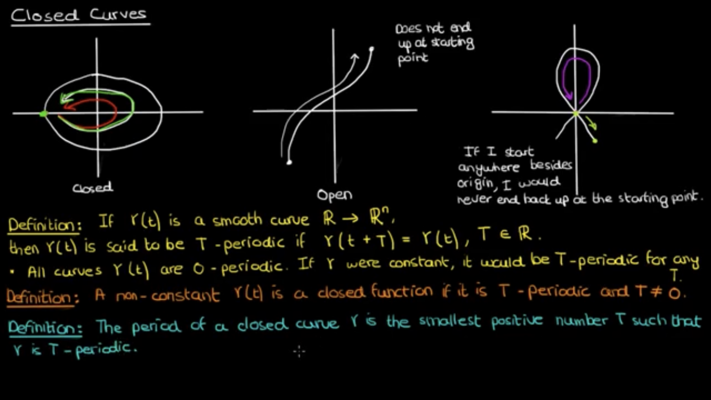
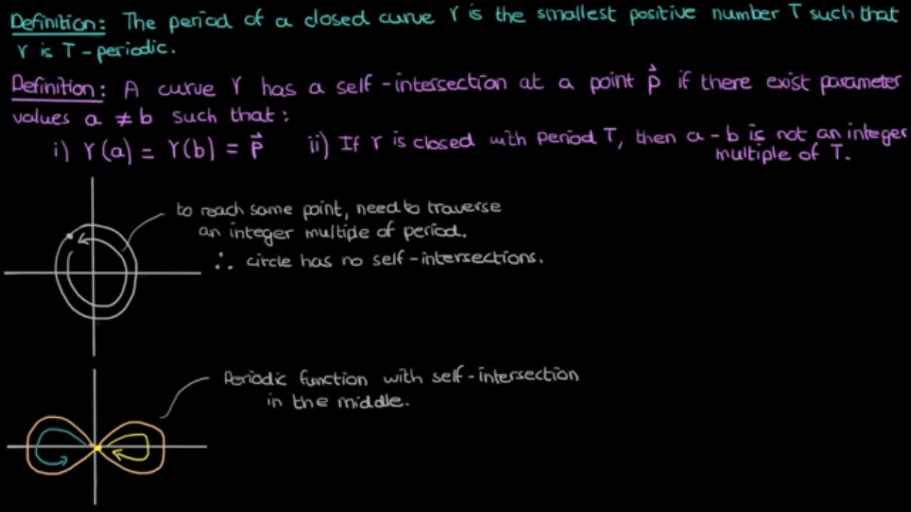

```{r setup, include=FALSE}
knitr::opts_chunk$set(echo=TRUE, cache=FALSE, messages=FALSE, warning=FALSE, eval=TRUE, fig.pos = 'H')
# options(tinytex.verbose = TRUE)
```

```{r packages, include=FALSE, eval=FALSE}
library(tidyverse)
library(ggplot2)
library(knitr)
```

# Books

## Lee, J. M., Chow, B., Chu, S. C., Glickenstein, D., and Guenther, C. (2009), “Manifolds and differential geometry,” Topology. An International Journal of Mathematics, ams.org.

- Chap 1: Differentiable Manifolds

- Chap 2: The Tangent Structure

- Chap 3: Immersion and Submersion

- Chap 4: Curves and Hypersurfaces in Euclidean Space

- Chap 8: Differential Forms

- Chap 13: Riemannian and Semi-Riemannian Geometry

## Kass, R. E., and Vos, P. W. (2011), Geometrical Foundations of Asymptotic Inference, John Wiley & Sons.

Appendix C: Basic Concepts in Differential Geometry

- Manifolds

- Submanifolds

- The Tangent Space

- Connections

- Riemannian Metric

- Tensors

- Tubular Neighborhoods

- The Measure Determined by a Metric

- Curvature


# Online Tutorials

[YouTube tutorials on differential geometry](https://www.youtube.com/playlist?list=PLdgVBOaXkb9DJjk8V0-RkXTnD4ZXUOFsc)

- Curves

- Arc length and reparameterization

- Arc length as a parameter

- Closed curves and periodic curves

- Curvature: intuition adn derivation

## Curves

1) Level Curves: 2-D and 3-D set, $C$. The intersection of 2 surfaces in 3-D is a curve. 

2) Parameterized Curves: a map $\gamma: t \rightarrow \mathbb{R}^n, t \in \mathbb{R}$.

3) Smooth function: infinite differentiable. All components of a parameterized curve $\gamma(t)$ are differentiable.

4) Tangent vector: the tangent vector of $\gamma(t)$ at the parameter value $t$ is $\frac{d\gamma}{dt}$.

```{r , fig.align = 'center', out.width = "100%", echo = FALSE, eval=TRUE}


```


## Arc length and reparameterization

1) Arc length definition: the arc length of a curve $\gamma$ starting at the point $\gamma(\alpha)$ is the function $S(t)$ given by:
$$
S(t) = \int_\alpha^t \|\dot{\gamma}(u)\| du.
$$

2) Reparameterization: smooth bijective map exists such that the inverse map is also smooth.

3) Regular point, singular point and regular curve. 

```{r , fig.align = 'center', out.width = "100%", echo = FALSE, eval=TRUE}


```


## Arc length as a parameter

1-3) Proof of the reparameterization with regard to arc length is a valid option. 

4) Theorem about unit speed curve.

```{r , fig.align = 'center', out.width = "100%", echo = FALSE, eval=TRUE}


```

## Closed curves and periodic curves

1) T-periodic: $Y(t+T)=Y(t), T\in \mathbb{R}$.

2) Self-intersection of a curve.

3) Theorem: a unit-speed reparameterization of a regular closed curve $\gamma$ is always closed.


```{r , fig.align = 'center', out.width = "100%", echo = FALSE, eval=TRUE}



```

## Curvature: intuition adn derivation

1) Curvature: the extend to which $\gamma$ deviates from a straight line. 
$$
K(s) = \|\frac{d^2\gamma}{ds^2}\|, 
$$
which shows how quickly the tangent vector changes.

2-4) Formula for curvature when $\gamma(t)$ is a regular curve with unit speed parameter $s$:
$$
k=\frac{\left\|\frac{d^{2} r}{d t^{2}} \times \frac{d r}{d t}\right\|}{\left\|\frac{d r}{d t}\right\|^{3}}
$$

4) Radius of curvature: $p=1/K$.


```{r , fig.align = 'center', out.width = "100%", echo = FALSE, eval=TRUE}


```


# Discussion


<!-- <!-- # References --> 
<!-- \setlength{\parindent}{-0.2in} -->
<!-- \setlength{\leftskip}{0.2in} -->
<!-- \setlength{\parskip}{8pt} -->
<!-- \vspace*{-0.2in} -->
<!-- \noindent -->
