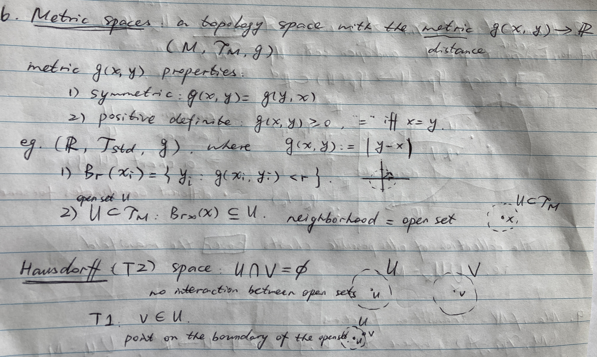
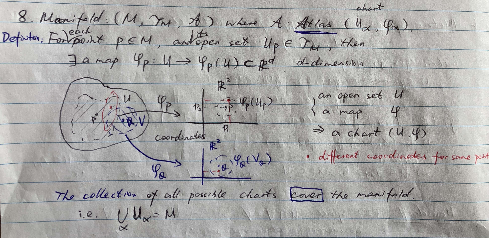
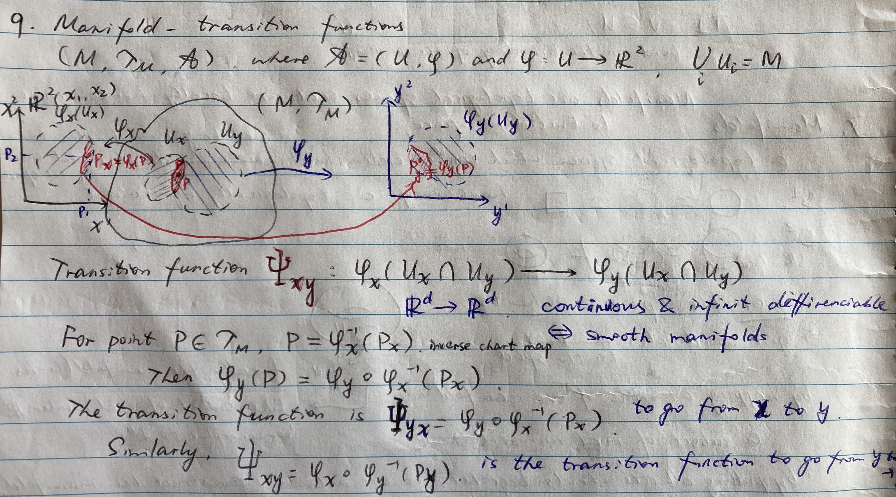
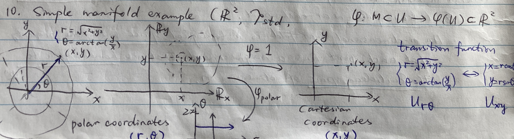
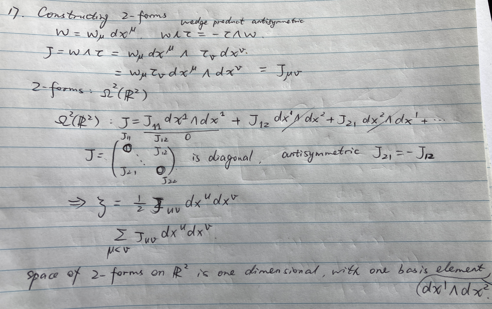

```{r setup, include=FALSE}
knitr::opts_chunk$set(echo=TRUE, cache=FALSE, messages=FALSE, warning=FALSE, eval=TRUE, fig.pos = 'H')
# options(tinytex.verbose = TRUE)
```

```{r packages, include=FALSE, eval=FALSE}
library(tidyverse)
library(ggplot2)
library(knitr)
```

# Online Tutorials

YouTube tutorials on topology, manifolds & differential geometry by [*WHYBmaths*](https://www.youtube.com/playlist?list=PLxBAVPVHJPcrNrcEBKbqC_ykiVqfxZgNl)

- Preliminary: Sets & Maps

- Topology: Introduction, Constructing Torus, Topological Spaces, Continuity, Metric Spaces, Hausdorff property

- Manifolds: Introduction, Topological Manifolds, Transition Functions, Tangent Space

- Other: Vector Fields, Differential Forms

**Manifolds** are **topological spaces** that are **locally homeomorphic** to Euclidean space. 

# Topological spaces

Topology space: a set $M$ with *topology* $\{\mathcal{T}_M\}$.

## Topology

Topology is the mathematical study of the properties of a geometric object that are preserved under *continuous deformations*, such as stretching, twisting, crumpling and bending. [*Wikipedia*](https://en.wikipedia.org/wiki/Topology)

Topological invariant: *homeomorphic* in the property of the space.

Homeomorphism: a continuous function between topological spaces that has a continuous inverse function.  

For example: a circle is homeomorphic to a rectangle/square by certain stretching. 

Constructing torus in 2-D. 

```{r , fig.align = 'center', out.width = "100%", echo = FALSE, eval=TRUE}
knitr::include_graphics("figures/manifold/IMG_1342.jpg")
```

## Topological space: $(M, \{\mathcal{T}_M\})$

Topology properties:

1) $M,\phi \in \{\mathcal{T}_M\}$;

2) For all topological element $\tau_i \in \{\mathcal{T}_M\}$, the finite intersection set is also in the topology,
$$
\bigcap_i \tau_i \in \{\mathcal{T}_M\};
$$

3) Similarly, the infinite union set is also in the topology,
$$
\bigcup_i \tau_i \in \{\mathcal{T}_M\};
$$

Two extreme cases: 

- Chaotic topology: $\mathcal{T}_M = \{M,\phi\}$.

- Discrete topology: $\mathcal{T}_M = \{P(M),\phi\}$, where $P(M)$ is the power set containing all possible subset of M.

Standard topology $T_{std}$ of a set $U \subset \mathbb{R}^2$:

1) Consider constructing a ball $B_r(x_i)$;

2) For any open set $U \in T_{std}$, there exists a ball $B_r(U) \subset U$.

1)&2) give a 2-d topology space $(U, B_r(U))$. [Example]


# Continuity of maps

```{r , fig.align = 'center', out.width = "100%", echo = FALSE, eval=TRUE}
knitr::include_graphics("figures/manifold/IMG_1343.jpg")
```


# Metric Spaces

```{r , fig.align = 'center', out.width = "100%", echo = FALSE, eval=TRUE}

```

# Manifolds

```{r , fig.align = 'center', out.width = "100%", echo = FALSE, eval=TRUE}
knitr::include_graphics("figures/manifold/IMG_1345.jpg")

```

# Transition functions

```{r , fig.align = 'center', out.width = "100%", echo = FALSE, eval=TRUE}

```

## Example
```{r , fig.align = 'center', out.width = "100%", echo = FALSE, eval=TRUE}

```

# Tangent spaces

```{r , fig.align = 'center', out.width = "100%", echo = FALSE, eval=TRUE}
knitr::include_graphics("figures/manifold/IMG_1349.jpg")
```

# Others

## Vector fields

```{r , fig.align = 'center', out.width = "100%", echo = FALSE, eval=TRUE}
knitr::include_graphics("figures/manifold/IMG_1350.jpg")
```

## Differential forms

```{r , fig.align = 'center', out.width = "100%", echo = FALSE, eval=TRUE}

```
